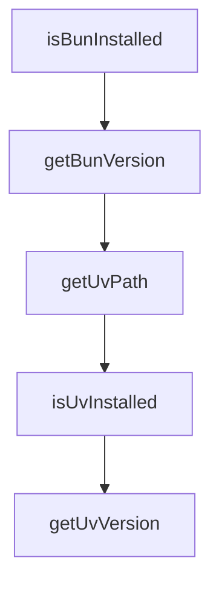

# Chapter 3: Installation, Upgrade, and Runtime Environment

Welcome to **Chapter 3: Installation, Upgrade, and Runtime Environment**. In this part of **Claude-Mem Tutorial: Persistent Memory Compression for Claude Code**, you will build an intuitive mental model first, then move into concrete implementation details and practical production tradeoffs.


This chapter focuses on keeping installation and upgrade workflows repeatable.

## Learning Goals

- run standard and advanced installation paths safely
- verify required runtime dependencies and auto-install behavior
- apply upgrade flow with minimal downtime risk
- understand platform-specific environment differences

## Runtime Dependencies

Claude-Mem relies on a mixed runtime stack, including:

- Node.js runtime baseline
- Bun for worker/service process management
- uv/Python components for vector search pathways
- SQLite for durable storage

## Upgrade Pattern

- snapshot current settings and data directory
- upgrade plugin version/channel deliberately
- verify worker health and context retrieval
- run a small session replay test before full usage

## Platform Notes

- watch Windows PATH/runtime setup carefully
- monitor local port conflicts for viewer/worker services
- keep terminal and shell environment consistent across sessions

## Source References

- [Installation Guide](https://docs.claude-mem.ai/installation)
- [Development Guide](https://docs.claude-mem.ai/development)
- [README System Requirements](https://github.com/thedotmack/claude-mem/blob/main/README.md#system-requirements)

## Summary

You now have a stable install/upgrade pattern for Claude-Mem environments.

Next: [Chapter 4: Configuration, Modes, and Context Injection](04-configuration-modes-and-context-injection.md)

## Source Code Walkthrough

### `scripts/smart-install.js`

The `isBunInstalled` function in [`scripts/smart-install.js`](https://github.com/thedotmack/claude-mem/blob/HEAD/scripts/smart-install.js) handles a key part of this chapter's functionality:

```js
 * Check if Bun is installed and accessible
 */
function isBunInstalled() {
  return getBunPath() !== null;
}

/**
 * Get Bun version if installed
 */
function getBunVersion() {
  const bunPath = getBunPath();
  if (!bunPath) return null;

  try {
    const result = spawnSync(bunPath, ['--version'], {
      encoding: 'utf-8',
      stdio: ['pipe', 'pipe', 'pipe'],
      shell: IS_WINDOWS
    });
    return result.status === 0 ? result.stdout.trim() : null;
  } catch {
    return null;
  }
}

/**
 * Get the uv executable path (from PATH or common install locations)
 */
function getUvPath() {
  // Try PATH first
  try {
    const result = spawnSync('uv', ['--version'], {
```

This function is important because it defines how Claude-Mem Tutorial: Persistent Memory Compression for Claude Code implements the patterns covered in this chapter.

### `scripts/smart-install.js`

The `getBunVersion` function in [`scripts/smart-install.js`](https://github.com/thedotmack/claude-mem/blob/HEAD/scripts/smart-install.js) handles a key part of this chapter's functionality:

```js
 * Get Bun version if installed
 */
function getBunVersion() {
  const bunPath = getBunPath();
  if (!bunPath) return null;

  try {
    const result = spawnSync(bunPath, ['--version'], {
      encoding: 'utf-8',
      stdio: ['pipe', 'pipe', 'pipe'],
      shell: IS_WINDOWS
    });
    return result.status === 0 ? result.stdout.trim() : null;
  } catch {
    return null;
  }
}

/**
 * Get the uv executable path (from PATH or common install locations)
 */
function getUvPath() {
  // Try PATH first
  try {
    const result = spawnSync('uv', ['--version'], {
      encoding: 'utf-8',
      stdio: ['pipe', 'pipe', 'pipe'],
      shell: IS_WINDOWS
    });
    if (result.status === 0) return 'uv';
  } catch {
    // Not in PATH
```

This function is important because it defines how Claude-Mem Tutorial: Persistent Memory Compression for Claude Code implements the patterns covered in this chapter.

### `scripts/smart-install.js`

The `getUvPath` function in [`scripts/smart-install.js`](https://github.com/thedotmack/claude-mem/blob/HEAD/scripts/smart-install.js) handles a key part of this chapter's functionality:

```js
 * Get the uv executable path (from PATH or common install locations)
 */
function getUvPath() {
  // Try PATH first
  try {
    const result = spawnSync('uv', ['--version'], {
      encoding: 'utf-8',
      stdio: ['pipe', 'pipe', 'pipe'],
      shell: IS_WINDOWS
    });
    if (result.status === 0) return 'uv';
  } catch {
    // Not in PATH
  }

  // Check common installation paths
  return UV_COMMON_PATHS.find(existsSync) || null;
}

/**
 * Check if uv is installed and accessible
 */
function isUvInstalled() {
  return getUvPath() !== null;
}

/**
 * Get uv version if installed
 */
function getUvVersion() {
  const uvPath = getUvPath();
  if (!uvPath) return null;
```

This function is important because it defines how Claude-Mem Tutorial: Persistent Memory Compression for Claude Code implements the patterns covered in this chapter.

### `scripts/smart-install.js`

The `isUvInstalled` function in [`scripts/smart-install.js`](https://github.com/thedotmack/claude-mem/blob/HEAD/scripts/smart-install.js) handles a key part of this chapter's functionality:

```js
 * Check if uv is installed and accessible
 */
function isUvInstalled() {
  return getUvPath() !== null;
}

/**
 * Get uv version if installed
 */
function getUvVersion() {
  const uvPath = getUvPath();
  if (!uvPath) return null;

  try {
    const result = spawnSync(uvPath, ['--version'], {
      encoding: 'utf-8',
      stdio: ['pipe', 'pipe', 'pipe'],
      shell: IS_WINDOWS
    });
    return result.status === 0 ? result.stdout.trim() : null;
  } catch {
    return null;
  }
}

/**
 * Install Bun automatically based on platform
 */
function installBun() {
  console.error('🔧 Bun not found. Installing Bun runtime...');

  try {
```

This function is important because it defines how Claude-Mem Tutorial: Persistent Memory Compression for Claude Code implements the patterns covered in this chapter.


## How These Components Connect


