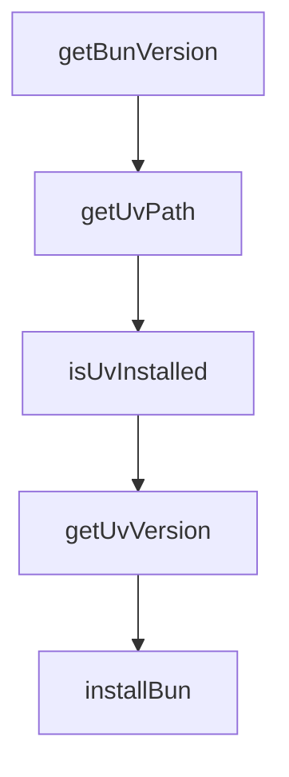

# Chapter 4: Configuration, Modes, and Context Injection

Welcome to **Chapter 4: Configuration, Modes, and Context Injection**. In this part of **Claude-Mem Tutorial: Persistent Memory Compression for Claude Code**, you will build an intuitive mental model first, then move into concrete implementation details and practical production tradeoffs.


This chapter covers the highest-leverage controls for memory quality and context relevance.

## Learning Goals

- tune core settings in `~/.claude-mem/settings.json`
- configure model/provider options and runtime defaults
- control context injection filters and display behavior
- avoid over-injection and noisy memory surfaces

## Key Configuration Areas

- model/provider selection
- worker and data directory settings
- context injection filtering and presentation
- mode and behavior toggles for memory retrieval

## Configuration Hygiene

- track settings changes in small increments
- validate one config change per session when debugging
- keep project-level context expectations documented

## Source References

- [Configuration Guide](https://docs.claude-mem.ai/configuration)
- [Folder Context Files](https://docs.claude-mem.ai/usage/folder-context)
- [README Configuration](https://github.com/thedotmack/claude-mem/blob/main/README.md#configuration)

## Summary

You now know how to tune Claude-Mem behavior for accurate, low-noise context injection.

Next: [Chapter 5: Search Tools and Progressive Disclosure](05-search-tools-and-progressive-disclosure.md)

## Depth Expansion Playbook

## Source Code Walkthrough

### `scripts/smart-install.js`

The `getBunVersion` function in [`scripts/smart-install.js`](https://github.com/thedotmack/claude-mem/blob/HEAD/scripts/smart-install.js) handles a key part of this chapter's functionality:

```js
 * Get Bun version if installed
 */
function getBunVersion() {
  const bunPath = getBunPath();
  if (!bunPath) return null;

  try {
    const result = spawnSync(bunPath, ['--version'], {
      encoding: 'utf-8',
      stdio: ['pipe', 'pipe', 'pipe'],
      shell: IS_WINDOWS
    });
    return result.status === 0 ? result.stdout.trim() : null;
  } catch {
    return null;
  }
}

/**
 * Get the uv executable path (from PATH or common install locations)
 */
function getUvPath() {
  // Try PATH first
  try {
    const result = spawnSync('uv', ['--version'], {
      encoding: 'utf-8',
      stdio: ['pipe', 'pipe', 'pipe'],
      shell: IS_WINDOWS
    });
    if (result.status === 0) return 'uv';
  } catch {
    // Not in PATH
```

This function is important because it defines how Claude-Mem Tutorial: Persistent Memory Compression for Claude Code implements the patterns covered in this chapter.

### `scripts/smart-install.js`

The `getUvPath` function in [`scripts/smart-install.js`](https://github.com/thedotmack/claude-mem/blob/HEAD/scripts/smart-install.js) handles a key part of this chapter's functionality:

```js
 * Get the uv executable path (from PATH or common install locations)
 */
function getUvPath() {
  // Try PATH first
  try {
    const result = spawnSync('uv', ['--version'], {
      encoding: 'utf-8',
      stdio: ['pipe', 'pipe', 'pipe'],
      shell: IS_WINDOWS
    });
    if (result.status === 0) return 'uv';
  } catch {
    // Not in PATH
  }

  // Check common installation paths
  return UV_COMMON_PATHS.find(existsSync) || null;
}

/**
 * Check if uv is installed and accessible
 */
function isUvInstalled() {
  return getUvPath() !== null;
}

/**
 * Get uv version if installed
 */
function getUvVersion() {
  const uvPath = getUvPath();
  if (!uvPath) return null;
```

This function is important because it defines how Claude-Mem Tutorial: Persistent Memory Compression for Claude Code implements the patterns covered in this chapter.

### `scripts/smart-install.js`

The `isUvInstalled` function in [`scripts/smart-install.js`](https://github.com/thedotmack/claude-mem/blob/HEAD/scripts/smart-install.js) handles a key part of this chapter's functionality:

```js
 * Check if uv is installed and accessible
 */
function isUvInstalled() {
  return getUvPath() !== null;
}

/**
 * Get uv version if installed
 */
function getUvVersion() {
  const uvPath = getUvPath();
  if (!uvPath) return null;

  try {
    const result = spawnSync(uvPath, ['--version'], {
      encoding: 'utf-8',
      stdio: ['pipe', 'pipe', 'pipe'],
      shell: IS_WINDOWS
    });
    return result.status === 0 ? result.stdout.trim() : null;
  } catch {
    return null;
  }
}

/**
 * Install Bun automatically based on platform
 */
function installBun() {
  console.error('🔧 Bun not found. Installing Bun runtime...');

  try {
```

This function is important because it defines how Claude-Mem Tutorial: Persistent Memory Compression for Claude Code implements the patterns covered in this chapter.

### `scripts/smart-install.js`

The `getUvVersion` function in [`scripts/smart-install.js`](https://github.com/thedotmack/claude-mem/blob/HEAD/scripts/smart-install.js) handles a key part of this chapter's functionality:

```js
 * Get uv version if installed
 */
function getUvVersion() {
  const uvPath = getUvPath();
  if (!uvPath) return null;

  try {
    const result = spawnSync(uvPath, ['--version'], {
      encoding: 'utf-8',
      stdio: ['pipe', 'pipe', 'pipe'],
      shell: IS_WINDOWS
    });
    return result.status === 0 ? result.stdout.trim() : null;
  } catch {
    return null;
  }
}

/**
 * Install Bun automatically based on platform
 */
function installBun() {
  console.error('🔧 Bun not found. Installing Bun runtime...');

  try {
    if (IS_WINDOWS) {
      console.error('   Installing via PowerShell...');
      execSync('powershell -c "irm bun.sh/install.ps1 | iex"', {
        stdio: 'inherit',
        shell: true
      });
    } else {
```

This function is important because it defines how Claude-Mem Tutorial: Persistent Memory Compression for Claude Code implements the patterns covered in this chapter.


## How These Components Connect


