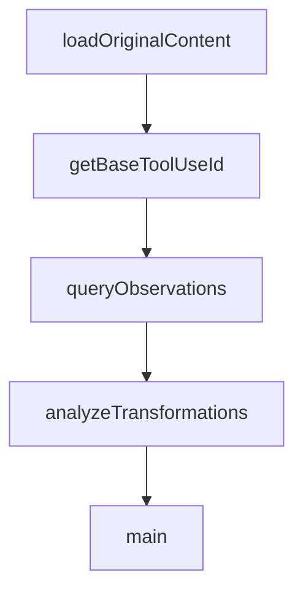

# Chapter 5: Search Tools and Progressive Disclosure

Welcome to **Chapter 5: Search Tools and Progressive Disclosure**. In this part of **Claude-Mem Tutorial: Persistent Memory Compression for Claude Code**, you will build an intuitive mental model first, then move into concrete implementation details and practical production tradeoffs.


This chapter shows how to retrieve memory context efficiently with layered search patterns.

## Learning Goals

- use the three-layer retrieval workflow correctly
- choose search/timeline/full-observation calls intentionally
- minimize token burn while maximizing relevance
- apply memory search patterns to debugging and planning tasks

## Three-Layer Retrieval Pattern

1. `search` for compact candidate index
2. `timeline` for chronological context around candidates
3. `get_observations` for full details of filtered IDs only

This staged approach is the primary token-efficiency mechanism in Claude-Mem.

## Practical Retrieval Rules

- batch relevant IDs instead of one-by-one requests
- filter by project/type/date before full detail fetches
- keep search queries explicit and scoped to intent

## Source References

- [Search Tools Guide](https://docs.claude-mem.ai/usage/search-tools)
- [README MCP Search Tools](https://github.com/thedotmack/claude-mem/blob/main/README.md#mcp-search-tools)
- [Progressive Disclosure Guide](https://docs.claude-mem.ai/progressive-disclosure)

## Summary

You now have a token-efficient memory retrieval workflow for complex sessions.

Next: [Chapter 6: Viewer Operations and Maintenance Workflows](06-viewer-operations-and-maintenance-workflows.md)

## Depth Expansion Playbook

## Source Code Walkthrough

### `scripts/analyze-transformations-smart.js`

The `loadOriginalContent` function in [`scripts/analyze-transformations-smart.js`](https://github.com/thedotmack/claude-mem/blob/HEAD/scripts/analyze-transformations-smart.js) handles a key part of this chapter's functionality:

```js
// Parse transcript to get BOTH tool_use (inputs) and tool_result (outputs) content
// Returns true if transcript is clean, false if contaminated (already transformed)
async function loadOriginalContentFromFile(filePath, fileLabel) {
  const fileStream = fs.createReadStream(filePath);
  const rl = readline.createInterface({
    input: fileStream,
    crlfDelay: Infinity
  });

  let count = 0;
  let isContaminated = false;
  const toolUseIdsFromThisFile = new Set();

  for await (const line of rl) {
    if (!line.includes('toolu_')) continue;

    try {
      const obj = JSON.parse(line);

      if (obj.message?.content) {
        for (const item of obj.message.content) {
          // Capture tool_use (inputs)
          if (item.type === 'tool_use' && item.id) {
            const existing = originalContent.get(item.id) || { input: '', output: '', name: '' };
            existing.input = JSON.stringify(item.input || {});
            existing.name = item.name;
            originalContent.set(item.id, existing);
            toolUseIdsFromThisFile.add(item.id);
            count++;
          }

          // Capture tool_result (outputs)
```

This function is important because it defines how Claude-Mem Tutorial: Persistent Memory Compression for Claude Code implements the patterns covered in this chapter.

### `scripts/analyze-transformations-smart.js`

The `getBaseToolUseId` function in [`scripts/analyze-transformations-smart.js`](https://github.com/thedotmack/claude-mem/blob/HEAD/scripts/analyze-transformations-smart.js) handles a key part of this chapter's functionality:

```js

// Strip __N suffix from tool_use_id to get base ID
function getBaseToolUseId(id) {
  return id ? id.replace(/__\d+$/, '') : id;
}

// Query observations from database using tool_use_ids found in transcripts
// Handles suffixed IDs like toolu_abc__1, toolu_abc__2 matching transcript's toolu_abc
function queryObservations() {
  // Get tool_use_ids from the loaded transcript content
  const toolUseIds = Array.from(originalContent.keys());

  if (toolUseIds.length === 0) {
    console.log('No tool use IDs found in transcripts\n');
    return [];
  }

  console.log(`Querying observations for ${toolUseIds.length} tool use IDs from transcripts...`);

  const db = new Database(DB_PATH, { readonly: true });

  // Build LIKE clauses to match both exact IDs and suffixed variants (toolu_abc, toolu_abc__1, etc)
  const likeConditions = toolUseIds.map(() => 'tool_use_id LIKE ?').join(' OR ');
  const likeParams = toolUseIds.map(id => `${id}%`);

  const query = `
    SELECT
      id,
      tool_use_id,
      type,
      narrative,
      title,
```

This function is important because it defines how Claude-Mem Tutorial: Persistent Memory Compression for Claude Code implements the patterns covered in this chapter.

### `scripts/analyze-transformations-smart.js`

The `queryObservations` function in [`scripts/analyze-transformations-smart.js`](https://github.com/thedotmack/claude-mem/blob/HEAD/scripts/analyze-transformations-smart.js) handles a key part of this chapter's functionality:

```js
// Query observations from database using tool_use_ids found in transcripts
// Handles suffixed IDs like toolu_abc__1, toolu_abc__2 matching transcript's toolu_abc
function queryObservations() {
  // Get tool_use_ids from the loaded transcript content
  const toolUseIds = Array.from(originalContent.keys());

  if (toolUseIds.length === 0) {
    console.log('No tool use IDs found in transcripts\n');
    return [];
  }

  console.log(`Querying observations for ${toolUseIds.length} tool use IDs from transcripts...`);

  const db = new Database(DB_PATH, { readonly: true });

  // Build LIKE clauses to match both exact IDs and suffixed variants (toolu_abc, toolu_abc__1, etc)
  const likeConditions = toolUseIds.map(() => 'tool_use_id LIKE ?').join(' OR ');
  const likeParams = toolUseIds.map(id => `${id}%`);

  const query = `
    SELECT
      id,
      tool_use_id,
      type,
      narrative,
      title,
      facts,
      concepts,
      LENGTH(COALESCE(facts,'')) as facts_len,
      LENGTH(COALESCE(title,'')) + LENGTH(COALESCE(facts,'')) as title_facts_len,
      LENGTH(COALESCE(title,'')) + LENGTH(COALESCE(facts,'')) + LENGTH(COALESCE(concepts,'')) as compact_len,
      LENGTH(COALESCE(narrative,'')) as narrative_len,
```

This function is important because it defines how Claude-Mem Tutorial: Persistent Memory Compression for Claude Code implements the patterns covered in this chapter.

### `scripts/analyze-transformations-smart.js`

The `analyzeTransformations` function in [`scripts/analyze-transformations-smart.js`](https://github.com/thedotmack/claude-mem/blob/HEAD/scripts/analyze-transformations-smart.js) handles a key part of this chapter's functionality:

```js

// Analyze OUTPUT-only replacement for eligible tools
function analyzeTransformations(observations) {
  console.log('='.repeat(110));
  console.log('OUTPUT REPLACEMENT ANALYSIS (Eligible Tools Only)');
  console.log('='.repeat(110));
  console.log();
  console.log('Eligible tools:', Array.from(REPLACEABLE_TOOLS).join(', '));
  console.log();

  // Group observations by BASE tool_use_id (strip __N suffix)
  // This groups toolu_abc, toolu_abc__1, toolu_abc__2 together
  const obsByToolId = new Map();
  observations.forEach(obs => {
    const baseId = getBaseToolUseId(obs.tool_use_id);
    if (!obsByToolId.has(baseId)) {
      obsByToolId.set(baseId, []);
    }
    obsByToolId.get(baseId).push(obs);
  });

  // Define strategies to test
  const strategies = [
    { name: 'facts_only', field: 'facts_len', desc: 'Facts only (~400 chars)' },
    { name: 'title_facts', field: 'title_facts_len', desc: 'Title + Facts (~450 chars)' },
    { name: 'compact', field: 'compact_len', desc: 'Title + Facts + Concepts (~500 chars)' },
    { name: 'narrative', field: 'narrative_len', desc: 'Narrative only (~700 chars)' },
    { name: 'full', field: 'full_obs_len', desc: 'Full observation (~1200 chars)' }
  ];

  // Track results per strategy
  const results = {};
```

This function is important because it defines how Claude-Mem Tutorial: Persistent Memory Compression for Claude Code implements the patterns covered in this chapter.


## How These Components Connect


