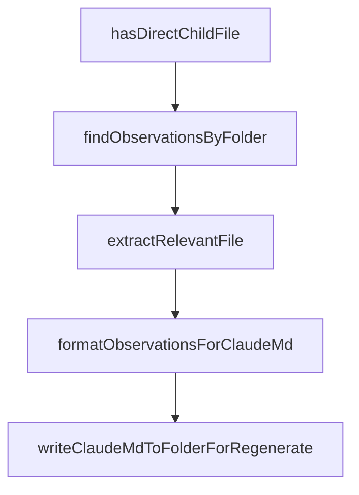

# Chapter 5: Search Tools and Progressive Disclosure

Welcome to **Chapter 5: Search Tools and Progressive Disclosure**. In this part of **Claude-Mem Tutorial: Persistent Memory Compression for Claude Code**, you will build an intuitive mental model first, then move into concrete implementation details and practical production tradeoffs.


This chapter shows how to retrieve memory context efficiently with layered search patterns.

## Learning Goals

- use the three-layer retrieval workflow correctly
- choose search/timeline/full-observation calls intentionally
- minimize token burn while maximizing relevance
- apply memory search patterns to debugging and planning tasks

## Three-Layer Retrieval Pattern

1. `search` for compact candidate index
2. `timeline` for chronological context around candidates
3. `get_observations` for full details of filtered IDs only

This staged approach is the primary token-efficiency mechanism in Claude-Mem.

## Practical Retrieval Rules

- batch relevant IDs instead of one-by-one requests
- filter by project/type/date before full detail fetches
- keep search queries explicit and scoped to intent

## Source References

- [Search Tools Guide](https://docs.claude-mem.ai/usage/search-tools)
- [README MCP Search Tools](https://github.com/thedotmack/claude-mem/blob/main/README.md#mcp-search-tools)
- [Progressive Disclosure Guide](https://docs.claude-mem.ai/progressive-disclosure)

## Summary

You now have a token-efficient memory retrieval workflow for complex sessions.

Next: [Chapter 6: Viewer Operations and Maintenance Workflows](06-viewer-operations-and-maintenance-workflows.md)

## Source Code Walkthrough

### `scripts/regenerate-claude-md.ts`

The `hasDirectChildFile` function in [`scripts/regenerate-claude-md.ts`](https://github.com/thedotmack/claude-mem/blob/HEAD/scripts/regenerate-claude-md.ts) handles a key part of this chapter's functionality:

```ts
 * Check if an observation has any files that are direct children of the folder
 */
function hasDirectChildFile(obs: ObservationRow, folderPath: string): boolean {
  const checkFiles = (filesJson: string | null): boolean => {
    if (!filesJson) return false;
    try {
      const files = JSON.parse(filesJson);
      if (Array.isArray(files)) {
        return files.some(f => isDirectChild(f, folderPath));
      }
    } catch {}
    return false;
  };

  return checkFiles(obs.files_modified) || checkFiles(obs.files_read);
}

/**
 * Query observations for a specific folder
 * folderPath is a relative path from the project root (e.g., "src/services")
 * Only returns observations with files directly in the folder (not in subfolders)
 */
function findObservationsByFolder(db: Database, relativeFolderPath: string, project: string, limit: number): ObservationRow[] {
  // Query more results than needed since we'll filter some out
  const queryLimit = limit * 3;

  const sql = `
    SELECT o.*, o.discovery_tokens
    FROM observations o
    WHERE o.project = ?
      AND (o.files_modified LIKE ? OR o.files_read LIKE ?)
    ORDER BY o.created_at_epoch DESC
```

This function is important because it defines how Claude-Mem Tutorial: Persistent Memory Compression for Claude Code implements the patterns covered in this chapter.

### `scripts/regenerate-claude-md.ts`

The `findObservationsByFolder` function in [`scripts/regenerate-claude-md.ts`](https://github.com/thedotmack/claude-mem/blob/HEAD/scripts/regenerate-claude-md.ts) handles a key part of this chapter's functionality:

```ts
 * Only returns observations with files directly in the folder (not in subfolders)
 */
function findObservationsByFolder(db: Database, relativeFolderPath: string, project: string, limit: number): ObservationRow[] {
  // Query more results than needed since we'll filter some out
  const queryLimit = limit * 3;

  const sql = `
    SELECT o.*, o.discovery_tokens
    FROM observations o
    WHERE o.project = ?
      AND (o.files_modified LIKE ? OR o.files_read LIKE ?)
    ORDER BY o.created_at_epoch DESC
    LIMIT ?
  `;

  // Files in DB are stored as relative paths like "src/services/foo.ts"
  // Match any file that starts with this folder path (we'll filter to direct children below)
  const likePattern = `%"${relativeFolderPath}/%`;
  const allMatches = db.prepare(sql).all(project, likePattern, likePattern, queryLimit) as ObservationRow[];

  // Filter to only observations with direct child files (not in subfolders)
  return allMatches.filter(obs => hasDirectChildFile(obs, relativeFolderPath)).slice(0, limit);
}

/**
 * Extract relevant file from an observation for display
 * Only returns files that are direct children of the folder (not in subfolders)
 * @param obs - The observation row
 * @param relativeFolder - Relative folder path (e.g., "src/services")
 */
function extractRelevantFile(obs: ObservationRow, relativeFolder: string): string {
  // Try files_modified first - only direct children
```

This function is important because it defines how Claude-Mem Tutorial: Persistent Memory Compression for Claude Code implements the patterns covered in this chapter.

### `scripts/regenerate-claude-md.ts`

The `extractRelevantFile` function in [`scripts/regenerate-claude-md.ts`](https://github.com/thedotmack/claude-mem/blob/HEAD/scripts/regenerate-claude-md.ts) handles a key part of this chapter's functionality:

```ts
 * @param relativeFolder - Relative folder path (e.g., "src/services")
 */
function extractRelevantFile(obs: ObservationRow, relativeFolder: string): string {
  // Try files_modified first - only direct children
  if (obs.files_modified) {
    try {
      const modified = JSON.parse(obs.files_modified);
      if (Array.isArray(modified) && modified.length > 0) {
        for (const file of modified) {
          if (isDirectChild(file, relativeFolder)) {
            // Get just the filename (no path since it's a direct child)
            return path.basename(file);
          }
        }
      }
    } catch {}
  }

  // Fall back to files_read - only direct children
  if (obs.files_read) {
    try {
      const read = JSON.parse(obs.files_read);
      if (Array.isArray(read) && read.length > 0) {
        for (const file of read) {
          if (isDirectChild(file, relativeFolder)) {
            return path.basename(file);
          }
        }
      }
    } catch {}
  }

```

This function is important because it defines how Claude-Mem Tutorial: Persistent Memory Compression for Claude Code implements the patterns covered in this chapter.

### `scripts/regenerate-claude-md.ts`

The `formatObservationsForClaudeMd` function in [`scripts/regenerate-claude-md.ts`](https://github.com/thedotmack/claude-mem/blob/HEAD/scripts/regenerate-claude-md.ts) handles a key part of this chapter's functionality:

```ts
 * Format observations for CLAUDE.md content
 */
function formatObservationsForClaudeMd(observations: ObservationRow[], folderPath: string): string {
  const lines: string[] = [];
  lines.push('# Recent Activity');
  lines.push('');

  if (observations.length === 0) {
    return '';
  }

  const byDate = groupByDate(observations, obs => obs.created_at);

  for (const [day, dayObs] of byDate) {
    lines.push(`### ${day}`);
    lines.push('');

    const byFile = new Map<string, ObservationRow[]>();
    for (const obs of dayObs) {
      const file = extractRelevantFile(obs, folderPath);
      if (!byFile.has(file)) byFile.set(file, []);
      byFile.get(file)!.push(obs);
    }

    for (const [file, fileObs] of byFile) {
      lines.push(`**${file}**`);
      lines.push('| ID | Time | T | Title | Read |');
      lines.push('|----|------|---|-------|------|');

      let lastTime = '';
      for (const obs of fileObs) {
        const time = formatTime(obs.created_at_epoch);
```

This function is important because it defines how Claude-Mem Tutorial: Persistent Memory Compression for Claude Code implements the patterns covered in this chapter.


## How These Components Connect


