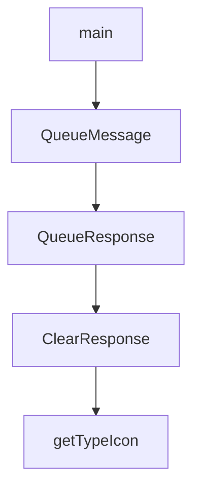

# Chapter 6: Viewer Operations and Maintenance Workflows

Welcome to **Chapter 6: Viewer Operations and Maintenance Workflows**. In this part of **Claude-Mem Tutorial: Persistent Memory Compression for Claude Code**, you will build an intuitive mental model first, then move into concrete implementation details and practical production tradeoffs.


This chapter focuses on day-to-day operation of the viewer, worker, and memory maintenance routines.

## Learning Goals

- use the web viewer for memory inspection and debugging
- manage worker lifecycle and health checks
- run routine maintenance and sanity checks
- keep memory data quality high over long-lived projects

## Operational Surfaces

- viewer UI (`http://localhost:37777`)
- worker status and logs
- session/observation inspection queries
- optional CLI utilities for queue and recovery operations

## Maintenance Checklist

- confirm worker health before major coding sessions
- inspect recent observations for malformed entries
- prune or archive stale data based on team policy
- validate search response quality periodically

## Source References

- [Usage Getting Started](https://docs.claude-mem.ai/usage/getting-started)
- [Architecture Worker Service](https://docs.claude-mem.ai/architecture/worker-service)
- [Export and Import Guide](https://docs.claude-mem.ai/usage/export-import)

## Summary

You now have a repeatable operations checklist for ongoing Claude-Mem usage.

Next: [Chapter 7: Troubleshooting, Recovery, and Reliability](07-troubleshooting-recovery-and-reliability.md)

## Depth Expansion Playbook

## Source Code Walkthrough

### `scripts/clear-failed-queue.ts`

The `main` function in [`scripts/clear-failed-queue.ts`](https://github.com/thedotmack/claude-mem/blob/HEAD/scripts/clear-failed-queue.ts) handles a key part of this chapter's functionality:

```ts
}

async function main() {
  const args = process.argv.slice(2);

  // Help flag
  if (args.includes('--help') || args.includes('-h')) {
    console.log(`
Claude-Mem Queue Clearer

Clear messages from the observation queue.

Usage:
  bun scripts/clear-failed-queue.ts [options]

Options:
  --help, -h     Show this help message
  --all          Clear ALL messages (pending, processing, and failed)
  --force        Clear without prompting for confirmation

Examples:
  # Clear failed messages interactively
  bun scripts/clear-failed-queue.ts

  # Clear ALL messages (pending, processing, failed)
  bun scripts/clear-failed-queue.ts --all

  # Clear without confirmation (non-interactive)
  bun scripts/clear-failed-queue.ts --force

  # Clear all messages without confirmation
  bun scripts/clear-failed-queue.ts --all --force
```

This function is important because it defines how Claude-Mem Tutorial: Persistent Memory Compression for Claude Code implements the patterns covered in this chapter.

### `scripts/clear-failed-queue.ts`

The `QueueMessage` interface in [`scripts/clear-failed-queue.ts`](https://github.com/thedotmack/claude-mem/blob/HEAD/scripts/clear-failed-queue.ts) handles a key part of this chapter's functionality:

```ts
const WORKER_URL = 'http://localhost:37777';

interface QueueMessage {
  id: number;
  session_db_id: number;
  message_type: string;
  tool_name: string | null;
  status: 'pending' | 'processing' | 'failed';
  retry_count: number;
  created_at_epoch: number;
  project: string | null;
}

interface QueueResponse {
  queue: {
    messages: QueueMessage[];
    totalPending: number;
    totalProcessing: number;
    totalFailed: number;
    stuckCount: number;
  };
  recentlyProcessed: QueueMessage[];
  sessionsWithPendingWork: number[];
}

interface ClearResponse {
  success: boolean;
  clearedCount: number;
}

async function checkWorkerHealth(): Promise<boolean> {
  try {
```

This interface is important because it defines how Claude-Mem Tutorial: Persistent Memory Compression for Claude Code implements the patterns covered in this chapter.

### `scripts/clear-failed-queue.ts`

The `QueueResponse` interface in [`scripts/clear-failed-queue.ts`](https://github.com/thedotmack/claude-mem/blob/HEAD/scripts/clear-failed-queue.ts) handles a key part of this chapter's functionality:

```ts
}

interface QueueResponse {
  queue: {
    messages: QueueMessage[];
    totalPending: number;
    totalProcessing: number;
    totalFailed: number;
    stuckCount: number;
  };
  recentlyProcessed: QueueMessage[];
  sessionsWithPendingWork: number[];
}

interface ClearResponse {
  success: boolean;
  clearedCount: number;
}

async function checkWorkerHealth(): Promise<boolean> {
  try {
    const res = await fetch(`${WORKER_URL}/api/health`);
    return res.ok;
  } catch {
    return false;
  }
}

async function getQueueStatus(): Promise<QueueResponse> {
  const res = await fetch(`${WORKER_URL}/api/pending-queue`);
  if (!res.ok) {
    throw new Error(`Failed to get queue status: ${res.status}`);
```

This interface is important because it defines how Claude-Mem Tutorial: Persistent Memory Compression for Claude Code implements the patterns covered in this chapter.

### `scripts/clear-failed-queue.ts`

The `ClearResponse` interface in [`scripts/clear-failed-queue.ts`](https://github.com/thedotmack/claude-mem/blob/HEAD/scripts/clear-failed-queue.ts) handles a key part of this chapter's functionality:

```ts
}

interface ClearResponse {
  success: boolean;
  clearedCount: number;
}

async function checkWorkerHealth(): Promise<boolean> {
  try {
    const res = await fetch(`${WORKER_URL}/api/health`);
    return res.ok;
  } catch {
    return false;
  }
}

async function getQueueStatus(): Promise<QueueResponse> {
  const res = await fetch(`${WORKER_URL}/api/pending-queue`);
  if (!res.ok) {
    throw new Error(`Failed to get queue status: ${res.status}`);
  }
  return res.json();
}

async function clearFailedQueue(): Promise<ClearResponse> {
  const res = await fetch(`${WORKER_URL}/api/pending-queue/failed`, {
    method: 'DELETE'
  });
  if (!res.ok) {
    throw new Error(`Failed to clear failed queue: ${res.status}`);
  }
  return res.json();
```

This interface is important because it defines how Claude-Mem Tutorial: Persistent Memory Compression for Claude Code implements the patterns covered in this chapter.


## How These Components Connect


