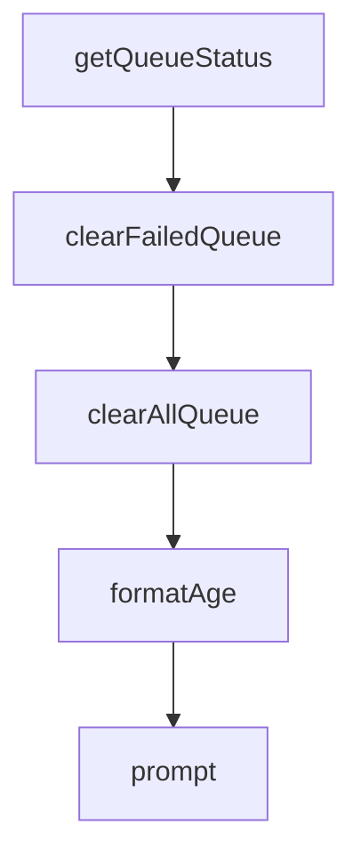

# Chapter 6: Viewer Operations and Maintenance Workflows

Welcome to **Chapter 6: Viewer Operations and Maintenance Workflows**. In this part of **Claude-Mem Tutorial: Persistent Memory Compression for Claude Code**, you will build an intuitive mental model first, then move into concrete implementation details and practical production tradeoffs.


This chapter focuses on day-to-day operation of the viewer, worker, and memory maintenance routines.

## Learning Goals

- use the web viewer for memory inspection and debugging
- manage worker lifecycle and health checks
- run routine maintenance and sanity checks
- keep memory data quality high over long-lived projects

## Operational Surfaces

- viewer UI (`http://localhost:37777`)
- worker status and logs
- session/observation inspection queries
- optional CLI utilities for queue and recovery operations

## Maintenance Checklist

- confirm worker health before major coding sessions
- inspect recent observations for malformed entries
- prune or archive stale data based on team policy
- validate search response quality periodically

## Source References

- [Usage Getting Started](https://docs.claude-mem.ai/usage/getting-started)
- [Architecture Worker Service](https://docs.claude-mem.ai/architecture/worker-service)
- [Export and Import Guide](https://docs.claude-mem.ai/usage/export-import)

## Summary

You now have a repeatable operations checklist for ongoing Claude-Mem usage.

Next: [Chapter 7: Troubleshooting, Recovery, and Reliability](07-troubleshooting-recovery-and-reliability.md)

## Source Code Walkthrough

### `scripts/clear-failed-queue.ts`

The `getQueueStatus` function in [`scripts/clear-failed-queue.ts`](https://github.com/thedotmack/claude-mem/blob/HEAD/scripts/clear-failed-queue.ts) handles a key part of this chapter's functionality:

```ts
}

async function getQueueStatus(): Promise<QueueResponse> {
  const res = await fetch(`${WORKER_URL}/api/pending-queue`);
  if (!res.ok) {
    throw new Error(`Failed to get queue status: ${res.status}`);
  }
  return res.json();
}

async function clearFailedQueue(): Promise<ClearResponse> {
  const res = await fetch(`${WORKER_URL}/api/pending-queue/failed`, {
    method: 'DELETE'
  });
  if (!res.ok) {
    throw new Error(`Failed to clear failed queue: ${res.status}`);
  }
  return res.json();
}

async function clearAllQueue(): Promise<ClearResponse> {
  const res = await fetch(`${WORKER_URL}/api/pending-queue/all`, {
    method: 'DELETE'
  });
  if (!res.ok) {
    throw new Error(`Failed to clear queue: ${res.status}`);
  }
  return res.json();
}

function formatAge(epochMs: number): string {
  const ageMs = Date.now() - epochMs;
```

This function is important because it defines how Claude-Mem Tutorial: Persistent Memory Compression for Claude Code implements the patterns covered in this chapter.

### `scripts/clear-failed-queue.ts`

The `clearFailedQueue` function in [`scripts/clear-failed-queue.ts`](https://github.com/thedotmack/claude-mem/blob/HEAD/scripts/clear-failed-queue.ts) handles a key part of this chapter's functionality:

```ts
}

async function clearFailedQueue(): Promise<ClearResponse> {
  const res = await fetch(`${WORKER_URL}/api/pending-queue/failed`, {
    method: 'DELETE'
  });
  if (!res.ok) {
    throw new Error(`Failed to clear failed queue: ${res.status}`);
  }
  return res.json();
}

async function clearAllQueue(): Promise<ClearResponse> {
  const res = await fetch(`${WORKER_URL}/api/pending-queue/all`, {
    method: 'DELETE'
  });
  if (!res.ok) {
    throw new Error(`Failed to clear queue: ${res.status}`);
  }
  return res.json();
}

function formatAge(epochMs: number): string {
  const ageMs = Date.now() - epochMs;
  const minutes = Math.floor(ageMs / 60000);
  const hours = Math.floor(minutes / 60);
  const days = Math.floor(hours / 24);

  if (days > 0) return `${days}d ${hours % 24}h ago`;
  if (hours > 0) return `${hours}h ${minutes % 60}m ago`;
  return `${minutes}m ago`;
}
```

This function is important because it defines how Claude-Mem Tutorial: Persistent Memory Compression for Claude Code implements the patterns covered in this chapter.

### `scripts/clear-failed-queue.ts`

The `clearAllQueue` function in [`scripts/clear-failed-queue.ts`](https://github.com/thedotmack/claude-mem/blob/HEAD/scripts/clear-failed-queue.ts) handles a key part of this chapter's functionality:

```ts
}

async function clearAllQueue(): Promise<ClearResponse> {
  const res = await fetch(`${WORKER_URL}/api/pending-queue/all`, {
    method: 'DELETE'
  });
  if (!res.ok) {
    throw new Error(`Failed to clear queue: ${res.status}`);
  }
  return res.json();
}

function formatAge(epochMs: number): string {
  const ageMs = Date.now() - epochMs;
  const minutes = Math.floor(ageMs / 60000);
  const hours = Math.floor(minutes / 60);
  const days = Math.floor(hours / 24);

  if (days > 0) return `${days}d ${hours % 24}h ago`;
  if (hours > 0) return `${hours}h ${minutes % 60}m ago`;
  return `${minutes}m ago`;
}

async function prompt(question: string): Promise<string> {
  // Check if we have a TTY for interactive input
  if (!process.stdin.isTTY) {
    console.log(question + '(no TTY, use --force flag for non-interactive mode)');
    return 'n';
  }

  return new Promise((resolve) => {
    process.stdout.write(question);
```

This function is important because it defines how Claude-Mem Tutorial: Persistent Memory Compression for Claude Code implements the patterns covered in this chapter.

### `scripts/clear-failed-queue.ts`

The `formatAge` function in [`scripts/clear-failed-queue.ts`](https://github.com/thedotmack/claude-mem/blob/HEAD/scripts/clear-failed-queue.ts) handles a key part of this chapter's functionality:

```ts
}

function formatAge(epochMs: number): string {
  const ageMs = Date.now() - epochMs;
  const minutes = Math.floor(ageMs / 60000);
  const hours = Math.floor(minutes / 60);
  const days = Math.floor(hours / 24);

  if (days > 0) return `${days}d ${hours % 24}h ago`;
  if (hours > 0) return `${hours}h ${minutes % 60}m ago`;
  return `${minutes}m ago`;
}

async function prompt(question: string): Promise<string> {
  // Check if we have a TTY for interactive input
  if (!process.stdin.isTTY) {
    console.log(question + '(no TTY, use --force flag for non-interactive mode)');
    return 'n';
  }

  return new Promise((resolve) => {
    process.stdout.write(question);
    process.stdin.setRawMode(false);
    process.stdin.resume();
    process.stdin.once('data', (data) => {
      process.stdin.pause();
      resolve(data.toString().trim());
    });
  });
}

async function main() {
```

This function is important because it defines how Claude-Mem Tutorial: Persistent Memory Compression for Claude Code implements the patterns covered in this chapter.


## How These Components Connect


