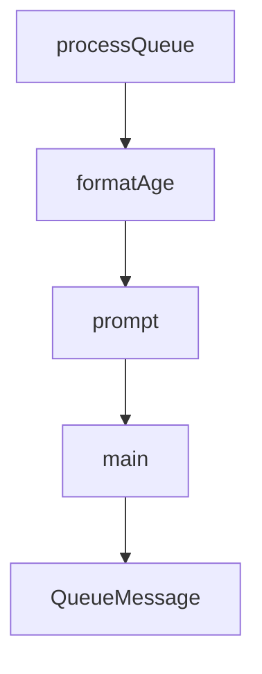

# Chapter 7: Troubleshooting, Recovery, and Reliability

Welcome to **Chapter 7: Troubleshooting, Recovery, and Reliability**. In this part of **Claude-Mem Tutorial: Persistent Memory Compression for Claude Code**, you will build an intuitive mental model first, then move into concrete implementation details and practical production tradeoffs.


This chapter covers incident-response patterns for the most common runtime and data issues.

## Learning Goals

- diagnose worker, hook, and database failures quickly
- recover stalled observation pipelines safely
- handle search/tool unavailability and token-limit errors
- build a repeatable reliability feedback loop

## High-Frequency Failure Domains

- worker service startup or crash loops
- hook execution failures and timeout issues
- SQLite lock/corruption/performance degradation
- MCP search tool misconfiguration or empty result sets

## Recovery Pattern

1. confirm service health and logs
2. verify queue/session state and failed tasks
3. run targeted recovery flow before full replay
4. re-test with small scoped search and injection checks

## Source References

- [Troubleshooting Guide](https://docs.claude-mem.ai/troubleshooting)
- [README Troubleshooting](https://github.com/thedotmack/claude-mem/blob/main/README.md#troubleshooting)
- [Manual Recovery Docs](https://docs.claude-mem.ai/usage/manual-recovery)

## Summary

You now have a practical reliability playbook for Claude-Mem operations.

Next: [Chapter 8: Contribution Workflow and Governance](08-contribution-workflow-and-governance.md)

## Source Code Walkthrough

### `scripts/check-pending-queue.ts`

The `processQueue` function in [`scripts/check-pending-queue.ts`](https://github.com/thedotmack/claude-mem/blob/HEAD/scripts/check-pending-queue.ts) handles a key part of this chapter's functionality:

```ts
}

async function processQueue(limit: number): Promise<ProcessResponse> {
  const res = await fetch(`${WORKER_URL}/api/pending-queue/process`, {
    method: 'POST',
    headers: { 'Content-Type': 'application/json' },
    body: JSON.stringify({ sessionLimit: limit })
  });
  if (!res.ok) {
    throw new Error(`Failed to process queue: ${res.status}`);
  }
  return res.json();
}

function formatAge(epochMs: number): string {
  const ageMs = Date.now() - epochMs;
  const minutes = Math.floor(ageMs / 60000);
  const hours = Math.floor(minutes / 60);
  const days = Math.floor(hours / 24);

  if (days > 0) return `${days}d ${hours % 24}h ago`;
  if (hours > 0) return `${hours}h ${minutes % 60}m ago`;
  return `${minutes}m ago`;
}

async function prompt(question: string): Promise<string> {
  // Check if we have a TTY for interactive input
  if (!process.stdin.isTTY) {
    console.log(question + '(no TTY, use --process flag for non-interactive mode)');
    return 'n';
  }

```

This function is important because it defines how Claude-Mem Tutorial: Persistent Memory Compression for Claude Code implements the patterns covered in this chapter.

### `scripts/check-pending-queue.ts`

The `formatAge` function in [`scripts/check-pending-queue.ts`](https://github.com/thedotmack/claude-mem/blob/HEAD/scripts/check-pending-queue.ts) handles a key part of this chapter's functionality:

```ts
}

function formatAge(epochMs: number): string {
  const ageMs = Date.now() - epochMs;
  const minutes = Math.floor(ageMs / 60000);
  const hours = Math.floor(minutes / 60);
  const days = Math.floor(hours / 24);

  if (days > 0) return `${days}d ${hours % 24}h ago`;
  if (hours > 0) return `${hours}h ${minutes % 60}m ago`;
  return `${minutes}m ago`;
}

async function prompt(question: string): Promise<string> {
  // Check if we have a TTY for interactive input
  if (!process.stdin.isTTY) {
    console.log(question + '(no TTY, use --process flag for non-interactive mode)');
    return 'n';
  }

  return new Promise((resolve) => {
    process.stdout.write(question);
    process.stdin.setRawMode(false);
    process.stdin.resume();
    process.stdin.once('data', (data) => {
      process.stdin.pause();
      resolve(data.toString().trim());
    });
  });
}

async function main() {
```

This function is important because it defines how Claude-Mem Tutorial: Persistent Memory Compression for Claude Code implements the patterns covered in this chapter.

### `scripts/check-pending-queue.ts`

The `prompt` function in [`scripts/check-pending-queue.ts`](https://github.com/thedotmack/claude-mem/blob/HEAD/scripts/check-pending-queue.ts) handles a key part of this chapter's functionality:

```ts
 *
 * Usage:
 *   bun scripts/check-pending-queue.ts           # Check status and prompt to process
 *   bun scripts/check-pending-queue.ts --process # Auto-process without prompting
 *   bun scripts/check-pending-queue.ts --limit 5 # Process up to 5 sessions
 */

const WORKER_URL = 'http://localhost:37777';

interface QueueMessage {
  id: number;
  session_db_id: number;
  message_type: string;
  tool_name: string | null;
  status: 'pending' | 'processing' | 'failed';
  retry_count: number;
  created_at_epoch: number;
  project: string | null;
}

interface QueueResponse {
  queue: {
    messages: QueueMessage[];
    totalPending: number;
    totalProcessing: number;
    totalFailed: number;
    stuckCount: number;
  };
  recentlyProcessed: QueueMessage[];
  sessionsWithPendingWork: number[];
}

```

This function is important because it defines how Claude-Mem Tutorial: Persistent Memory Compression for Claude Code implements the patterns covered in this chapter.

### `scripts/check-pending-queue.ts`

The `main` function in [`scripts/check-pending-queue.ts`](https://github.com/thedotmack/claude-mem/blob/HEAD/scripts/check-pending-queue.ts) handles a key part of this chapter's functionality:

```ts
}

async function main() {
  const args = process.argv.slice(2);

  // Help flag
  if (args.includes('--help') || args.includes('-h')) {
    console.log(`
Claude-Mem Pending Queue Manager

Check and process pending observation queue backlog.

Usage:
  bun scripts/check-pending-queue.ts [options]

Options:
  --help, -h     Show this help message
  --process      Auto-process without prompting
  --limit N      Process up to N sessions (default: 10)

Examples:
  # Check queue status interactively
  bun scripts/check-pending-queue.ts

  # Auto-process up to 10 sessions
  bun scripts/check-pending-queue.ts --process

  # Process up to 5 sessions
  bun scripts/check-pending-queue.ts --process --limit 5

What is this for?
  If the claude-mem worker crashes or restarts, pending observations may
```

This function is important because it defines how Claude-Mem Tutorial: Persistent Memory Compression for Claude Code implements the patterns covered in this chapter.


## How These Components Connect


