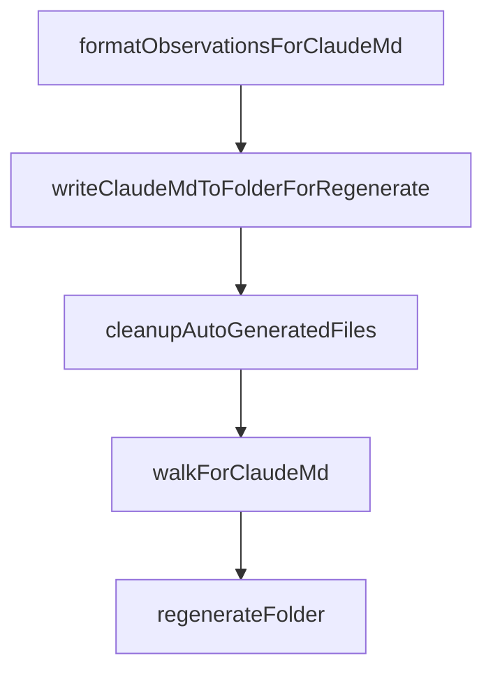

# Chapter 7: Troubleshooting, Recovery, and Reliability

Welcome to **Chapter 7: Troubleshooting, Recovery, and Reliability**. In this part of **Claude-Mem Tutorial: Persistent Memory Compression for Claude Code**, you will build an intuitive mental model first, then move into concrete implementation details and practical production tradeoffs.


This chapter covers incident-response patterns for the most common runtime and data issues.

## Learning Goals

- diagnose worker, hook, and database failures quickly
- recover stalled observation pipelines safely
- handle search/tool unavailability and token-limit errors
- build a repeatable reliability feedback loop

## High-Frequency Failure Domains

- worker service startup or crash loops
- hook execution failures and timeout issues
- SQLite lock/corruption/performance degradation
- MCP search tool misconfiguration or empty result sets

## Recovery Pattern

1. confirm service health and logs
2. verify queue/session state and failed tasks
3. run targeted recovery flow before full replay
4. re-test with small scoped search and injection checks

## Source References

- [Troubleshooting Guide](https://docs.claude-mem.ai/troubleshooting)
- [README Troubleshooting](https://github.com/thedotmack/claude-mem/blob/main/README.md#troubleshooting)
- [Manual Recovery Docs](https://docs.claude-mem.ai/usage/manual-recovery)

## Summary

You now have a practical reliability playbook for Claude-Mem operations.

Next: [Chapter 8: Contribution Workflow and Governance](08-contribution-workflow-and-governance.md)

## Depth Expansion Playbook

## Source Code Walkthrough

### `scripts/regenerate-claude-md.ts`

The `formatObservationsForClaudeMd` function in [`scripts/regenerate-claude-md.ts`](https://github.com/thedotmack/claude-mem/blob/HEAD/scripts/regenerate-claude-md.ts) handles a key part of this chapter's functionality:

```ts
 * Format observations for CLAUDE.md content
 */
function formatObservationsForClaudeMd(observations: ObservationRow[], folderPath: string): string {
  const lines: string[] = [];
  lines.push('# Recent Activity');
  lines.push('');

  if (observations.length === 0) {
    return '';
  }

  const byDate = groupByDate(observations, obs => obs.created_at);

  for (const [day, dayObs] of byDate) {
    lines.push(`### ${day}`);
    lines.push('');

    const byFile = new Map<string, ObservationRow[]>();
    for (const obs of dayObs) {
      const file = extractRelevantFile(obs, folderPath);
      if (!byFile.has(file)) byFile.set(file, []);
      byFile.get(file)!.push(obs);
    }

    for (const [file, fileObs] of byFile) {
      lines.push(`**${file}**`);
      lines.push('| ID | Time | T | Title | Read |');
      lines.push('|----|------|---|-------|------|');

      let lastTime = '';
      for (const obs of fileObs) {
        const time = formatTime(obs.created_at_epoch);
```

This function is important because it defines how Claude-Mem Tutorial: Persistent Memory Compression for Claude Code implements the patterns covered in this chapter.

### `scripts/regenerate-claude-md.ts`

The `writeClaudeMdToFolderForRegenerate` function in [`scripts/regenerate-claude-md.ts`](https://github.com/thedotmack/claude-mem/blob/HEAD/scripts/regenerate-claude-md.ts) handles a key part of this chapter's functionality:

```ts
 * which only writes to existing folders.
 */
function writeClaudeMdToFolderForRegenerate(folderPath: string, newContent: string): void {
  const resolvedPath = path.resolve(folderPath);

  // Never write inside .git directories — corrupts refs (#1165)
  if (resolvedPath.includes('/.git/') || resolvedPath.includes('\\.git\\') || resolvedPath.endsWith('/.git') || resolvedPath.endsWith('\\.git')) return;

  const claudeMdPath = path.join(folderPath, 'CLAUDE.md');
  const tempFile = `${claudeMdPath}.tmp`;

  // For regenerate CLI, we create the folder if needed
  mkdirSync(folderPath, { recursive: true });

  // Read existing content if file exists
  let existingContent = '';
  if (existsSync(claudeMdPath)) {
    existingContent = readFileSync(claudeMdPath, 'utf-8');
  }

  // Use shared utility to preserve user content outside tags
  const finalContent = replaceTaggedContent(existingContent, newContent);

  // Atomic write: temp file + rename
  writeFileSync(tempFile, finalContent);
  renameSync(tempFile, claudeMdPath);
}

/**
 * Clean up auto-generated CLAUDE.md files
 *
 * For each file with <claude-mem-context> tags:
```

This function is important because it defines how Claude-Mem Tutorial: Persistent Memory Compression for Claude Code implements the patterns covered in this chapter.

### `scripts/regenerate-claude-md.ts`

The `cleanupAutoGeneratedFiles` function in [`scripts/regenerate-claude-md.ts`](https://github.com/thedotmack/claude-mem/blob/HEAD/scripts/regenerate-claude-md.ts) handles a key part of this chapter's functionality:

```ts
 * - If has remaining content → save the stripped version
 */
function cleanupAutoGeneratedFiles(workingDir: string, dryRun: boolean): void {
  console.log('=== CLAUDE.md Cleanup Mode ===\n');
  console.log(`Scanning ${workingDir} for CLAUDE.md files with auto-generated content...\n`);

  const filesToProcess: string[] = [];

  // Walk directories to find CLAUDE.md files
  function walkForClaudeMd(dir: string): void {
    const ignorePatterns = ['node_modules', '.git', '.next', 'dist', 'build'];

    try {
      const entries = readdirSync(dir, { withFileTypes: true });
      for (const entry of entries) {
        const fullPath = path.join(dir, entry.name);

        if (entry.isDirectory()) {
          if (!ignorePatterns.includes(entry.name)) {
            walkForClaudeMd(fullPath);
          }
        } else if (entry.name === 'CLAUDE.md') {
          // Check if file contains auto-generated content
          try {
            const content = readFileSync(fullPath, 'utf-8');
            if (content.includes('<claude-mem-context>')) {
              filesToProcess.push(fullPath);
            }
          } catch {
            // Skip files we can't read
          }
        }
```

This function is important because it defines how Claude-Mem Tutorial: Persistent Memory Compression for Claude Code implements the patterns covered in this chapter.

### `scripts/regenerate-claude-md.ts`

The `walkForClaudeMd` function in [`scripts/regenerate-claude-md.ts`](https://github.com/thedotmack/claude-mem/blob/HEAD/scripts/regenerate-claude-md.ts) handles a key part of this chapter's functionality:

```ts

  // Walk directories to find CLAUDE.md files
  function walkForClaudeMd(dir: string): void {
    const ignorePatterns = ['node_modules', '.git', '.next', 'dist', 'build'];

    try {
      const entries = readdirSync(dir, { withFileTypes: true });
      for (const entry of entries) {
        const fullPath = path.join(dir, entry.name);

        if (entry.isDirectory()) {
          if (!ignorePatterns.includes(entry.name)) {
            walkForClaudeMd(fullPath);
          }
        } else if (entry.name === 'CLAUDE.md') {
          // Check if file contains auto-generated content
          try {
            const content = readFileSync(fullPath, 'utf-8');
            if (content.includes('<claude-mem-context>')) {
              filesToProcess.push(fullPath);
            }
          } catch {
            // Skip files we can't read
          }
        }
      }
    } catch {
      // Ignore permission errors
    }
  }

  walkForClaudeMd(workingDir);
```

This function is important because it defines how Claude-Mem Tutorial: Persistent Memory Compression for Claude Code implements the patterns covered in this chapter.


## How These Components Connect


