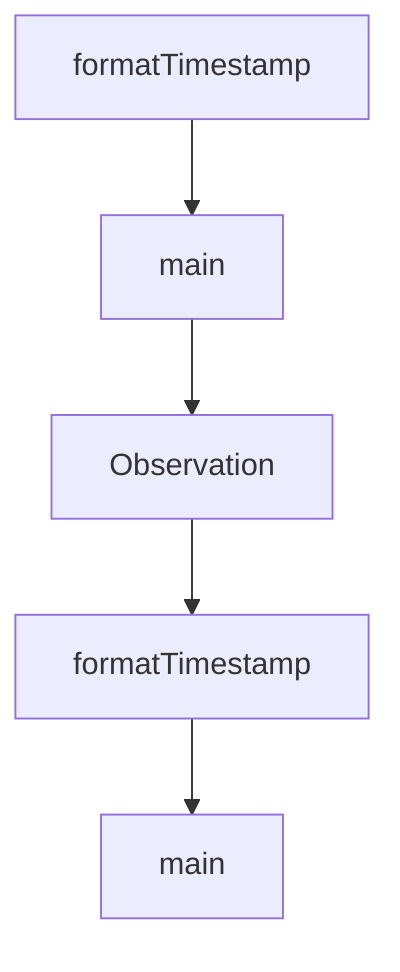

# Chapter 8: Contribution Workflow and Governance

Welcome to **Chapter 8: Contribution Workflow and Governance**. In this part of **Claude-Mem Tutorial: Persistent Memory Compression for Claude Code**, you will build an intuitive mental model first, then move into concrete implementation details and practical production tradeoffs.


This chapter explains how to contribute safely to a memory infrastructure project where reliability and data integrity are critical.

## Learning Goals

- follow contribution flow with strong test and docs discipline
- contribute changes without degrading context quality
- apply governance controls to high-impact memory features
- align operational documentation with code changes

## Contribution Workflow

1. open issue or validate existing issue scope
2. implement focused change in feature branch
3. run tests and validate memory behavior end-to-end
4. update docs for behavior, settings, or workflow changes
5. submit PR with explicit validation evidence

## Governance Priorities

- reliability over novelty for core capture/retrieval logic
- explicit migration notes for config and storage changes
- reproducible troubleshooting guidance for every major feature
- clear version/channel communication for experimental capabilities

## Source References

- [README Contributing](https://github.com/thedotmack/claude-mem/blob/main/README.md#contributing)
- [Development Docs](https://docs.claude-mem.ai/development)
- [Architecture Evolution](https://docs.claude-mem.ai/architecture-evolution)

## Summary

You now have an end-to-end model for adopting and contributing to Claude-Mem responsibly.

Next steps:

- define your team's memory governance defaults
- pilot progressive-disclosure search patterns in daily work
- contribute one reliability improvement with tests and documentation

## Source Code Walkthrough

### `scripts/verify-timestamp-fix.ts`

The `formatTimestamp` function in [`scripts/verify-timestamp-fix.ts`](https://github.com/thedotmack/claude-mem/blob/HEAD/scripts/verify-timestamp-fix.ts) handles a key part of this chapter's functionality:

```ts
}

function formatTimestamp(epoch: number): string {
  return new Date(epoch).toLocaleString('en-US', {
    timeZone: 'America/Los_Angeles',
    year: 'numeric',
    month: 'short',
    day: 'numeric',
    hour: '2-digit',
    minute: '2-digit',
    second: '2-digit'
  });
}

function main() {
  console.log('🔍 Verifying timestamp fix...\n');

  const db = new Database(DB_PATH);

  try {
    // Check 1: Observations still in bad window
    console.log('Check 1: Looking for observations still in bad window (Dec 24 19:45-20:31)...');
    const badWindowObs = db.query<Observation, []>(`
      SELECT id, memory_session_id, created_at_epoch, created_at, title
      FROM observations
      WHERE created_at_epoch >= ${BAD_WINDOW_START}
        AND created_at_epoch <= ${BAD_WINDOW_END}
      ORDER BY id
    `).all();

    if (badWindowObs.length === 0) {
      console.log('✅ No observations found in bad window - GOOD!\n');
```

This function is important because it defines how Claude-Mem Tutorial: Persistent Memory Compression for Claude Code implements the patterns covered in this chapter.

### `scripts/verify-timestamp-fix.ts`

The `main` function in [`scripts/verify-timestamp-fix.ts`](https://github.com/thedotmack/claude-mem/blob/HEAD/scripts/verify-timestamp-fix.ts) handles a key part of this chapter's functionality:

```ts
 *
 * This script verifies that the timestamp corruption has been properly fixed.
 * It checks for any remaining observations in the bad window that shouldn't be there.
 */

import Database from 'bun:sqlite';
import { resolve } from 'path';

const DB_PATH = resolve(process.env.HOME!, '.claude-mem/claude-mem.db');

// Bad window: Dec 24 19:45-20:31 (using actual epoch format from database)
const BAD_WINDOW_START = 1766623500000; // Dec 24 19:45 PST
const BAD_WINDOW_END = 1766626260000;   // Dec 24 20:31 PST

// Original corruption window: Dec 16-22 (when sessions actually started)
const ORIGINAL_WINDOW_START = 1765914000000; // Dec 16 00:00 PST
const ORIGINAL_WINDOW_END = 1766613600000;   // Dec 23 23:59 PST

interface Observation {
  id: number;
  memory_session_id: string;
  created_at_epoch: number;
  created_at: string;
  title: string;
}

function formatTimestamp(epoch: number): string {
  return new Date(epoch).toLocaleString('en-US', {
    timeZone: 'America/Los_Angeles',
    year: 'numeric',
    month: 'short',
    day: 'numeric',
```

This function is important because it defines how Claude-Mem Tutorial: Persistent Memory Compression for Claude Code implements the patterns covered in this chapter.

### `scripts/verify-timestamp-fix.ts`

The `Observation` interface in [`scripts/verify-timestamp-fix.ts`](https://github.com/thedotmack/claude-mem/blob/HEAD/scripts/verify-timestamp-fix.ts) handles a key part of this chapter's functionality:

```ts
const ORIGINAL_WINDOW_END = 1766613600000;   // Dec 23 23:59 PST

interface Observation {
  id: number;
  memory_session_id: string;
  created_at_epoch: number;
  created_at: string;
  title: string;
}

function formatTimestamp(epoch: number): string {
  return new Date(epoch).toLocaleString('en-US', {
    timeZone: 'America/Los_Angeles',
    year: 'numeric',
    month: 'short',
    day: 'numeric',
    hour: '2-digit',
    minute: '2-digit',
    second: '2-digit'
  });
}

function main() {
  console.log('🔍 Verifying timestamp fix...\n');

  const db = new Database(DB_PATH);

  try {
    // Check 1: Observations still in bad window
    console.log('Check 1: Looking for observations still in bad window (Dec 24 19:45-20:31)...');
    const badWindowObs = db.query<Observation, []>(`
      SELECT id, memory_session_id, created_at_epoch, created_at, title
```

This interface is important because it defines how Claude-Mem Tutorial: Persistent Memory Compression for Claude Code implements the patterns covered in this chapter.

### `scripts/validate-timestamp-logic.ts`

The `formatTimestamp` function in [`scripts/validate-timestamp-logic.ts`](https://github.com/thedotmack/claude-mem/blob/HEAD/scripts/validate-timestamp-logic.ts) handles a key part of this chapter's functionality:

```ts
const DB_PATH = resolve(process.env.HOME!, '.claude-mem/claude-mem.db');

function formatTimestamp(epoch: number): string {
  return new Date(epoch).toLocaleString('en-US', {
    timeZone: 'America/Los_Angeles',
    year: 'numeric',
    month: 'short',
    day: 'numeric',
    hour: '2-digit',
    minute: '2-digit',
    second: '2-digit'
  });
}

function main() {
  console.log('🔍 Validating timestamp logic for backlog processing...\n');

  const db = new Database(DB_PATH);

  try {
    // Check for pending messages
    const pendingStats = db.query(`
      SELECT
        status,
        COUNT(*) as count,
        MIN(created_at_epoch) as earliest,
        MAX(created_at_epoch) as latest
      FROM pending_messages
      GROUP BY status
      ORDER BY status
    `).all();

```

This function is important because it defines how Claude-Mem Tutorial: Persistent Memory Compression for Claude Code implements the patterns covered in this chapter.


## How These Components Connect


