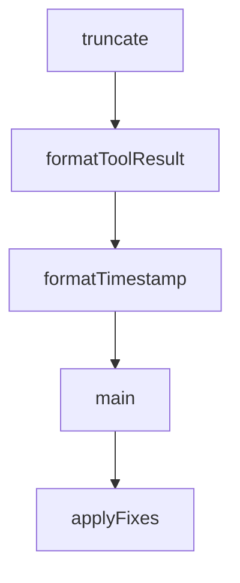

# Chapter 8: Contribution Workflow and Governance

Welcome to **Chapter 8: Contribution Workflow and Governance**. In this part of **Claude-Mem Tutorial: Persistent Memory Compression for Claude Code**, you will build an intuitive mental model first, then move into concrete implementation details and practical production tradeoffs.


This chapter explains how to contribute safely to a memory infrastructure project where reliability and data integrity are critical.

## Learning Goals

- follow contribution flow with strong test and docs discipline
- contribute changes without degrading context quality
- apply governance controls to high-impact memory features
- align operational documentation with code changes

## Contribution Workflow

1. open issue or validate existing issue scope
2. implement focused change in feature branch
3. run tests and validate memory behavior end-to-end
4. update docs for behavior, settings, or workflow changes
5. submit PR with explicit validation evidence

## Governance Priorities

- reliability over novelty for core capture/retrieval logic
- explicit migration notes for config and storage changes
- reproducible troubleshooting guidance for every major feature
- clear version/channel communication for experimental capabilities

## Source References

- [README Contributing](https://github.com/thedotmack/claude-mem/blob/main/README.md#contributing)
- [Development Docs](https://docs.claude-mem.ai/development)
- [Architecture Evolution](https://docs.claude-mem.ai/architecture-evolution)

## Summary

You now have an end-to-end model for adopting and contributing to Claude-Mem responsibly.

Next steps:

- define your team's memory governance defaults
- pilot progressive-disclosure search patterns in daily work
- contribute one reliability improvement with tests and documentation

## Depth Expansion Playbook

## Source Code Walkthrough

### `scripts/transcript-to-markdown.ts`

The `truncate` function in [`scripts/transcript-to-markdown.ts`](https://github.com/thedotmack/claude-mem/blob/HEAD/scripts/transcript-to-markdown.ts) handles a key part of this chapter's functionality:

```ts
 * Truncate string to max length, adding ellipsis if needed
 */
function truncate(str: string, maxLen: number = 500): string {
  if (str.length <= maxLen) return str;
  return str.substring(0, maxLen) + '\n... [truncated]';
}

/**
 * Format tool result content for display
 */
function formatToolResult(result: ToolResultContent): string {
  if (typeof result.content === 'string') {
    // Try to parse as JSON for better formatting
    try {
      const parsed = JSON.parse(result.content);
      return JSON.stringify(parsed, null, 2);
    } catch {
      return truncate(result.content);
    }
  }

  if (Array.isArray(result.content)) {
    // Handle array of content items - extract text and parse if JSON
    const formatted = result.content.map((item: any) => {
      if (item.type === 'text' && item.text) {
        try {
          const parsed = JSON.parse(item.text);
          return JSON.stringify(parsed, null, 2);
        } catch {
          return item.text;
        }
      }
```

This function is important because it defines how Claude-Mem Tutorial: Persistent Memory Compression for Claude Code implements the patterns covered in this chapter.

### `scripts/transcript-to-markdown.ts`

The `formatToolResult` function in [`scripts/transcript-to-markdown.ts`](https://github.com/thedotmack/claude-mem/blob/HEAD/scripts/transcript-to-markdown.ts) handles a key part of this chapter's functionality:

```ts
 * Format tool result content for display
 */
function formatToolResult(result: ToolResultContent): string {
  if (typeof result.content === 'string') {
    // Try to parse as JSON for better formatting
    try {
      const parsed = JSON.parse(result.content);
      return JSON.stringify(parsed, null, 2);
    } catch {
      return truncate(result.content);
    }
  }

  if (Array.isArray(result.content)) {
    // Handle array of content items - extract text and parse if JSON
    const formatted = result.content.map((item: any) => {
      if (item.type === 'text' && item.text) {
        try {
          const parsed = JSON.parse(item.text);
          return JSON.stringify(parsed, null, 2);
        } catch {
          return item.text;
        }
      }
      return JSON.stringify(item, null, 2);
    }).join('\n\n');

    return formatted;
  }

  return '[unknown result type]';
}
```

This function is important because it defines how Claude-Mem Tutorial: Persistent Memory Compression for Claude Code implements the patterns covered in this chapter.

### `scripts/fix-all-timestamps.ts`

The `formatTimestamp` function in [`scripts/fix-all-timestamps.ts`](https://github.com/thedotmack/claude-mem/blob/HEAD/scripts/fix-all-timestamps.ts) handles a key part of this chapter's functionality:

```ts
}

function formatTimestamp(epoch: number): string {
  return new Date(epoch).toLocaleString('en-US', {
    timeZone: 'America/Los_Angeles',
    year: 'numeric',
    month: 'short',
    day: 'numeric',
    hour: '2-digit',
    minute: '2-digit',
    second: '2-digit'
  });
}

function main() {
  const args = process.argv.slice(2);
  const dryRun = args.includes('--dry-run');
  const autoYes = args.includes('--yes') || args.includes('-y');

  console.log('🔍 Finding ALL observations with timestamp corruption...\n');
  if (dryRun) {
    console.log('🏃 DRY RUN MODE - No changes will be made\n');
  }

  const db = new Database(DB_PATH);

  try {
    // Find all observations where timestamp doesn't match session
    const corrupted = db.query<CorruptedObservation, []>(`
      SELECT
        o.id as obs_id,
        o.title as obs_title,
```

This function is important because it defines how Claude-Mem Tutorial: Persistent Memory Compression for Claude Code implements the patterns covered in this chapter.

### `scripts/fix-all-timestamps.ts`

The `main` function in [`scripts/fix-all-timestamps.ts`](https://github.com/thedotmack/claude-mem/blob/HEAD/scripts/fix-all-timestamps.ts) handles a key part of this chapter's functionality:

```ts
}

function main() {
  const args = process.argv.slice(2);
  const dryRun = args.includes('--dry-run');
  const autoYes = args.includes('--yes') || args.includes('-y');

  console.log('🔍 Finding ALL observations with timestamp corruption...\n');
  if (dryRun) {
    console.log('🏃 DRY RUN MODE - No changes will be made\n');
  }

  const db = new Database(DB_PATH);

  try {
    // Find all observations where timestamp doesn't match session
    const corrupted = db.query<CorruptedObservation, []>(`
      SELECT
        o.id as obs_id,
        o.title as obs_title,
        o.created_at_epoch as obs_created,
        s.started_at_epoch as session_started,
        s.completed_at_epoch as session_completed,
        s.memory_session_id
      FROM observations o
      JOIN sdk_sessions s ON o.memory_session_id = s.memory_session_id
      WHERE o.created_at_epoch < s.started_at_epoch  -- Observation older than session
         OR (s.completed_at_epoch IS NOT NULL
             AND o.created_at_epoch > (s.completed_at_epoch + 3600000))  -- More than 1hr after session
      ORDER BY o.id
    `).all();

```

This function is important because it defines how Claude-Mem Tutorial: Persistent Memory Compression for Claude Code implements the patterns covered in this chapter.


## How These Components Connect


