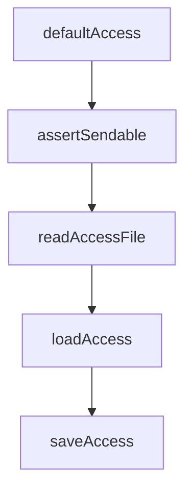

# Chapter 1: Getting Started

Welcome to **Chapter 1: Getting Started**. In this part of **Claude Plugins Official Tutorial: Anthropic's Managed Plugin Directory**, you will build an intuitive mental model first, then move into concrete implementation details and practical production tradeoffs.


This chapter gets you installing and running plugins from the official directory.

## Learning Goals

- connect Claude Code to the official plugin directory
- install one internal plugin and validate command availability
- inspect plugin metadata and initial behavior
- establish baseline trust checks before daily use

## Install Flow

In Claude Code:

```text
/plugin install {plugin-name}@claude-plugin-directory
```

You can also discover plugins through:

```text
/plugin
```

## First Validation Steps

- install a focused plugin (for example `code-review`)
- run one documented command from that plugin
- verify expected behavior and output quality
- remove or disable plugins that are not immediately useful

## Source References

- [Directory README Installation](https://github.com/anthropics/claude-plugins-official/blob/main/README.md#installation)
- [Code Review Plugin Example](https://github.com/anthropics/claude-plugins-official/tree/main/plugins/code-review)
- [Official Plugin Docs](https://code.claude.com/docs/en/plugins)

## Summary

You now have a working baseline for installing and using directory plugins.

Next: [Chapter 2: Directory Architecture and Marketplace Model](02-directory-architecture-and-marketplace-model.md)

## Source Code Walkthrough

### `external_plugins/discord/server.ts`

The `defaultAccess` function in [`external_plugins/discord/server.ts`](https://github.com/anthropics/claude-plugins-official/blob/HEAD/external_plugins/discord/server.ts) handles a key part of this chapter's functionality:

```ts
}

function defaultAccess(): Access {
  return {
    dmPolicy: 'pairing',
    allowFrom: [],
    groups: {},
    pending: {},
  }
}

const MAX_CHUNK_LIMIT = 2000
const MAX_ATTACHMENT_BYTES = 25 * 1024 * 1024

// reply's files param takes any path. .env is ~60 bytes and ships as an
// upload. Claude can already Read+paste file contents, so this isn't a new
// exfil channel for arbitrary paths — but the server's own state is the one
// thing Claude has no reason to ever send.
function assertSendable(f: string): void {
  let real, stateReal: string
  try {
    real = realpathSync(f)
    stateReal = realpathSync(STATE_DIR)
  } catch { return } // statSync will fail properly; or STATE_DIR absent → nothing to leak
  const inbox = join(stateReal, 'inbox')
  if (real.startsWith(stateReal + sep) && !real.startsWith(inbox + sep)) {
    throw new Error(`refusing to send channel state: ${f}`)
  }
}

function readAccessFile(): Access {
  try {
```

This function is important because it defines how Claude Plugins Official Tutorial: Anthropic's Managed Plugin Directory implements the patterns covered in this chapter.

### `external_plugins/discord/server.ts`

The `assertSendable` function in [`external_plugins/discord/server.ts`](https://github.com/anthropics/claude-plugins-official/blob/HEAD/external_plugins/discord/server.ts) handles a key part of this chapter's functionality:

```ts
// exfil channel for arbitrary paths — but the server's own state is the one
// thing Claude has no reason to ever send.
function assertSendable(f: string): void {
  let real, stateReal: string
  try {
    real = realpathSync(f)
    stateReal = realpathSync(STATE_DIR)
  } catch { return } // statSync will fail properly; or STATE_DIR absent → nothing to leak
  const inbox = join(stateReal, 'inbox')
  if (real.startsWith(stateReal + sep) && !real.startsWith(inbox + sep)) {
    throw new Error(`refusing to send channel state: ${f}`)
  }
}

function readAccessFile(): Access {
  try {
    const raw = readFileSync(ACCESS_FILE, 'utf8')
    const parsed = JSON.parse(raw) as Partial<Access>
    return {
      dmPolicy: parsed.dmPolicy ?? 'pairing',
      allowFrom: parsed.allowFrom ?? [],
      groups: parsed.groups ?? {},
      pending: parsed.pending ?? {},
      mentionPatterns: parsed.mentionPatterns,
      ackReaction: parsed.ackReaction,
      replyToMode: parsed.replyToMode,
      textChunkLimit: parsed.textChunkLimit,
      chunkMode: parsed.chunkMode,
    }
  } catch (err) {
    if ((err as NodeJS.ErrnoException).code === 'ENOENT') return defaultAccess()
    try { renameSync(ACCESS_FILE, `${ACCESS_FILE}.corrupt-${Date.now()}`) } catch {}
```

This function is important because it defines how Claude Plugins Official Tutorial: Anthropic's Managed Plugin Directory implements the patterns covered in this chapter.

### `external_plugins/discord/server.ts`

The `readAccessFile` function in [`external_plugins/discord/server.ts`](https://github.com/anthropics/claude-plugins-official/blob/HEAD/external_plugins/discord/server.ts) handles a key part of this chapter's functionality:

```ts
}

function readAccessFile(): Access {
  try {
    const raw = readFileSync(ACCESS_FILE, 'utf8')
    const parsed = JSON.parse(raw) as Partial<Access>
    return {
      dmPolicy: parsed.dmPolicy ?? 'pairing',
      allowFrom: parsed.allowFrom ?? [],
      groups: parsed.groups ?? {},
      pending: parsed.pending ?? {},
      mentionPatterns: parsed.mentionPatterns,
      ackReaction: parsed.ackReaction,
      replyToMode: parsed.replyToMode,
      textChunkLimit: parsed.textChunkLimit,
      chunkMode: parsed.chunkMode,
    }
  } catch (err) {
    if ((err as NodeJS.ErrnoException).code === 'ENOENT') return defaultAccess()
    try { renameSync(ACCESS_FILE, `${ACCESS_FILE}.corrupt-${Date.now()}`) } catch {}
    process.stderr.write(`discord: access.json is corrupt, moved aside. Starting fresh.\n`)
    return defaultAccess()
  }
}

// In static mode, access is snapshotted at boot and never re-read or written.
// Pairing requires runtime mutation, so it's downgraded to allowlist with a
// startup warning — handing out codes that never get approved would be worse.
const BOOT_ACCESS: Access | null = STATIC
  ? (() => {
      const a = readAccessFile()
      if (a.dmPolicy === 'pairing') {
```

This function is important because it defines how Claude Plugins Official Tutorial: Anthropic's Managed Plugin Directory implements the patterns covered in this chapter.

### `external_plugins/discord/server.ts`

The `loadAccess` function in [`external_plugins/discord/server.ts`](https://github.com/anthropics/claude-plugins-official/blob/HEAD/external_plugins/discord/server.ts) handles a key part of this chapter's functionality:

```ts
  : null

function loadAccess(): Access {
  return BOOT_ACCESS ?? readAccessFile()
}

function saveAccess(a: Access): void {
  if (STATIC) return
  mkdirSync(STATE_DIR, { recursive: true, mode: 0o700 })
  const tmp = ACCESS_FILE + '.tmp'
  writeFileSync(tmp, JSON.stringify(a, null, 2) + '\n', { mode: 0o600 })
  renameSync(tmp, ACCESS_FILE)
}

function pruneExpired(a: Access): boolean {
  const now = Date.now()
  let changed = false
  for (const [code, p] of Object.entries(a.pending)) {
    if (p.expiresAt < now) {
      delete a.pending[code]
      changed = true
    }
  }
  return changed
}

type GateResult =
  | { action: 'deliver'; access: Access }
  | { action: 'drop' }
  | { action: 'pair'; code: string; isResend: boolean }

// Track message IDs we recently sent, so reply-to-bot in guild channels
```

This function is important because it defines how Claude Plugins Official Tutorial: Anthropic's Managed Plugin Directory implements the patterns covered in this chapter.


## How These Components Connect


