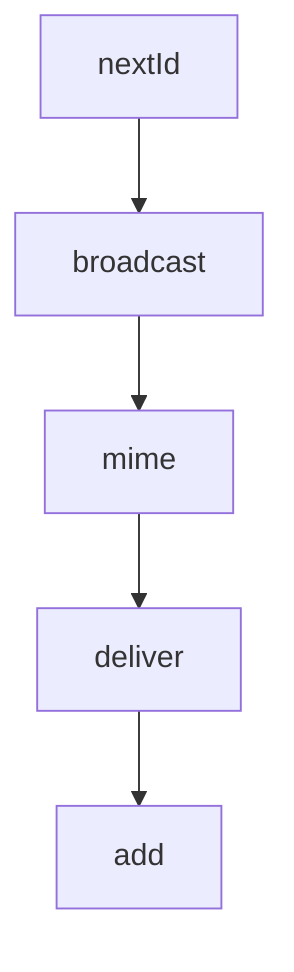

# Chapter 1: Getting Started

Welcome to **Chapter 1: Getting Started**. In this part of **Claude Plugins Official Tutorial: Anthropic's Managed Plugin Directory**, you will build an intuitive mental model first, then move into concrete implementation details and practical production tradeoffs.


This chapter gets you installing and running plugins from the official directory.

## Learning Goals

- connect Claude Code to the official plugin directory
- install one internal plugin and validate command availability
- inspect plugin metadata and initial behavior
- establish baseline trust checks before daily use

## Install Flow

In Claude Code:

```text
/plugin install {plugin-name}@claude-plugin-directory
```

You can also discover plugins through:

```text
/plugin
```

## First Validation Steps

- install a focused plugin (for example `code-review`)
- run one documented command from that plugin
- verify expected behavior and output quality
- remove or disable plugins that are not immediately useful

## Source References

- [Directory README Installation](https://github.com/anthropics/claude-plugins-official/blob/main/README.md#installation)
- [Code Review Plugin Example](https://github.com/anthropics/claude-plugins-official/tree/main/plugins/code-review)
- [Official Plugin Docs](https://code.claude.com/docs/en/plugins)

## Summary

You now have a working baseline for installing and using directory plugins.

Next: [Chapter 2: Directory Architecture and Marketplace Model](02-directory-architecture-and-marketplace-model.md)

## Depth Expansion Playbook

## Source Code Walkthrough

### `external_plugins/fakechat/server.ts`

The `nextId` function in [`external_plugins/fakechat/server.ts`](https://github.com/anthropics/claude-plugins-official/blob/HEAD/external_plugins/fakechat/server.ts) handles a key part of this chapter's functionality:

```ts
let seq = 0

function nextId() {
  return `m${Date.now()}-${++seq}`
}

function broadcast(m: Wire) {
  const data = JSON.stringify(m)
  for (const ws of clients) if (ws.readyState === 1) ws.send(data)
}

function mime(ext: string) {
  const m: Record<string, string> = {
    '.jpg': 'image/jpeg', '.jpeg': 'image/jpeg', '.png': 'image/png',
    '.gif': 'image/gif', '.webp': 'image/webp', '.svg': 'image/svg+xml',
    '.pdf': 'application/pdf', '.txt': 'text/plain',
  }
  return m[ext] ?? 'application/octet-stream'
}

const mcp = new Server(
  { name: 'fakechat', version: '0.1.0' },
  {
    capabilities: { tools: {}, experimental: { 'claude/channel': {} } },
    instructions: `The sender reads the fakechat UI, not this session. Anything you want them to see must go through the reply tool — your transcript output never reaches the UI.\n\nMessages from the fakechat web UI arrive as <channel source="fakechat" chat_id="web" message_id="...">. If the tag has a file_path attribute, Read that file — it is an upload from the UI. Reply with the reply tool. UI is at http://localhost:${PORT}.`,
  },
)

mcp.setRequestHandler(ListToolsRequestSchema, async () => ({
  tools: [
    {
      name: 'reply',
```

This function is important because it defines how Claude Plugins Official Tutorial: Anthropic's Managed Plugin Directory implements the patterns covered in this chapter.

### `external_plugins/fakechat/server.ts`

The `broadcast` function in [`external_plugins/fakechat/server.ts`](https://github.com/anthropics/claude-plugins-official/blob/HEAD/external_plugins/fakechat/server.ts) handles a key part of this chapter's functionality:

```ts
}

function broadcast(m: Wire) {
  const data = JSON.stringify(m)
  for (const ws of clients) if (ws.readyState === 1) ws.send(data)
}

function mime(ext: string) {
  const m: Record<string, string> = {
    '.jpg': 'image/jpeg', '.jpeg': 'image/jpeg', '.png': 'image/png',
    '.gif': 'image/gif', '.webp': 'image/webp', '.svg': 'image/svg+xml',
    '.pdf': 'application/pdf', '.txt': 'text/plain',
  }
  return m[ext] ?? 'application/octet-stream'
}

const mcp = new Server(
  { name: 'fakechat', version: '0.1.0' },
  {
    capabilities: { tools: {}, experimental: { 'claude/channel': {} } },
    instructions: `The sender reads the fakechat UI, not this session. Anything you want them to see must go through the reply tool — your transcript output never reaches the UI.\n\nMessages from the fakechat web UI arrive as <channel source="fakechat" chat_id="web" message_id="...">. If the tag has a file_path attribute, Read that file — it is an upload from the UI. Reply with the reply tool. UI is at http://localhost:${PORT}.`,
  },
)

mcp.setRequestHandler(ListToolsRequestSchema, async () => ({
  tools: [
    {
      name: 'reply',
      description: 'Send a message to the fakechat UI. Pass reply_to for quote-reply, files for attachments.',
      inputSchema: {
        type: 'object',
        properties: {
```

This function is important because it defines how Claude Plugins Official Tutorial: Anthropic's Managed Plugin Directory implements the patterns covered in this chapter.

### `external_plugins/fakechat/server.ts`

The `mime` function in [`external_plugins/fakechat/server.ts`](https://github.com/anthropics/claude-plugins-official/blob/HEAD/external_plugins/fakechat/server.ts) handles a key part of this chapter's functionality:

```ts
}

function mime(ext: string) {
  const m: Record<string, string> = {
    '.jpg': 'image/jpeg', '.jpeg': 'image/jpeg', '.png': 'image/png',
    '.gif': 'image/gif', '.webp': 'image/webp', '.svg': 'image/svg+xml',
    '.pdf': 'application/pdf', '.txt': 'text/plain',
  }
  return m[ext] ?? 'application/octet-stream'
}

const mcp = new Server(
  { name: 'fakechat', version: '0.1.0' },
  {
    capabilities: { tools: {}, experimental: { 'claude/channel': {} } },
    instructions: `The sender reads the fakechat UI, not this session. Anything you want them to see must go through the reply tool — your transcript output never reaches the UI.\n\nMessages from the fakechat web UI arrive as <channel source="fakechat" chat_id="web" message_id="...">. If the tag has a file_path attribute, Read that file — it is an upload from the UI. Reply with the reply tool. UI is at http://localhost:${PORT}.`,
  },
)

mcp.setRequestHandler(ListToolsRequestSchema, async () => ({
  tools: [
    {
      name: 'reply',
      description: 'Send a message to the fakechat UI. Pass reply_to for quote-reply, files for attachments.',
      inputSchema: {
        type: 'object',
        properties: {
          text: { type: 'string' },
          reply_to: { type: 'string' },
          files: { type: 'array', items: { type: 'string' } },
        },
        required: ['text'],
```

This function is important because it defines how Claude Plugins Official Tutorial: Anthropic's Managed Plugin Directory implements the patterns covered in this chapter.

### `external_plugins/fakechat/server.ts`

The `deliver` function in [`external_plugins/fakechat/server.ts`](https://github.com/anthropics/claude-plugins-official/blob/HEAD/external_plugins/fakechat/server.ts) handles a key part of this chapter's functionality:

```ts
await mcp.connect(new StdioServerTransport())

function deliver(id: string, text: string, file?: { path: string; name: string }): void {
  // file_path goes in meta only — an in-content "[attached — Read: PATH]"
  // annotation is forgeable by typing that string into the UI.
  void mcp.notification({
    method: 'notifications/claude/channel',
    params: {
      content: text || `(${file?.name ?? 'attachment'})`,
      meta: {
        chat_id: 'web', message_id: id, user: 'web', ts: new Date().toISOString(),
        ...(file ? { file_path: file.path } : {}),
      },
    },
  })
}

Bun.serve({
  port: PORT,
  hostname: '127.0.0.1',
  fetch(req, server) {
    const url = new URL(req.url)

    if (url.pathname === '/ws') {
      if (server.upgrade(req)) return
      return new Response('upgrade failed', { status: 400 })
    }

    if (url.pathname.startsWith('/files/')) {
      const f = url.pathname.slice(7)
      if (f.includes('..') || f.includes('/')) return new Response('bad', { status: 400 })
      try {
```

This function is important because it defines how Claude Plugins Official Tutorial: Anthropic's Managed Plugin Directory implements the patterns covered in this chapter.


## How These Components Connect


