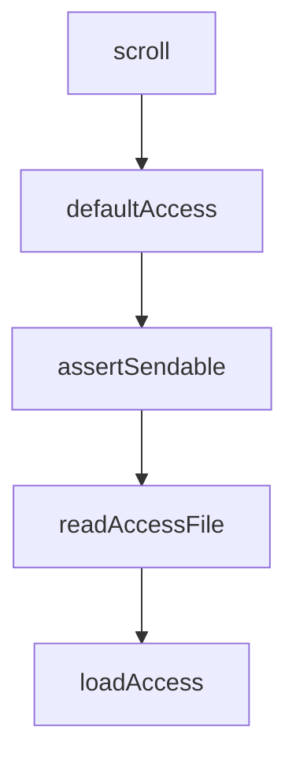

# Chapter 2: Directory Architecture and Marketplace Model

Welcome to **Chapter 2: Directory Architecture and Marketplace Model**. In this part of **Claude Plugins Official Tutorial: Anthropic's Managed Plugin Directory**, you will build an intuitive mental model first, then move into concrete implementation details and practical production tradeoffs.


This chapter explains the repository layout and curation model.

## Learning Goals

- distinguish internal plugins from external partner/community plugins
- understand how marketplace metadata is structured
- navigate plugin directories for capability discovery
- map directory structure to operational decisions

## Repository Topology

- `plugins/`: internal plugins maintained by Anthropic
- `external_plugins/`: third-party and partner plugins
- `.claude-plugin/marketplace.json`: marketplace-level catalog metadata

## Operational Implications

- internal plugins may align closely with official guidance patterns
- external plugins increase capability breadth but require stronger vetting
- marketplace metadata is the central source of installable plugin inventory

## Source References

- [Directory README Structure](https://github.com/anthropics/claude-plugins-official/blob/main/README.md#structure)
- [Marketplace Catalog](https://github.com/anthropics/claude-plugins-official/blob/main/.claude-plugin/marketplace.json)
- [Internal Plugins Directory](https://github.com/anthropics/claude-plugins-official/tree/main/plugins)
- [External Plugins Directory](https://github.com/anthropics/claude-plugins-official/tree/main/external_plugins)

## Summary

You now understand the curation and architecture layers of the directory.

Next: [Chapter 3: Plugin Manifest and Structural Contracts](03-plugin-manifest-and-structural-contracts.md)

## Depth Expansion Playbook

## Source Code Walkthrough

### `external_plugins/fakechat/server.ts`

The `scroll` function in [`external_plugins/fakechat/server.ts`](https://github.com/anthropics/claude-plugins-official/blob/HEAD/external_plugins/fakechat/server.ts) handles a key part of this chapter's functionality:

```ts
  const who = m.from === 'user' ? 'you' : 'bot'
  const el = line(who, m.text, m.replyTo, m.file)
  log.appendChild(el); scroll()
  msgs[m.id] = { body: el.querySelector('.body') }
}

function line(who, text, replyTo, file) {
  const div = document.createElement('div')
  const t = new Date().toTimeString().slice(0, 8)
  const reply = replyTo && msgs[replyTo] ? ' ↳ ' + (msgs[replyTo].body.textContent || '(file)').slice(0, 40) : ''
  div.innerHTML = '[' + t + '] <b>' + who + '</b>' + reply + ': <span class=body></span>'
  const body = div.querySelector('.body')
  body.textContent = text || ''
  if (file) {
    const indent = 11 + who.length + 2  // '[HH:MM:SS] ' + who + ': '
    if (text) body.appendChild(document.createTextNode('\\n' + ' '.repeat(indent)))
    const a = document.createElement('a')
    a.href = file.url; a.download = file.name; a.textContent = '[' + file.name + ']'
    body.appendChild(a)
  }
  return div
}

function scroll() { window.scrollTo(0, document.body.scrollHeight) }
input.addEventListener('keydown', e => { if (e.key === 'Enter' && !e.shiftKey) { e.preventDefault(); form.requestSubmit() } })
</script>
`

```

This function is important because it defines how Claude Plugins Official Tutorial: Anthropic's Managed Plugin Directory implements the patterns covered in this chapter.

### `external_plugins/discord/server.ts`

The `defaultAccess` function in [`external_plugins/discord/server.ts`](https://github.com/anthropics/claude-plugins-official/blob/HEAD/external_plugins/discord/server.ts) handles a key part of this chapter's functionality:

```ts
}

function defaultAccess(): Access {
  return {
    dmPolicy: 'pairing',
    allowFrom: [],
    groups: {},
    pending: {},
  }
}

const MAX_CHUNK_LIMIT = 2000
const MAX_ATTACHMENT_BYTES = 25 * 1024 * 1024

// reply's files param takes any path. .env is ~60 bytes and ships as an
// upload. Claude can already Read+paste file contents, so this isn't a new
// exfil channel for arbitrary paths — but the server's own state is the one
// thing Claude has no reason to ever send.
function assertSendable(f: string): void {
  let real, stateReal: string
  try {
    real = realpathSync(f)
    stateReal = realpathSync(STATE_DIR)
  } catch { return } // statSync will fail properly; or STATE_DIR absent → nothing to leak
  const inbox = join(stateReal, 'inbox')
  if (real.startsWith(stateReal + sep) && !real.startsWith(inbox + sep)) {
    throw new Error(`refusing to send channel state: ${f}`)
  }
}

function readAccessFile(): Access {
  try {
```

This function is important because it defines how Claude Plugins Official Tutorial: Anthropic's Managed Plugin Directory implements the patterns covered in this chapter.

### `external_plugins/discord/server.ts`

The `assertSendable` function in [`external_plugins/discord/server.ts`](https://github.com/anthropics/claude-plugins-official/blob/HEAD/external_plugins/discord/server.ts) handles a key part of this chapter's functionality:

```ts
// exfil channel for arbitrary paths — but the server's own state is the one
// thing Claude has no reason to ever send.
function assertSendable(f: string): void {
  let real, stateReal: string
  try {
    real = realpathSync(f)
    stateReal = realpathSync(STATE_DIR)
  } catch { return } // statSync will fail properly; or STATE_DIR absent → nothing to leak
  const inbox = join(stateReal, 'inbox')
  if (real.startsWith(stateReal + sep) && !real.startsWith(inbox + sep)) {
    throw new Error(`refusing to send channel state: ${f}`)
  }
}

function readAccessFile(): Access {
  try {
    const raw = readFileSync(ACCESS_FILE, 'utf8')
    const parsed = JSON.parse(raw) as Partial<Access>
    return {
      dmPolicy: parsed.dmPolicy ?? 'pairing',
      allowFrom: parsed.allowFrom ?? [],
      groups: parsed.groups ?? {},
      pending: parsed.pending ?? {},
      mentionPatterns: parsed.mentionPatterns,
      ackReaction: parsed.ackReaction,
      replyToMode: parsed.replyToMode,
      textChunkLimit: parsed.textChunkLimit,
      chunkMode: parsed.chunkMode,
    }
  } catch (err) {
    if ((err as NodeJS.ErrnoException).code === 'ENOENT') return defaultAccess()
    try { renameSync(ACCESS_FILE, `${ACCESS_FILE}.corrupt-${Date.now()}`) } catch {}
```

This function is important because it defines how Claude Plugins Official Tutorial: Anthropic's Managed Plugin Directory implements the patterns covered in this chapter.

### `external_plugins/discord/server.ts`

The `readAccessFile` function in [`external_plugins/discord/server.ts`](https://github.com/anthropics/claude-plugins-official/blob/HEAD/external_plugins/discord/server.ts) handles a key part of this chapter's functionality:

```ts
}

function readAccessFile(): Access {
  try {
    const raw = readFileSync(ACCESS_FILE, 'utf8')
    const parsed = JSON.parse(raw) as Partial<Access>
    return {
      dmPolicy: parsed.dmPolicy ?? 'pairing',
      allowFrom: parsed.allowFrom ?? [],
      groups: parsed.groups ?? {},
      pending: parsed.pending ?? {},
      mentionPatterns: parsed.mentionPatterns,
      ackReaction: parsed.ackReaction,
      replyToMode: parsed.replyToMode,
      textChunkLimit: parsed.textChunkLimit,
      chunkMode: parsed.chunkMode,
    }
  } catch (err) {
    if ((err as NodeJS.ErrnoException).code === 'ENOENT') return defaultAccess()
    try { renameSync(ACCESS_FILE, `${ACCESS_FILE}.corrupt-${Date.now()}`) } catch {}
    process.stderr.write(`discord: access.json is corrupt, moved aside. Starting fresh.\n`)
    return defaultAccess()
  }
}

// In static mode, access is snapshotted at boot and never re-read or written.
// Pairing requires runtime mutation, so it's downgraded to allowlist with a
// startup warning — handing out codes that never get approved would be worse.
const BOOT_ACCESS: Access | null = STATIC
  ? (() => {
      const a = readAccessFile()
      if (a.dmPolicy === 'pairing') {
```

This function is important because it defines how Claude Plugins Official Tutorial: Anthropic's Managed Plugin Directory implements the patterns covered in this chapter.


## How These Components Connect


