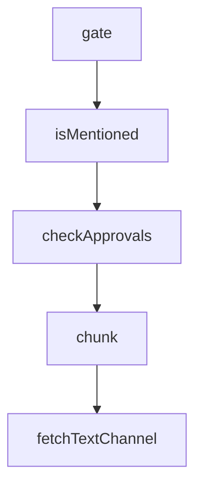

# Chapter 2: Directory Architecture and Marketplace Model

Welcome to **Chapter 2: Directory Architecture and Marketplace Model**. In this part of **Claude Plugins Official Tutorial: Anthropic's Managed Plugin Directory**, you will build an intuitive mental model first, then move into concrete implementation details and practical production tradeoffs.


This chapter explains the repository layout and curation model.

## Learning Goals

- distinguish internal plugins from external partner/community plugins
- understand how marketplace metadata is structured
- navigate plugin directories for capability discovery
- map directory structure to operational decisions

## Repository Topology

- `plugins/`: internal plugins maintained by Anthropic
- `external_plugins/`: third-party and partner plugins
- `.claude-plugin/marketplace.json`: marketplace-level catalog metadata

## Operational Implications

- internal plugins may align closely with official guidance patterns
- external plugins increase capability breadth but require stronger vetting
- marketplace metadata is the central source of installable plugin inventory

## Source References

- [Directory README Structure](https://github.com/anthropics/claude-plugins-official/blob/main/README.md#structure)
- [Marketplace Catalog](https://github.com/anthropics/claude-plugins-official/blob/main/.claude-plugin/marketplace.json)
- [Internal Plugins Directory](https://github.com/anthropics/claude-plugins-official/tree/main/plugins)
- [External Plugins Directory](https://github.com/anthropics/claude-plugins-official/tree/main/external_plugins)

## Summary

You now understand the curation and architecture layers of the directory.

Next: [Chapter 3: Plugin Manifest and Structural Contracts](03-plugin-manifest-and-structural-contracts.md)

## Source Code Walkthrough

### `external_plugins/discord/server.ts`

The `gate` function in [`external_plugins/discord/server.ts`](https://github.com/anthropics/claude-plugins-official/blob/HEAD/external_plugins/discord/server.ts) handles a key part of this chapter's functionality:

```ts
}

async function gate(msg: Message): Promise<GateResult> {
  const access = loadAccess()
  const pruned = pruneExpired(access)
  if (pruned) saveAccess(access)

  if (access.dmPolicy === 'disabled') return { action: 'drop' }

  const senderId = msg.author.id
  const isDM = msg.channel.type === ChannelType.DM

  if (isDM) {
    if (access.allowFrom.includes(senderId)) return { action: 'deliver', access }
    if (access.dmPolicy === 'allowlist') return { action: 'drop' }

    // pairing mode — check for existing non-expired code for this sender
    for (const [code, p] of Object.entries(access.pending)) {
      if (p.senderId === senderId) {
        // Reply twice max (initial + one reminder), then go silent.
        if ((p.replies ?? 1) >= 2) return { action: 'drop' }
        p.replies = (p.replies ?? 1) + 1
        saveAccess(access)
        return { action: 'pair', code, isResend: true }
      }
    }
    // Cap pending at 3. Extra attempts are silently dropped.
    if (Object.keys(access.pending).length >= 3) return { action: 'drop' }

    const code = randomBytes(3).toString('hex') // 6 hex chars
    const now = Date.now()
    access.pending[code] = {
```

This function is important because it defines how Claude Plugins Official Tutorial: Anthropic's Managed Plugin Directory implements the patterns covered in this chapter.

### `external_plugins/discord/server.ts`

The `isMentioned` function in [`external_plugins/discord/server.ts`](https://github.com/anthropics/claude-plugins-official/blob/HEAD/external_plugins/discord/server.ts) handles a key part of this chapter's functionality:

```ts
    return { action: 'drop' }
  }
  if (requireMention && !(await isMentioned(msg, access.mentionPatterns))) {
    return { action: 'drop' }
  }
  return { action: 'deliver', access }
}

async function isMentioned(msg: Message, extraPatterns?: string[]): Promise<boolean> {
  if (client.user && msg.mentions.has(client.user)) return true

  // Reply to one of our messages counts as an implicit mention.
  const refId = msg.reference?.messageId
  if (refId) {
    if (recentSentIds.has(refId)) return true
    // Fallback: fetch the referenced message and check authorship.
    // Can fail if the message was deleted or we lack history perms.
    try {
      const ref = await msg.fetchReference()
      if (ref.author.id === client.user?.id) return true
    } catch {}
  }

  const text = msg.content
  for (const pat of extraPatterns ?? []) {
    try {
      if (new RegExp(pat, 'i').test(text)) return true
    } catch {}
  }
  return false
}

```

This function is important because it defines how Claude Plugins Official Tutorial: Anthropic's Managed Plugin Directory implements the patterns covered in this chapter.

### `external_plugins/discord/server.ts`

The `checkApprovals` function in [`external_plugins/discord/server.ts`](https://github.com/anthropics/claude-plugins-official/blob/HEAD/external_plugins/discord/server.ts) handles a key part of this chapter's functionality:

```ts
// the DM channel ID. (The skill writes it.)

function checkApprovals(): void {
  let files: string[]
  try {
    files = readdirSync(APPROVED_DIR)
  } catch {
    return
  }
  if (files.length === 0) return

  for (const senderId of files) {
    const file = join(APPROVED_DIR, senderId)
    let dmChannelId: string
    try {
      dmChannelId = readFileSync(file, 'utf8').trim()
    } catch {
      rmSync(file, { force: true })
      continue
    }
    if (!dmChannelId) {
      // No channel ID — can't send. Drop the marker.
      rmSync(file, { force: true })
      continue
    }

    void (async () => {
      try {
        const ch = await fetchTextChannel(dmChannelId)
        if ('send' in ch) {
          await ch.send("Paired! Say hi to Claude.")
        }
```

This function is important because it defines how Claude Plugins Official Tutorial: Anthropic's Managed Plugin Directory implements the patterns covered in this chapter.

### `external_plugins/discord/server.ts`

The `chunk` function in [`external_plugins/discord/server.ts`](https://github.com/anthropics/claude-plugins-official/blob/HEAD/external_plugins/discord/server.ts) handles a key part of this chapter's functionality:

```ts
  /** Emoji to react with on receipt. Empty string disables. Unicode char or custom emoji ID. */
  ackReaction?: string
  /** Which chunks get Discord's reply reference when reply_to is passed. Default: 'first'. 'off' = never thread. */
  replyToMode?: 'off' | 'first' | 'all'
  /** Max chars per outbound message before splitting. Default: 2000 (Discord's hard cap). */
  textChunkLimit?: number
  /** Split on paragraph boundaries instead of hard char count. */
  chunkMode?: 'length' | 'newline'
}

function defaultAccess(): Access {
  return {
    dmPolicy: 'pairing',
    allowFrom: [],
    groups: {},
    pending: {},
  }
}

const MAX_CHUNK_LIMIT = 2000
const MAX_ATTACHMENT_BYTES = 25 * 1024 * 1024

// reply's files param takes any path. .env is ~60 bytes and ships as an
// upload. Claude can already Read+paste file contents, so this isn't a new
// exfil channel for arbitrary paths — but the server's own state is the one
// thing Claude has no reason to ever send.
function assertSendable(f: string): void {
  let real, stateReal: string
  try {
    real = realpathSync(f)
    stateReal = realpathSync(STATE_DIR)
  } catch { return } // statSync will fail properly; or STATE_DIR absent → nothing to leak
```

This function is important because it defines how Claude Plugins Official Tutorial: Anthropic's Managed Plugin Directory implements the patterns covered in this chapter.


## How These Components Connect


