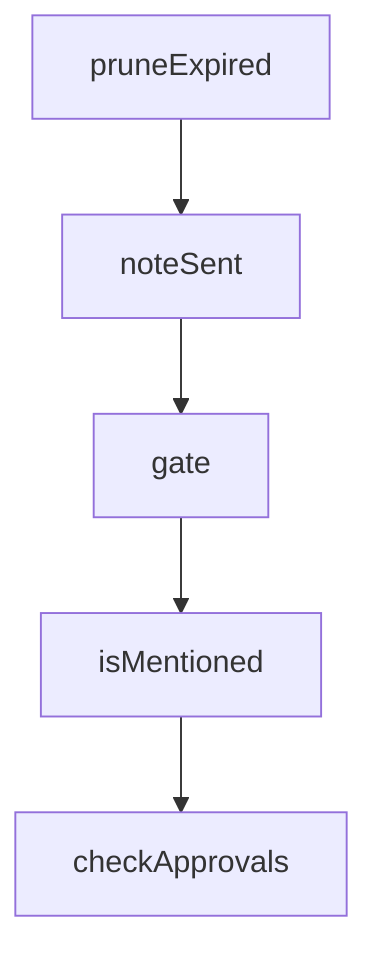

# Chapter 3: Plugin Manifest and Structural Contracts

Welcome to **Chapter 3: Plugin Manifest and Structural Contracts**. In this part of **Claude Plugins Official Tutorial: Anthropic's Managed Plugin Directory**, you will build an intuitive mental model first, then move into concrete implementation details and practical production tradeoffs.


This chapter covers mandatory and optional plugin structure expectations.

## Learning Goals

- identify required plugin metadata files
- understand optional capability directories and when to use them
- apply consistent plugin scaffolding for maintainability
- avoid structural anti-patterns that reduce discoverability

## Standard Plugin Contract

Typical structure includes:

- `.claude-plugin/plugin.json` (required)
- `.mcp.json` (optional)
- `commands/` (optional)
- `agents/` (optional)
- `skills/` (optional)
- `README.md` (strongly recommended)

## Structural Quality Heuristics

- keep command names clear and scoped
- keep agent definitions task-specific
- keep skills modular with explicit activation intent
- document setup and constraints in README

## Source References

- [Directory README Plugin Structure](https://github.com/anthropics/claude-plugins-official/blob/main/README.md#plugin-structure)
- [Example Plugin Reference](https://github.com/anthropics/claude-plugins-official/tree/main/plugins/example-plugin)
- [Plugin Dev Toolkit](https://github.com/anthropics/claude-plugins-official/tree/main/plugins/plugin-dev)

## Summary

You now have a clear contract for authoring structurally compliant plugins.

Next: [Chapter 4: Commands, Agents, Skills, Hooks, and MCP Composition](04-commands-agents-skills-hooks-and-mcp-composition.md)

## Depth Expansion Playbook

## Source Code Walkthrough

### `external_plugins/discord/server.ts`

The `pruneExpired` function in [`external_plugins/discord/server.ts`](https://github.com/anthropics/claude-plugins-official/blob/HEAD/external_plugins/discord/server.ts) handles a key part of this chapter's functionality:

```ts
}

function pruneExpired(a: Access): boolean {
  const now = Date.now()
  let changed = false
  for (const [code, p] of Object.entries(a.pending)) {
    if (p.expiresAt < now) {
      delete a.pending[code]
      changed = true
    }
  }
  return changed
}

type GateResult =
  | { action: 'deliver'; access: Access }
  | { action: 'drop' }
  | { action: 'pair'; code: string; isResend: boolean }

// Track message IDs we recently sent, so reply-to-bot in guild channels
// counts as a mention without needing fetchReference().
const recentSentIds = new Set<string>()
const RECENT_SENT_CAP = 200

function noteSent(id: string): void {
  recentSentIds.add(id)
  if (recentSentIds.size > RECENT_SENT_CAP) {
    // Sets iterate in insertion order — this drops the oldest.
    const first = recentSentIds.values().next().value
    if (first) recentSentIds.delete(first)
  }
}
```

This function is important because it defines how Claude Plugins Official Tutorial: Anthropic's Managed Plugin Directory implements the patterns covered in this chapter.

### `external_plugins/discord/server.ts`

The `noteSent` function in [`external_plugins/discord/server.ts`](https://github.com/anthropics/claude-plugins-official/blob/HEAD/external_plugins/discord/server.ts) handles a key part of this chapter's functionality:

```ts
const RECENT_SENT_CAP = 200

function noteSent(id: string): void {
  recentSentIds.add(id)
  if (recentSentIds.size > RECENT_SENT_CAP) {
    // Sets iterate in insertion order — this drops the oldest.
    const first = recentSentIds.values().next().value
    if (first) recentSentIds.delete(first)
  }
}

async function gate(msg: Message): Promise<GateResult> {
  const access = loadAccess()
  const pruned = pruneExpired(access)
  if (pruned) saveAccess(access)

  if (access.dmPolicy === 'disabled') return { action: 'drop' }

  const senderId = msg.author.id
  const isDM = msg.channel.type === ChannelType.DM

  if (isDM) {
    if (access.allowFrom.includes(senderId)) return { action: 'deliver', access }
    if (access.dmPolicy === 'allowlist') return { action: 'drop' }

    // pairing mode — check for existing non-expired code for this sender
    for (const [code, p] of Object.entries(access.pending)) {
      if (p.senderId === senderId) {
        // Reply twice max (initial + one reminder), then go silent.
        if ((p.replies ?? 1) >= 2) return { action: 'drop' }
        p.replies = (p.replies ?? 1) + 1
        saveAccess(access)
```

This function is important because it defines how Claude Plugins Official Tutorial: Anthropic's Managed Plugin Directory implements the patterns covered in this chapter.

### `external_plugins/discord/server.ts`

The `gate` function in [`external_plugins/discord/server.ts`](https://github.com/anthropics/claude-plugins-official/blob/HEAD/external_plugins/discord/server.ts) handles a key part of this chapter's functionality:

```ts
}

async function gate(msg: Message): Promise<GateResult> {
  const access = loadAccess()
  const pruned = pruneExpired(access)
  if (pruned) saveAccess(access)

  if (access.dmPolicy === 'disabled') return { action: 'drop' }

  const senderId = msg.author.id
  const isDM = msg.channel.type === ChannelType.DM

  if (isDM) {
    if (access.allowFrom.includes(senderId)) return { action: 'deliver', access }
    if (access.dmPolicy === 'allowlist') return { action: 'drop' }

    // pairing mode — check for existing non-expired code for this sender
    for (const [code, p] of Object.entries(access.pending)) {
      if (p.senderId === senderId) {
        // Reply twice max (initial + one reminder), then go silent.
        if ((p.replies ?? 1) >= 2) return { action: 'drop' }
        p.replies = (p.replies ?? 1) + 1
        saveAccess(access)
        return { action: 'pair', code, isResend: true }
      }
    }
    // Cap pending at 3. Extra attempts are silently dropped.
    if (Object.keys(access.pending).length >= 3) return { action: 'drop' }

    const code = randomBytes(3).toString('hex') // 6 hex chars
    const now = Date.now()
    access.pending[code] = {
```

This function is important because it defines how Claude Plugins Official Tutorial: Anthropic's Managed Plugin Directory implements the patterns covered in this chapter.

### `external_plugins/discord/server.ts`

The `isMentioned` function in [`external_plugins/discord/server.ts`](https://github.com/anthropics/claude-plugins-official/blob/HEAD/external_plugins/discord/server.ts) handles a key part of this chapter's functionality:

```ts
    return { action: 'drop' }
  }
  if (requireMention && !(await isMentioned(msg, access.mentionPatterns))) {
    return { action: 'drop' }
  }
  return { action: 'deliver', access }
}

async function isMentioned(msg: Message, extraPatterns?: string[]): Promise<boolean> {
  if (client.user && msg.mentions.has(client.user)) return true

  // Reply to one of our messages counts as an implicit mention.
  const refId = msg.reference?.messageId
  if (refId) {
    if (recentSentIds.has(refId)) return true
    // Fallback: fetch the referenced message and check authorship.
    // Can fail if the message was deleted or we lack history perms.
    try {
      const ref = await msg.fetchReference()
      if (ref.author.id === client.user?.id) return true
    } catch {}
  }

  const text = msg.content
  for (const pat of extraPatterns ?? []) {
    try {
      if (new RegExp(pat, 'i').test(text)) return true
    } catch {}
  }
  return false
}

```

This function is important because it defines how Claude Plugins Official Tutorial: Anthropic's Managed Plugin Directory implements the patterns covered in this chapter.


## How These Components Connect


