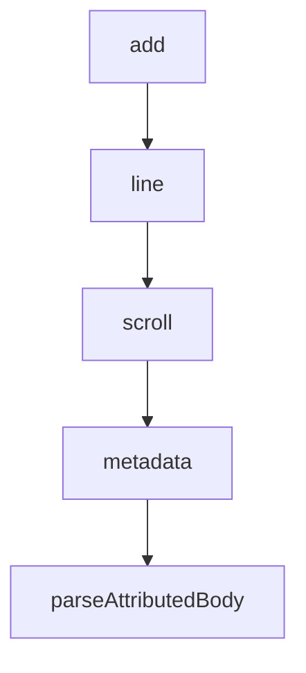

# Chapter 4: Commands, Agents, Skills, Hooks, and MCP Composition

Welcome to **Chapter 4: Commands, Agents, Skills, Hooks, and MCP Composition**. In this part of **Claude Plugins Official Tutorial: Anthropic's Managed Plugin Directory**, you will build an intuitive mental model first, then move into concrete implementation details and practical production tradeoffs.


This chapter explains how plugin capability types combine to form reliable workflows.

## Learning Goals

- understand distinct roles of commands, agents, skills, hooks, and MCP
- compose plugin capabilities without unnecessary complexity
- map capability choices to user-facing workflow outcomes
- avoid overloading single plugins with conflicting concerns

## Capability Composition Model

- commands: deterministic entrypoints
- agents: specialized reasoning personas
- skills: reusable domain instruction packs
- hooks: lifecycle automation and enforcement
- MCP: external tool/system integrations

## Practical Composition Pattern

- start with command-first workflow entrypoint
- add one or two specialist agents where reasoning depth is needed
- add skills for repeated domain knowledge patterns
- attach hooks only where automation policy is clear

## Source References

- [Example Plugin Capabilities](https://github.com/anthropics/claude-plugins-official/tree/main/plugins/example-plugin)
- [Code Review Plugin](https://github.com/anthropics/claude-plugins-official/tree/main/plugins/code-review)
- [Hookify Plugin](https://github.com/anthropics/claude-plugins-official/tree/main/plugins/hookify)

## Summary

You now know how to compose plugin capabilities into maintainable workflows.

Next: [Chapter 5: Trust, Security, and Risk Controls](05-trust-security-and-risk-controls.md)

## Source Code Walkthrough

### `external_plugins/fakechat/server.ts`

The `add` function in [`external_plugins/fakechat/server.ts`](https://github.com/anthropics/claude-plugins-official/blob/HEAD/external_plugins/fakechat/server.ts) handles a key part of this chapter's functionality:

```ts
  },
  websocket: {
    open: ws => { clients.add(ws) },
    close: ws => { clients.delete(ws) },
    message: (_, raw) => {
      try {
        const { id, text } = JSON.parse(String(raw)) as { id: string; text: string }
        if (id && text?.trim()) deliver(id, text.trim())
      } catch {}
    },
  },
})

process.stderr.write(`fakechat: http://localhost:${PORT}\n`)

const HTML = `<!doctype html>
<meta charset="utf-8">
<title>fakechat</title>
<style>
body { font-family: monospace; margin: 0; padding: 1em 1em 7em; }
#log { white-space: pre-wrap; word-break: break-word; }
form { position: fixed; bottom: 0; left: 0; right: 0; padding: 1em; background: #fff; }
#text { width: 100%; box-sizing: border-box; font: inherit; margin-bottom: 0.5em; }
#file { display: none; }
#row { display: flex; gap: 1ch; }
#row button[type=submit] { margin-left: auto; }
</style>
<h3>fakechat</h3>
<pre id=log></pre>
<form id=form>
  <textarea id=text rows=2 autocomplete=off autofocus></textarea>
  <div id=row>
```

This function is important because it defines how Claude Plugins Official Tutorial: Anthropic's Managed Plugin Directory implements the patterns covered in this chapter.

### `external_plugins/fakechat/server.ts`

The `line` function in [`external_plugins/fakechat/server.ts`](https://github.com/anthropics/claude-plugins-official/blob/HEAD/external_plugins/fakechat/server.ts) handles a key part of this chapter's functionality:

```ts
function add(m) {
  const who = m.from === 'user' ? 'you' : 'bot'
  const el = line(who, m.text, m.replyTo, m.file)
  log.appendChild(el); scroll()
  msgs[m.id] = { body: el.querySelector('.body') }
}

function line(who, text, replyTo, file) {
  const div = document.createElement('div')
  const t = new Date().toTimeString().slice(0, 8)
  const reply = replyTo && msgs[replyTo] ? ' ↳ ' + (msgs[replyTo].body.textContent || '(file)').slice(0, 40) : ''
  div.innerHTML = '[' + t + '] <b>' + who + '</b>' + reply + ': <span class=body></span>'
  const body = div.querySelector('.body')
  body.textContent = text || ''
  if (file) {
    const indent = 11 + who.length + 2  // '[HH:MM:SS] ' + who + ': '
    if (text) body.appendChild(document.createTextNode('\\n' + ' '.repeat(indent)))
    const a = document.createElement('a')
    a.href = file.url; a.download = file.name; a.textContent = '[' + file.name + ']'
    body.appendChild(a)
  }
  return div
}

function scroll() { window.scrollTo(0, document.body.scrollHeight) }
input.addEventListener('keydown', e => { if (e.key === 'Enter' && !e.shiftKey) { e.preventDefault(); form.requestSubmit() } })
</script>
`

```

This function is important because it defines how Claude Plugins Official Tutorial: Anthropic's Managed Plugin Directory implements the patterns covered in this chapter.

### `external_plugins/fakechat/server.ts`

The `scroll` function in [`external_plugins/fakechat/server.ts`](https://github.com/anthropics/claude-plugins-official/blob/HEAD/external_plugins/fakechat/server.ts) handles a key part of this chapter's functionality:

```ts
  const who = m.from === 'user' ? 'you' : 'bot'
  const el = line(who, m.text, m.replyTo, m.file)
  log.appendChild(el); scroll()
  msgs[m.id] = { body: el.querySelector('.body') }
}

function line(who, text, replyTo, file) {
  const div = document.createElement('div')
  const t = new Date().toTimeString().slice(0, 8)
  const reply = replyTo && msgs[replyTo] ? ' ↳ ' + (msgs[replyTo].body.textContent || '(file)').slice(0, 40) : ''
  div.innerHTML = '[' + t + '] <b>' + who + '</b>' + reply + ': <span class=body></span>'
  const body = div.querySelector('.body')
  body.textContent = text || ''
  if (file) {
    const indent = 11 + who.length + 2  // '[HH:MM:SS] ' + who + ': '
    if (text) body.appendChild(document.createTextNode('\\n' + ' '.repeat(indent)))
    const a = document.createElement('a')
    a.href = file.url; a.download = file.name; a.textContent = '[' + file.name + ']'
    body.appendChild(a)
  }
  return div
}

function scroll() { window.scrollTo(0, document.body.scrollHeight) }
input.addEventListener('keydown', e => { if (e.key === 'Enter' && !e.shiftKey) { e.preventDefault(); form.requestSubmit() } })
</script>
`

```

This function is important because it defines how Claude Plugins Official Tutorial: Anthropic's Managed Plugin Directory implements the patterns covered in this chapter.

### `external_plugins/imessage/server.ts`

The `metadata` class in [`external_plugins/imessage/server.ts`](https://github.com/anthropics/claude-plugins-official/blob/HEAD/external_plugins/imessage/server.ts) handles a key part of this chapter's functionality:

```ts
  if (i < 0) return null
  i += 'NSString'.length
  // Skip class metadata until the '+' (0x2B) marking the inline string payload.
  while (i < buf.length && buf[i] !== 0x2B) i++
  if (i >= buf.length) return null
  i++
  // Streamtyped length prefix: small lengths are literal bytes; 0x81/0x82/0x83
  // escape to 1/2/3-byte little-endian lengths respectively.
  let len: number
  const b = buf[i++]
  if (b === 0x81) { len = buf[i]; i += 1 }
  else if (b === 0x82) { len = buf.readUInt16LE(i); i += 2 }
  else if (b === 0x83) { len = buf.readUIntLE(i, 3); i += 3 }
  else { len = b }
  if (i + len > buf.length) return null
  return buf.toString('utf8', i, i + len)
}

type Row = {
  rowid: number
  guid: string
  text: string | null
  attributedBody: Uint8Array | null
  date: number
  is_from_me: number
  cache_has_attachments: number
  service: string | null
  handle_id: string | null
  chat_guid: string
  chat_style: number | null
}

```

This class is important because it defines how Claude Plugins Official Tutorial: Anthropic's Managed Plugin Directory implements the patterns covered in this chapter.


## How These Components Connect


