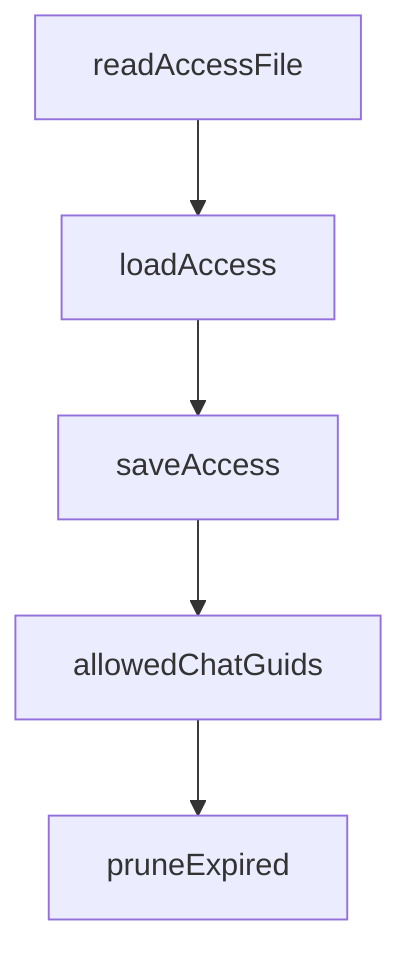

# Chapter 5: Trust, Security, and Risk Controls

Welcome to **Chapter 5: Trust, Security, and Risk Controls**. In this part of **Claude Plugins Official Tutorial: Anthropic's Managed Plugin Directory**, you will build an intuitive mental model first, then move into concrete implementation details and practical production tradeoffs.


This chapter focuses on safe plugin adoption and third-party risk controls.

## Learning Goals

- evaluate trust boundaries before plugin installation
- apply security controls for plugins with MCP/tool integrations
- document risk posture for internal approval workflows
- reduce blast radius of plugin misbehavior

## Baseline Risk Controls

- install only trusted and reviewed plugins
- audit plugin README and metadata before install
- inspect `.mcp.json` and hook behaviors for sensitive operations
- isolate experimental plugins from production-critical workflows

## Operational Safety Pattern

- pilot plugins in non-critical projects first
- require explicit approval for plugins with external network actions
- maintain an allowlist of approved plugin names and versions

## Source References

- [Directory Trust Warning](https://github.com/anthropics/claude-plugins-official/blob/main/README.md)
- [Official Plugin Docs](https://code.claude.com/docs/en/plugins)
- [External Plugins Directory](https://github.com/anthropics/claude-plugins-official/tree/main/external_plugins)

## Summary

You now have a practical safety model for directory plugin adoption.

Next: [Chapter 6: Installation, Operations, and Update Strategy](06-installation-operations-and-update-strategy.md)

## Source Code Walkthrough

### `external_plugins/imessage/server.ts`

The `readAccessFile` function in [`external_plugins/imessage/server.ts`](https://github.com/anthropics/claude-plugins-official/blob/HEAD/external_plugins/imessage/server.ts) handles a key part of this chapter's functionality:

```ts
}

function readAccessFile(): Access {
  try {
    const raw = readFileSync(ACCESS_FILE, 'utf8')
    const parsed = JSON.parse(raw) as Partial<Access>
    return {
      dmPolicy: parsed.dmPolicy ?? 'allowlist',
      allowFrom: parsed.allowFrom ?? [],
      groups: parsed.groups ?? {},
      pending: parsed.pending ?? {},
      mentionPatterns: parsed.mentionPatterns,
      textChunkLimit: parsed.textChunkLimit,
      chunkMode: parsed.chunkMode,
    }
  } catch (err) {
    if ((err as NodeJS.ErrnoException).code === 'ENOENT') return defaultAccess()
    try { renameSync(ACCESS_FILE, `${ACCESS_FILE}.corrupt-${Date.now()}`) } catch {}
    process.stderr.write(`imessage: access.json is corrupt, moved aside. Starting fresh.\n`)
    return defaultAccess()
  }
}

// In static mode, access is snapshotted at boot and never re-read or written.
// Pairing requires runtime mutation, so it's downgraded to allowlist.
const BOOT_ACCESS: Access | null = STATIC
  ? (() => {
      const a = readAccessFile()
      if (a.dmPolicy === 'pairing') {
        process.stderr.write(
          'imessage channel: static mode — dmPolicy "pairing" downgraded to "allowlist"\n',
        )
```

This function is important because it defines how Claude Plugins Official Tutorial: Anthropic's Managed Plugin Directory implements the patterns covered in this chapter.

### `external_plugins/imessage/server.ts`

The `loadAccess` function in [`external_plugins/imessage/server.ts`](https://github.com/anthropics/claude-plugins-official/blob/HEAD/external_plugins/imessage/server.ts) handles a key part of this chapter's functionality:

```ts
  : null

function loadAccess(): Access {
  return BOOT_ACCESS ?? readAccessFile()
}

function saveAccess(a: Access): void {
  if (STATIC) return
  mkdirSync(STATE_DIR, { recursive: true, mode: 0o700 })
  const tmp = ACCESS_FILE + '.tmp'
  writeFileSync(tmp, JSON.stringify(a, null, 2) + '\n', { mode: 0o600 })
  renameSync(tmp, ACCESS_FILE)
}

// chat.db has every text macOS received, gated or not. chat_messages scopes
// reads to chats you've opened: self-chat, allowlisted DMs, configured groups.
function allowedChatGuids(): Set<string> {
  const access = loadAccess()
  const out = new Set<string>(Object.keys(access.groups))
  const handles = new Set([...access.allowFrom.map(h => h.toLowerCase()), ...SELF])
  for (const h of handles) {
    for (const { guid } of qChatsForHandle.all(h)) out.add(guid)
  }
  return out
}

function pruneExpired(a: Access): boolean {
  const now = Date.now()
  let changed = false
  for (const [code, p] of Object.entries(a.pending)) {
    if (p.expiresAt < now) {
      delete a.pending[code]
```

This function is important because it defines how Claude Plugins Official Tutorial: Anthropic's Managed Plugin Directory implements the patterns covered in this chapter.

### `external_plugins/imessage/server.ts`

The `saveAccess` function in [`external_plugins/imessage/server.ts`](https://github.com/anthropics/claude-plugins-official/blob/HEAD/external_plugins/imessage/server.ts) handles a key part of this chapter's functionality:

```ts
}

function saveAccess(a: Access): void {
  if (STATIC) return
  mkdirSync(STATE_DIR, { recursive: true, mode: 0o700 })
  const tmp = ACCESS_FILE + '.tmp'
  writeFileSync(tmp, JSON.stringify(a, null, 2) + '\n', { mode: 0o600 })
  renameSync(tmp, ACCESS_FILE)
}

// chat.db has every text macOS received, gated or not. chat_messages scopes
// reads to chats you've opened: self-chat, allowlisted DMs, configured groups.
function allowedChatGuids(): Set<string> {
  const access = loadAccess()
  const out = new Set<string>(Object.keys(access.groups))
  const handles = new Set([...access.allowFrom.map(h => h.toLowerCase()), ...SELF])
  for (const h of handles) {
    for (const { guid } of qChatsForHandle.all(h)) out.add(guid)
  }
  return out
}

function pruneExpired(a: Access): boolean {
  const now = Date.now()
  let changed = false
  for (const [code, p] of Object.entries(a.pending)) {
    if (p.expiresAt < now) {
      delete a.pending[code]
      changed = true
    }
  }
  return changed
```

This function is important because it defines how Claude Plugins Official Tutorial: Anthropic's Managed Plugin Directory implements the patterns covered in this chapter.

### `external_plugins/imessage/server.ts`

The `allowedChatGuids` function in [`external_plugins/imessage/server.ts`](https://github.com/anthropics/claude-plugins-official/blob/HEAD/external_plugins/imessage/server.ts) handles a key part of this chapter's functionality:

```ts
// chat.db has every text macOS received, gated or not. chat_messages scopes
// reads to chats you've opened: self-chat, allowlisted DMs, configured groups.
function allowedChatGuids(): Set<string> {
  const access = loadAccess()
  const out = new Set<string>(Object.keys(access.groups))
  const handles = new Set([...access.allowFrom.map(h => h.toLowerCase()), ...SELF])
  for (const h of handles) {
    for (const { guid } of qChatsForHandle.all(h)) out.add(guid)
  }
  return out
}

function pruneExpired(a: Access): boolean {
  const now = Date.now()
  let changed = false
  for (const [code, p] of Object.entries(a.pending)) {
    if (p.expiresAt < now) {
      delete a.pending[code]
      changed = true
    }
  }
  return changed
}

type GateInput = {
  senderId: string
  chatGuid: string
  isGroup: boolean
  text: string
}

type GateResult =
```

This function is important because it defines how Claude Plugins Official Tutorial: Anthropic's Managed Plugin Directory implements the patterns covered in this chapter.


## How These Components Connect


