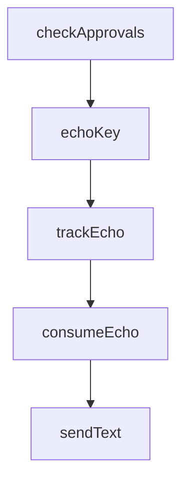

# Chapter 6: Installation, Operations, and Update Strategy

Welcome to **Chapter 6: Installation, Operations, and Update Strategy**. In this part of **Claude Plugins Official Tutorial: Anthropic's Managed Plugin Directory**, you will build an intuitive mental model first, then move into concrete implementation details and practical production tradeoffs.


This chapter covers repeatable operations for long-lived plugin portfolios.

## Learning Goals

- standardize installation and discovery workflows
- manage updates without destabilizing critical tasks
- monitor plugin behavior and usage value over time
- retire low-value or high-risk plugins cleanly

## Operations Checklist

- maintain approved plugin baseline by team role
- review plugin changes on a fixed cadence
- keep quick rollback plan for problematic plugin updates
- track active command usage to reduce dead plugin load

## Update Strategy

- stagger updates across teams/environments
- validate command behavior after update before broad rollout
- maintain known-good snapshots for incident fallback

## Source References

- [Directory README](https://github.com/anthropics/claude-plugins-official/blob/main/README.md)
- [Marketplace Catalog](https://github.com/anthropics/claude-plugins-official/blob/main/.claude-plugin/marketplace.json)
- [Feature Dev Plugin Example](https://github.com/anthropics/claude-plugins-official/tree/main/plugins/feature-dev)

## Summary

You now have an operational strategy for managing plugin portfolios over time.

Next: [Chapter 7: Submission and Contribution Workflow](07-submission-and-contribution-workflow.md)

## Source Code Walkthrough

### `external_plugins/imessage/server.ts`

The `checkApprovals` function in [`external_plugins/imessage/server.ts`](https://github.com/anthropics/claude-plugins-official/blob/HEAD/external_plugins/imessage/server.ts) handles a key part of this chapter's functionality:

```ts
// The /imessage:access skill drops approved/<senderId> (contents = chatGuid)
// when pairing succeeds. Poll for it, send confirmation, clean up.
function checkApprovals(): void {
  let files: string[]
  try {
    files = readdirSync(APPROVED_DIR)
  } catch {
    return
  }
  for (const senderId of files) {
    const file = join(APPROVED_DIR, senderId)
    let chatGuid: string
    try {
      chatGuid = readFileSync(file, 'utf8').trim()
    } catch {
      rmSync(file, { force: true })
      continue
    }
    if (!chatGuid) {
      rmSync(file, { force: true })
      continue
    }
    const err = sendText(chatGuid, "Paired! Say hi to Claude.")
    if (err) process.stderr.write(`imessage channel: approval confirm failed: ${err}\n`)
    rmSync(file, { force: true })
  }
}

if (!STATIC) setInterval(checkApprovals, 5000).unref()

// --- sending -----------------------------------------------------------------

```

This function is important because it defines how Claude Plugins Official Tutorial: Anthropic's Managed Plugin Directory implements the patterns covered in this chapter.

### `external_plugins/imessage/server.ts`

The `echoKey` function in [`external_plugins/imessage/server.ts`](https://github.com/anthropics/claude-plugins-official/blob/HEAD/external_plugins/imessage/server.ts) handles a key part of this chapter's functionality:

```ts
const echo = new Map<string, number>()

function echoKey(raw: string): string {
  return raw
    .replace(/\s*Sent by Claude\s*$/, '')
    .replace(/[\u200d\ufe00-\ufe0f]/g, '')    // ZWJ + variation selectors — chat.db is inconsistent about these
    .replace(/[\u2018\u2019]/g, "'")
    .replace(/[\u201c\u201d]/g, '"')
    .trim()
    .replace(/\s+/g, ' ')
    .slice(0, 120)
}

function trackEcho(chatGuid: string, key: string): void {
  const now = Date.now()
  for (const [k, t] of echo) if (now - t > ECHO_WINDOW_MS) echo.delete(k)
  echo.set(`${chatGuid}\x00${echoKey(key)}`, now)
}

function consumeEcho(chatGuid: string, key: string): boolean {
  const k = `${chatGuid}\x00${echoKey(key)}`
  const t = echo.get(k)
  if (t == null || Date.now() - t > ECHO_WINDOW_MS) return false
  echo.delete(k)
  return true
}

function sendText(chatGuid: string, text: string): string | null {
  const res = spawnSync('osascript', ['-', text, chatGuid], {
    input: SEND_SCRIPT,
    encoding: 'utf8',
  })
```

This function is important because it defines how Claude Plugins Official Tutorial: Anthropic's Managed Plugin Directory implements the patterns covered in this chapter.

### `external_plugins/imessage/server.ts`

The `trackEcho` function in [`external_plugins/imessage/server.ts`](https://github.com/anthropics/claude-plugins-official/blob/HEAD/external_plugins/imessage/server.ts) handles a key part of this chapter's functionality:

```ts
}

function trackEcho(chatGuid: string, key: string): void {
  const now = Date.now()
  for (const [k, t] of echo) if (now - t > ECHO_WINDOW_MS) echo.delete(k)
  echo.set(`${chatGuid}\x00${echoKey(key)}`, now)
}

function consumeEcho(chatGuid: string, key: string): boolean {
  const k = `${chatGuid}\x00${echoKey(key)}`
  const t = echo.get(k)
  if (t == null || Date.now() - t > ECHO_WINDOW_MS) return false
  echo.delete(k)
  return true
}

function sendText(chatGuid: string, text: string): string | null {
  const res = spawnSync('osascript', ['-', text, chatGuid], {
    input: SEND_SCRIPT,
    encoding: 'utf8',
  })
  if (res.status !== 0) return res.stderr.trim() || `osascript exit ${res.status}`
  trackEcho(chatGuid, text)
  return null
}

function sendAttachment(chatGuid: string, filePath: string): string | null {
  const res = spawnSync('osascript', ['-', filePath, chatGuid], {
    input: SEND_FILE_SCRIPT,
    encoding: 'utf8',
  })
  if (res.status !== 0) return res.stderr.trim() || `osascript exit ${res.status}`
```

This function is important because it defines how Claude Plugins Official Tutorial: Anthropic's Managed Plugin Directory implements the patterns covered in this chapter.

### `external_plugins/imessage/server.ts`

The `consumeEcho` function in [`external_plugins/imessage/server.ts`](https://github.com/anthropics/claude-plugins-official/blob/HEAD/external_plugins/imessage/server.ts) handles a key part of this chapter's functionality:

```ts
}

function consumeEcho(chatGuid: string, key: string): boolean {
  const k = `${chatGuid}\x00${echoKey(key)}`
  const t = echo.get(k)
  if (t == null || Date.now() - t > ECHO_WINDOW_MS) return false
  echo.delete(k)
  return true
}

function sendText(chatGuid: string, text: string): string | null {
  const res = spawnSync('osascript', ['-', text, chatGuid], {
    input: SEND_SCRIPT,
    encoding: 'utf8',
  })
  if (res.status !== 0) return res.stderr.trim() || `osascript exit ${res.status}`
  trackEcho(chatGuid, text)
  return null
}

function sendAttachment(chatGuid: string, filePath: string): string | null {
  const res = spawnSync('osascript', ['-', filePath, chatGuid], {
    input: SEND_FILE_SCRIPT,
    encoding: 'utf8',
  })
  if (res.status !== 0) return res.stderr.trim() || `osascript exit ${res.status}`
  trackEcho(chatGuid, '\x00att')
  return null
}

function chunk(text: string, limit: number, mode: 'length' | 'newline'): string[] {
  if (text.length <= limit) return [text]
```

This function is important because it defines how Claude Plugins Official Tutorial: Anthropic's Managed Plugin Directory implements the patterns covered in this chapter.


## How These Components Connect


