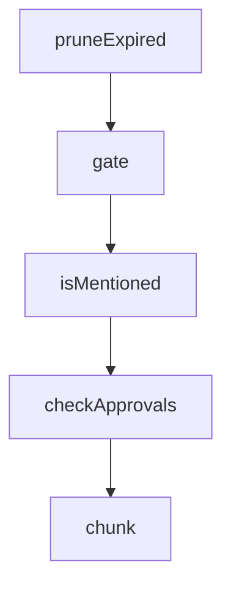

# Chapter 6: Installation, Operations, and Update Strategy

Welcome to **Chapter 6: Installation, Operations, and Update Strategy**. In this part of **Claude Plugins Official Tutorial: Anthropic's Managed Plugin Directory**, you will build an intuitive mental model first, then move into concrete implementation details and practical production tradeoffs.


This chapter covers repeatable operations for long-lived plugin portfolios.

## Learning Goals

- standardize installation and discovery workflows
- manage updates without destabilizing critical tasks
- monitor plugin behavior and usage value over time
- retire low-value or high-risk plugins cleanly

## Operations Checklist

- maintain approved plugin baseline by team role
- review plugin changes on a fixed cadence
- keep quick rollback plan for problematic plugin updates
- track active command usage to reduce dead plugin load

## Update Strategy

- stagger updates across teams/environments
- validate command behavior after update before broad rollout
- maintain known-good snapshots for incident fallback

## Source References

- [Directory README](https://github.com/anthropics/claude-plugins-official/blob/main/README.md)
- [Marketplace Catalog](https://github.com/anthropics/claude-plugins-official/blob/main/.claude-plugin/marketplace.json)
- [Feature Dev Plugin Example](https://github.com/anthropics/claude-plugins-official/tree/main/plugins/feature-dev)

## Summary

You now have an operational strategy for managing plugin portfolios over time.

Next: [Chapter 7: Submission and Contribution Workflow](07-submission-and-contribution-workflow.md)

## Depth Expansion Playbook

## Source Code Walkthrough

### `external_plugins/telegram/server.ts`

The `pruneExpired` function in [`external_plugins/telegram/server.ts`](https://github.com/anthropics/claude-plugins-official/blob/HEAD/external_plugins/telegram/server.ts) handles a key part of this chapter's functionality:

```ts
}

function pruneExpired(a: Access): boolean {
  const now = Date.now()
  let changed = false
  for (const [code, p] of Object.entries(a.pending)) {
    if (p.expiresAt < now) {
      delete a.pending[code]
      changed = true
    }
  }
  return changed
}

type GateResult =
  | { action: 'deliver'; access: Access }
  | { action: 'drop' }
  | { action: 'pair'; code: string; isResend: boolean }

function gate(ctx: Context): GateResult {
  const access = loadAccess()
  const pruned = pruneExpired(access)
  if (pruned) saveAccess(access)

  if (access.dmPolicy === 'disabled') return { action: 'drop' }

  const from = ctx.from
  if (!from) return { action: 'drop' }
  const senderId = String(from.id)
  const chatType = ctx.chat?.type

  if (chatType === 'private') {
```

This function is important because it defines how Claude Plugins Official Tutorial: Anthropic's Managed Plugin Directory implements the patterns covered in this chapter.

### `external_plugins/telegram/server.ts`

The `gate` function in [`external_plugins/telegram/server.ts`](https://github.com/anthropics/claude-plugins-official/blob/HEAD/external_plugins/telegram/server.ts) handles a key part of this chapter's functionality:

```ts
}

// Outbound gate — reply/react/edit can only target chats the inbound gate
// would deliver from. Telegram DM chat_id == user_id, so allowFrom covers DMs.
function assertAllowedChat(chat_id: string): void {
  const access = loadAccess()
  if (access.allowFrom.includes(chat_id)) return
  if (chat_id in access.groups) return
  throw new Error(`chat ${chat_id} is not allowlisted — add via /telegram:access`)
}

function saveAccess(a: Access): void {
  if (STATIC) return
  mkdirSync(STATE_DIR, { recursive: true, mode: 0o700 })
  const tmp = ACCESS_FILE + '.tmp'
  writeFileSync(tmp, JSON.stringify(a, null, 2) + '\n', { mode: 0o600 })
  renameSync(tmp, ACCESS_FILE)
}

function pruneExpired(a: Access): boolean {
  const now = Date.now()
  let changed = false
  for (const [code, p] of Object.entries(a.pending)) {
    if (p.expiresAt < now) {
      delete a.pending[code]
      changed = true
    }
  }
  return changed
}

type GateResult =
```

This function is important because it defines how Claude Plugins Official Tutorial: Anthropic's Managed Plugin Directory implements the patterns covered in this chapter.

### `external_plugins/telegram/server.ts`

The `isMentioned` function in [`external_plugins/telegram/server.ts`](https://github.com/anthropics/claude-plugins-official/blob/HEAD/external_plugins/telegram/server.ts) handles a key part of this chapter's functionality:

```ts
      return { action: 'drop' }
    }
    if (requireMention && !isMentioned(ctx, access.mentionPatterns)) {
      return { action: 'drop' }
    }
    return { action: 'deliver', access }
  }

  return { action: 'drop' }
}

function isMentioned(ctx: Context, extraPatterns?: string[]): boolean {
  const entities = ctx.message?.entities ?? ctx.message?.caption_entities ?? []
  const text = ctx.message?.text ?? ctx.message?.caption ?? ''
  for (const e of entities) {
    if (e.type === 'mention') {
      const mentioned = text.slice(e.offset, e.offset + e.length)
      if (mentioned.toLowerCase() === `@${botUsername}`.toLowerCase()) return true
    }
    if (e.type === 'text_mention' && e.user?.is_bot && e.user.username === botUsername) {
      return true
    }
  }

  // Reply to one of our messages counts as an implicit mention.
  if (ctx.message?.reply_to_message?.from?.username === botUsername) return true

  for (const pat of extraPatterns ?? []) {
    try {
      if (new RegExp(pat, 'i').test(text)) return true
    } catch {
      // Invalid user-supplied regex — skip it.
```

This function is important because it defines how Claude Plugins Official Tutorial: Anthropic's Managed Plugin Directory implements the patterns covered in this chapter.

### `external_plugins/telegram/server.ts`

The `checkApprovals` function in [`external_plugins/telegram/server.ts`](https://github.com/anthropics/claude-plugins-official/blob/HEAD/external_plugins/telegram/server.ts) handles a key part of this chapter's functionality:

```ts
// chatId == senderId, so we can send directly without stashing chatId.

function checkApprovals(): void {
  let files: string[]
  try {
    files = readdirSync(APPROVED_DIR)
  } catch {
    return
  }
  if (files.length === 0) return

  for (const senderId of files) {
    const file = join(APPROVED_DIR, senderId)
    void bot.api.sendMessage(senderId, "Paired! Say hi to Claude.").then(
      () => rmSync(file, { force: true }),
      err => {
        process.stderr.write(`telegram channel: failed to send approval confirm: ${err}\n`)
        // Remove anyway — don't loop on a broken send.
        rmSync(file, { force: true })
      },
    )
  }
}

if (!STATIC) setInterval(checkApprovals, 5000).unref()

// Telegram caps messages at 4096 chars. Split long replies, preferring
// paragraph boundaries when chunkMode is 'newline'.

function chunk(text: string, limit: number, mode: 'length' | 'newline'): string[] {
  if (text.length <= limit) return [text]
  const out: string[] = []
```

This function is important because it defines how Claude Plugins Official Tutorial: Anthropic's Managed Plugin Directory implements the patterns covered in this chapter.


## How These Components Connect


