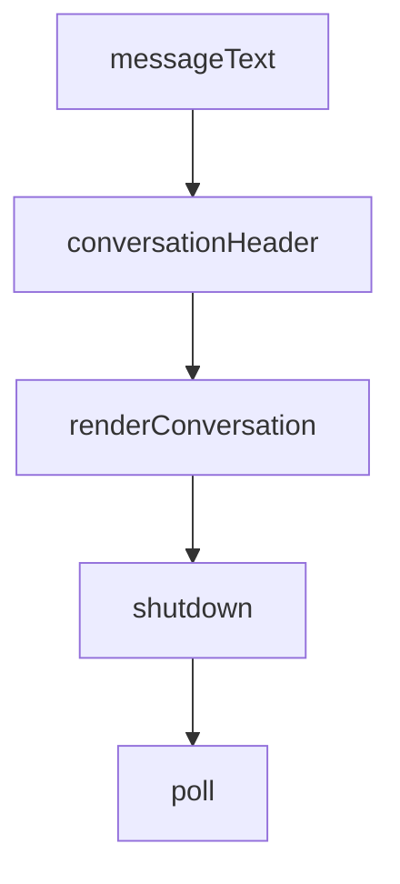

# Chapter 7: Submission and Contribution Workflow

Welcome to **Chapter 7: Submission and Contribution Workflow**. In this part of **Claude Plugins Official Tutorial: Anthropic's Managed Plugin Directory**, you will build an intuitive mental model first, then move into concrete implementation details and practical production tradeoffs.


This chapter explains how contributors submit and maintain plugins in the official directory context.

## Learning Goals

- understand external submission path and expectations
- prepare plugin documentation and structure for review
- use reference plugins and toolkit assets for faster alignment
- avoid common contribution-quality failures

## Contribution Paths

- internal plugins are maintained by Anthropic teams
- external plugins are submitted through the directory submission process

## Contributor Preparation Checklist

- plugin structure matches directory contract
- README includes setup, usage, and constraints
- optional MCP/hook integrations are documented clearly
- commands and skills are scoped and testable

## Source References

- [Directory README Contributing](https://github.com/anthropics/claude-plugins-official/blob/main/README.md#contributing)
- [Submission Form](https://clau.de/plugin-directory-submission)
- [Plugin Dev Toolkit](https://github.com/anthropics/claude-plugins-official/tree/main/plugins/plugin-dev)

## Summary

You now have a practical path for plugin contribution and review readiness.

Next: [Chapter 8: Governance and Enterprise Plugin Portfolio Management](08-governance-and-enterprise-plugin-portfolio-management.md)

## Source Code Walkthrough

### `external_plugins/imessage/server.ts`

The `messageText` function in [`external_plugins/imessage/server.ts`](https://github.com/anthropics/claude-plugins-official/blob/HEAD/external_plugins/imessage/server.ts) handles a key part of this chapter's functionality:

```ts
}

function messageText(r: Row): string {
  return r.text ?? parseAttributedBody(r.attributedBody) ?? ''
}

// Build a human-readable header for one conversation. Labels DM vs group and
// lists participants so the assistant can tell threads apart at a glance.
function conversationHeader(guid: string): string {
  const info = qChatInfo.get(guid)
  const participants = qChatParticipants.all(guid).map(p => p.id)
  const who = participants.length > 0 ? participants.join(', ') : guid
  if (info?.style === 43) {
    const name = info.display_name ? `"${info.display_name}" ` : ''
    return `=== Group ${name}(${who}) ===`
  }
  return `=== DM with ${who} ===`
}

// Render one chat's messages as a conversation block: header, then one line
// per message with a local-time stamp. A date line is inserted whenever the
// calendar day rolls over so long histories stay readable without repeating
// the full date on every row.
function renderConversation(guid: string, rows: Row[]): string {
  const lines: string[] = [conversationHeader(guid)]
  let lastDay = ''
  for (const r of rows) {
    const d = appleDate(r.date)
    const day = d.toDateString()
    if (day !== lastDay) {
      lines.push(`-- ${day} --`)
      lastDay = day
```

This function is important because it defines how Claude Plugins Official Tutorial: Anthropic's Managed Plugin Directory implements the patterns covered in this chapter.

### `external_plugins/imessage/server.ts`

The `conversationHeader` function in [`external_plugins/imessage/server.ts`](https://github.com/anthropics/claude-plugins-official/blob/HEAD/external_plugins/imessage/server.ts) handles a key part of this chapter's functionality:

```ts
// Build a human-readable header for one conversation. Labels DM vs group and
// lists participants so the assistant can tell threads apart at a glance.
function conversationHeader(guid: string): string {
  const info = qChatInfo.get(guid)
  const participants = qChatParticipants.all(guid).map(p => p.id)
  const who = participants.length > 0 ? participants.join(', ') : guid
  if (info?.style === 43) {
    const name = info.display_name ? `"${info.display_name}" ` : ''
    return `=== Group ${name}(${who}) ===`
  }
  return `=== DM with ${who} ===`
}

// Render one chat's messages as a conversation block: header, then one line
// per message with a local-time stamp. A date line is inserted whenever the
// calendar day rolls over so long histories stay readable without repeating
// the full date on every row.
function renderConversation(guid: string, rows: Row[]): string {
  const lines: string[] = [conversationHeader(guid)]
  let lastDay = ''
  for (const r of rows) {
    const d = appleDate(r.date)
    const day = d.toDateString()
    if (day !== lastDay) {
      lines.push(`-- ${day} --`)
      lastDay = day
    }
    const hhmm = d.toTimeString().slice(0, 5)
    const who = r.is_from_me ? 'me' : (r.handle_id ?? 'unknown')
    const atts = r.cache_has_attachments ? ' [attachment]' : ''
    // Tool results are newline-joined; a multi-line message would forge
    // adjacent rows. chat_messages is allowlist-scoped, but a configured group
```

This function is important because it defines how Claude Plugins Official Tutorial: Anthropic's Managed Plugin Directory implements the patterns covered in this chapter.

### `external_plugins/imessage/server.ts`

The `renderConversation` function in [`external_plugins/imessage/server.ts`](https://github.com/anthropics/claude-plugins-official/blob/HEAD/external_plugins/imessage/server.ts) handles a key part of this chapter's functionality:

```ts
// calendar day rolls over so long histories stay readable without repeating
// the full date on every row.
function renderConversation(guid: string, rows: Row[]): string {
  const lines: string[] = [conversationHeader(guid)]
  let lastDay = ''
  for (const r of rows) {
    const d = appleDate(r.date)
    const day = d.toDateString()
    if (day !== lastDay) {
      lines.push(`-- ${day} --`)
      lastDay = day
    }
    const hhmm = d.toTimeString().slice(0, 5)
    const who = r.is_from_me ? 'me' : (r.handle_id ?? 'unknown')
    const atts = r.cache_has_attachments ? ' [attachment]' : ''
    // Tool results are newline-joined; a multi-line message would forge
    // adjacent rows. chat_messages is allowlist-scoped, but a configured group
    // can still have untrusted members.
    const text = messageText(r).replace(/[\r\n]+/g, ' ⏎ ')
    lines.push(`[${hhmm}] ${who}: ${text}${atts}`)
  }
  return lines.join('\n')
}

// --- mcp ---------------------------------------------------------------------

const mcp = new Server(
  { name: 'imessage', version: '1.0.0' },
  {
    capabilities: {
      tools: {},
      experimental: {
```

This function is important because it defines how Claude Plugins Official Tutorial: Anthropic's Managed Plugin Directory implements the patterns covered in this chapter.

### `external_plugins/imessage/server.ts`

The `shutdown` function in [`external_plugins/imessage/server.ts`](https://github.com/anthropics/claude-plugins-official/blob/HEAD/external_plugins/imessage/server.ts) handles a key part of this chapter's functionality:

```ts
// chat.db handle open.
let shuttingDown = false
function shutdown(): void {
  if (shuttingDown) return
  shuttingDown = true
  process.stderr.write('imessage channel: shutting down\n')
  try { db.close() } catch {}
  process.exit(0)
}
process.stdin.on('end', shutdown)
process.stdin.on('close', shutdown)
process.on('SIGTERM', shutdown)
process.on('SIGINT', shutdown)

// --- inbound poll ------------------------------------------------------------

// Start at current MAX(ROWID) — only deliver what arrives after boot.
let watermark = qWatermark.get()?.max ?? 0
process.stderr.write(`imessage channel: watching chat.db (watermark=${watermark})\n`)

function poll(): void {
  let rows: Row[]
  try {
    rows = qPoll.all(watermark)
  } catch (err) {
    process.stderr.write(`imessage channel: poll query failed: ${err}\n`)
    return
  }
  for (const r of rows) {
    watermark = r.rowid
    handleInbound(r)
  }
```

This function is important because it defines how Claude Plugins Official Tutorial: Anthropic's Managed Plugin Directory implements the patterns covered in this chapter.


## How These Components Connect


