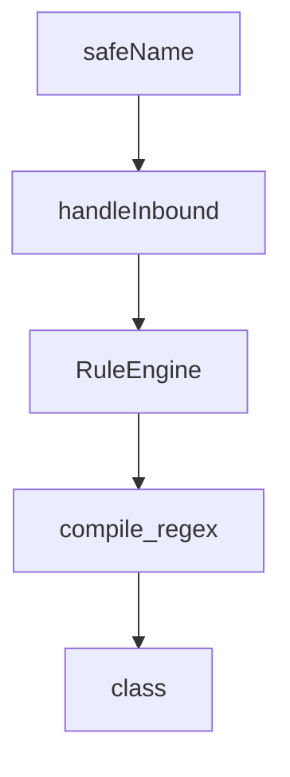

# Chapter 7: Submission and Contribution Workflow

Welcome to **Chapter 7: Submission and Contribution Workflow**. In this part of **Claude Plugins Official Tutorial: Anthropic's Managed Plugin Directory**, you will build an intuitive mental model first, then move into concrete implementation details and practical production tradeoffs.


This chapter explains how contributors submit and maintain plugins in the official directory context.

## Learning Goals

- understand external submission path and expectations
- prepare plugin documentation and structure for review
- use reference plugins and toolkit assets for faster alignment
- avoid common contribution-quality failures

## Contribution Paths

- internal plugins are maintained by Anthropic teams
- external plugins are submitted through the directory submission process

## Contributor Preparation Checklist

- plugin structure matches directory contract
- README includes setup, usage, and constraints
- optional MCP/hook integrations are documented clearly
- commands and skills are scoped and testable

## Source References

- [Directory README Contributing](https://github.com/anthropics/claude-plugins-official/blob/main/README.md#contributing)
- [Submission Form](https://clau.de/plugin-directory-submission)
- [Plugin Dev Toolkit](https://github.com/anthropics/claude-plugins-official/tree/main/plugins/plugin-dev)

## Summary

You now have a practical path for plugin contribution and review readiness.

Next: [Chapter 8: Governance and Enterprise Plugin Portfolio Management](08-governance-and-enterprise-plugin-portfolio-management.md)

## Depth Expansion Playbook

## Source Code Walkthrough

### `external_plugins/telegram/server.ts`

The `safeName` function in [`external_plugins/telegram/server.ts`](https://github.com/anthropics/claude-plugins-official/blob/HEAD/external_plugins/telegram/server.ts) handles a key part of this chapter's functionality:

```ts
bot.on('message:document', async ctx => {
  const doc = ctx.message.document
  const name = safeName(doc.file_name)
  const text = ctx.message.caption ?? `(document: ${name ?? 'file'})`
  await handleInbound(ctx, text, undefined, {
    kind: 'document',
    file_id: doc.file_id,
    size: doc.file_size,
    mime: doc.mime_type,
    name,
  })
})

bot.on('message:voice', async ctx => {
  const voice = ctx.message.voice
  const text = ctx.message.caption ?? '(voice message)'
  await handleInbound(ctx, text, undefined, {
    kind: 'voice',
    file_id: voice.file_id,
    size: voice.file_size,
    mime: voice.mime_type,
  })
})

bot.on('message:audio', async ctx => {
  const audio = ctx.message.audio
  const name = safeName(audio.file_name)
  const text = ctx.message.caption ?? `(audio: ${safeName(audio.title) ?? name ?? 'audio'})`
  await handleInbound(ctx, text, undefined, {
    kind: 'audio',
    file_id: audio.file_id,
    size: audio.file_size,
```

This function is important because it defines how Claude Plugins Official Tutorial: Anthropic's Managed Plugin Directory implements the patterns covered in this chapter.

### `external_plugins/telegram/server.ts`

The `handleInbound` function in [`external_plugins/telegram/server.ts`](https://github.com/anthropics/claude-plugins-official/blob/HEAD/external_plugins/telegram/server.ts) handles a key part of this chapter's functionality:

```ts

bot.on('message:text', async ctx => {
  await handleInbound(ctx, ctx.message.text, undefined)
})

bot.on('message:photo', async ctx => {
  const caption = ctx.message.caption ?? '(photo)'
  // Defer download until after the gate approves — any user can send photos,
  // and we don't want to burn API quota or fill the inbox for dropped messages.
  await handleInbound(ctx, caption, async () => {
    // Largest size is last in the array.
    const photos = ctx.message.photo
    const best = photos[photos.length - 1]
    try {
      const file = await ctx.api.getFile(best.file_id)
      if (!file.file_path) return undefined
      const url = `https://api.telegram.org/file/bot${TOKEN}/${file.file_path}`
      const res = await fetch(url)
      const buf = Buffer.from(await res.arrayBuffer())
      const ext = file.file_path.split('.').pop() ?? 'jpg'
      const path = join(INBOX_DIR, `${Date.now()}-${best.file_unique_id}.${ext}`)
      mkdirSync(INBOX_DIR, { recursive: true })
      writeFileSync(path, buf)
      return path
    } catch (err) {
      process.stderr.write(`telegram channel: photo download failed: ${err}\n`)
      return undefined
    }
  })
})

bot.on('message:document', async ctx => {
```

This function is important because it defines how Claude Plugins Official Tutorial: Anthropic's Managed Plugin Directory implements the patterns covered in this chapter.

### `plugins/hookify/core/rule_engine.py`

The `RuleEngine` class in [`plugins/hookify/core/rule_engine.py`](https://github.com/anthropics/claude-plugins-official/blob/HEAD/plugins/hookify/core/rule_engine.py) handles a key part of this chapter's functionality:

```py


class RuleEngine:
    """Evaluates rules against hook input data."""

    def __init__(self):
        """Initialize rule engine."""
        # No need for instance cache anymore - using global lru_cache
        pass

    def evaluate_rules(self, rules: List[Rule], input_data: Dict[str, Any]) -> Dict[str, Any]:
        """Evaluate all rules and return combined results.

        Checks all rules and accumulates matches. Blocking rules take priority
        over warning rules. All matching rule messages are combined.

        Args:
            rules: List of Rule objects to evaluate
            input_data: Hook input JSON (tool_name, tool_input, etc.)

        Returns:
            Response dict with systemMessage, hookSpecificOutput, etc.
            Empty dict {} if no rules match.
        """
        hook_event = input_data.get('hook_event_name', '')
        blocking_rules = []
        warning_rules = []

        for rule in rules:
            if self._rule_matches(rule, input_data):
                if rule.action == 'block':
                    blocking_rules.append(rule)
```

This class is important because it defines how Claude Plugins Official Tutorial: Anthropic's Managed Plugin Directory implements the patterns covered in this chapter.

### `plugins/hookify/core/rule_engine.py`

The `compile_regex` function in [`plugins/hookify/core/rule_engine.py`](https://github.com/anthropics/claude-plugins-official/blob/HEAD/plugins/hookify/core/rule_engine.py) handles a key part of this chapter's functionality:

```py
# Cache compiled regexes (max 128 patterns)
@lru_cache(maxsize=128)
def compile_regex(pattern: str) -> re.Pattern:
    """Compile regex pattern with caching.

    Args:
        pattern: Regex pattern string

    Returns:
        Compiled regex pattern
    """
    return re.compile(pattern, re.IGNORECASE)


class RuleEngine:
    """Evaluates rules against hook input data."""

    def __init__(self):
        """Initialize rule engine."""
        # No need for instance cache anymore - using global lru_cache
        pass

    def evaluate_rules(self, rules: List[Rule], input_data: Dict[str, Any]) -> Dict[str, Any]:
        """Evaluate all rules and return combined results.

        Checks all rules and accumulates matches. Blocking rules take priority
        over warning rules. All matching rule messages are combined.

        Args:
            rules: List of Rule objects to evaluate
            input_data: Hook input JSON (tool_name, tool_input, etc.)

```

This function is important because it defines how Claude Plugins Official Tutorial: Anthropic's Managed Plugin Directory implements the patterns covered in this chapter.


## How These Components Connect


