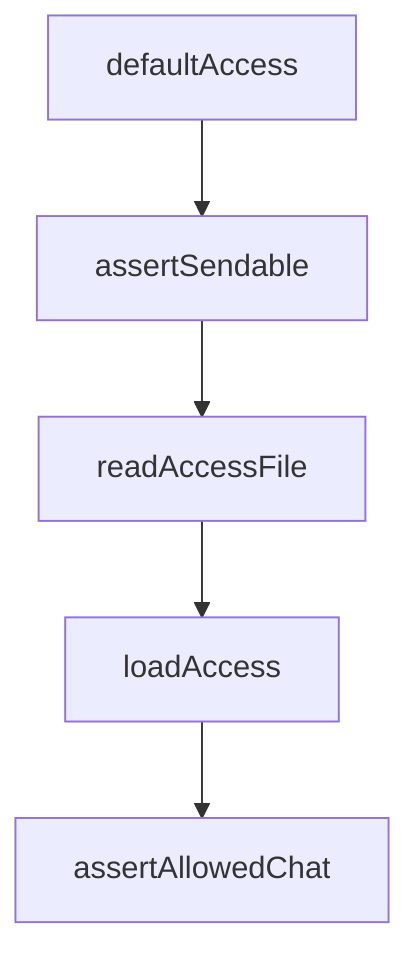

# Chapter 8: Governance and Enterprise Plugin Portfolio Management

Welcome to **Chapter 8: Governance and Enterprise Plugin Portfolio Management**. In this part of **Claude Plugins Official Tutorial: Anthropic's Managed Plugin Directory**, you will build an intuitive mental model first, then move into concrete implementation details and practical production tradeoffs.


This chapter provides a governance model for enterprise-scale plugin adoption.

## Learning Goals

- design plugin approval and lifecycle governance
- map plugin capabilities to compliance and security policies
- build portfolio review loops for capability and risk optimization
- keep developer velocity high while controlling operational exposure

## Governance Framework

- approved baseline plugin set by function
- risk classification for plugin categories
- periodic review and recertification
- incident-response playbook for plugin regressions

## Enterprise Practices

- require explicit rationale for every new plugin
- prefer narrowly scoped plugins over broad opaque bundles
- pair plugin rollout with observability and rollback readiness

## Source References

- [Official Plugin Docs](https://code.claude.com/docs/en/plugins)
- [Directory Repository](https://github.com/anthropics/claude-plugins-official)
- [Marketplace Catalog](https://github.com/anthropics/claude-plugins-official/blob/main/.claude-plugin/marketplace.json)

## Summary

You now have an enterprise-ready governance model for Claude Code plugin portfolios.

Next steps:

- define your org's approved plugin baseline
- publish contribution and review checklists internally
- onboard teams with role-specific plugin bundles

## Source Code Walkthrough

### `external_plugins/telegram/server.ts`

The `defaultAccess` function in [`external_plugins/telegram/server.ts`](https://github.com/anthropics/claude-plugins-official/blob/HEAD/external_plugins/telegram/server.ts) handles a key part of this chapter's functionality:

```ts
}

function defaultAccess(): Access {
  return {
    dmPolicy: 'pairing',
    allowFrom: [],
    groups: {},
    pending: {},
  }
}

const MAX_CHUNK_LIMIT = 4096
const MAX_ATTACHMENT_BYTES = 50 * 1024 * 1024

// reply's files param takes any path. .env is ~60 bytes and ships as a
// document. Claude can already Read+paste file contents, so this isn't a new
// exfil channel for arbitrary paths — but the server's own state is the one
// thing Claude has no reason to ever send.
function assertSendable(f: string): void {
  let real, stateReal: string
  try {
    real = realpathSync(f)
    stateReal = realpathSync(STATE_DIR)
  } catch { return } // statSync will fail properly; or STATE_DIR absent → nothing to leak
  const inbox = join(stateReal, 'inbox')
  if (real.startsWith(stateReal + sep) && !real.startsWith(inbox + sep)) {
    throw new Error(`refusing to send channel state: ${f}`)
  }
}

function readAccessFile(): Access {
  try {
```

This function is important because it defines how Claude Plugins Official Tutorial: Anthropic's Managed Plugin Directory implements the patterns covered in this chapter.

### `external_plugins/telegram/server.ts`

The `assertSendable` function in [`external_plugins/telegram/server.ts`](https://github.com/anthropics/claude-plugins-official/blob/HEAD/external_plugins/telegram/server.ts) handles a key part of this chapter's functionality:

```ts
// exfil channel for arbitrary paths — but the server's own state is the one
// thing Claude has no reason to ever send.
function assertSendable(f: string): void {
  let real, stateReal: string
  try {
    real = realpathSync(f)
    stateReal = realpathSync(STATE_DIR)
  } catch { return } // statSync will fail properly; or STATE_DIR absent → nothing to leak
  const inbox = join(stateReal, 'inbox')
  if (real.startsWith(stateReal + sep) && !real.startsWith(inbox + sep)) {
    throw new Error(`refusing to send channel state: ${f}`)
  }
}

function readAccessFile(): Access {
  try {
    const raw = readFileSync(ACCESS_FILE, 'utf8')
    const parsed = JSON.parse(raw) as Partial<Access>
    return {
      dmPolicy: parsed.dmPolicy ?? 'pairing',
      allowFrom: parsed.allowFrom ?? [],
      groups: parsed.groups ?? {},
      pending: parsed.pending ?? {},
      mentionPatterns: parsed.mentionPatterns,
      ackReaction: parsed.ackReaction,
      replyToMode: parsed.replyToMode,
      textChunkLimit: parsed.textChunkLimit,
      chunkMode: parsed.chunkMode,
    }
  } catch (err) {
    if ((err as NodeJS.ErrnoException).code === 'ENOENT') return defaultAccess()
    try {
```

This function is important because it defines how Claude Plugins Official Tutorial: Anthropic's Managed Plugin Directory implements the patterns covered in this chapter.

### `external_plugins/telegram/server.ts`

The `readAccessFile` function in [`external_plugins/telegram/server.ts`](https://github.com/anthropics/claude-plugins-official/blob/HEAD/external_plugins/telegram/server.ts) handles a key part of this chapter's functionality:

```ts
}

function readAccessFile(): Access {
  try {
    const raw = readFileSync(ACCESS_FILE, 'utf8')
    const parsed = JSON.parse(raw) as Partial<Access>
    return {
      dmPolicy: parsed.dmPolicy ?? 'pairing',
      allowFrom: parsed.allowFrom ?? [],
      groups: parsed.groups ?? {},
      pending: parsed.pending ?? {},
      mentionPatterns: parsed.mentionPatterns,
      ackReaction: parsed.ackReaction,
      replyToMode: parsed.replyToMode,
      textChunkLimit: parsed.textChunkLimit,
      chunkMode: parsed.chunkMode,
    }
  } catch (err) {
    if ((err as NodeJS.ErrnoException).code === 'ENOENT') return defaultAccess()
    try {
      renameSync(ACCESS_FILE, `${ACCESS_FILE}.corrupt-${Date.now()}`)
    } catch {}
    process.stderr.write(`telegram channel: access.json is corrupt, moved aside. Starting fresh.\n`)
    return defaultAccess()
  }
}

// In static mode, access is snapshotted at boot and never re-read or written.
// Pairing requires runtime mutation, so it's downgraded to allowlist with a
// startup warning — handing out codes that never get approved would be worse.
const BOOT_ACCESS: Access | null = STATIC
  ? (() => {
```

This function is important because it defines how Claude Plugins Official Tutorial: Anthropic's Managed Plugin Directory implements the patterns covered in this chapter.

### `external_plugins/telegram/server.ts`

The `loadAccess` function in [`external_plugins/telegram/server.ts`](https://github.com/anthropics/claude-plugins-official/blob/HEAD/external_plugins/telegram/server.ts) handles a key part of this chapter's functionality:

```ts
  : null

function loadAccess(): Access {
  return BOOT_ACCESS ?? readAccessFile()
}

// Outbound gate — reply/react/edit can only target chats the inbound gate
// would deliver from. Telegram DM chat_id == user_id, so allowFrom covers DMs.
function assertAllowedChat(chat_id: string): void {
  const access = loadAccess()
  if (access.allowFrom.includes(chat_id)) return
  if (chat_id in access.groups) return
  throw new Error(`chat ${chat_id} is not allowlisted — add via /telegram:access`)
}

function saveAccess(a: Access): void {
  if (STATIC) return
  mkdirSync(STATE_DIR, { recursive: true, mode: 0o700 })
  const tmp = ACCESS_FILE + '.tmp'
  writeFileSync(tmp, JSON.stringify(a, null, 2) + '\n', { mode: 0o600 })
  renameSync(tmp, ACCESS_FILE)
}

function pruneExpired(a: Access): boolean {
  const now = Date.now()
  let changed = false
  for (const [code, p] of Object.entries(a.pending)) {
    if (p.expiresAt < now) {
      delete a.pending[code]
      changed = true
    }
  }
```

This function is important because it defines how Claude Plugins Official Tutorial: Anthropic's Managed Plugin Directory implements the patterns covered in this chapter.


## How These Components Connect


