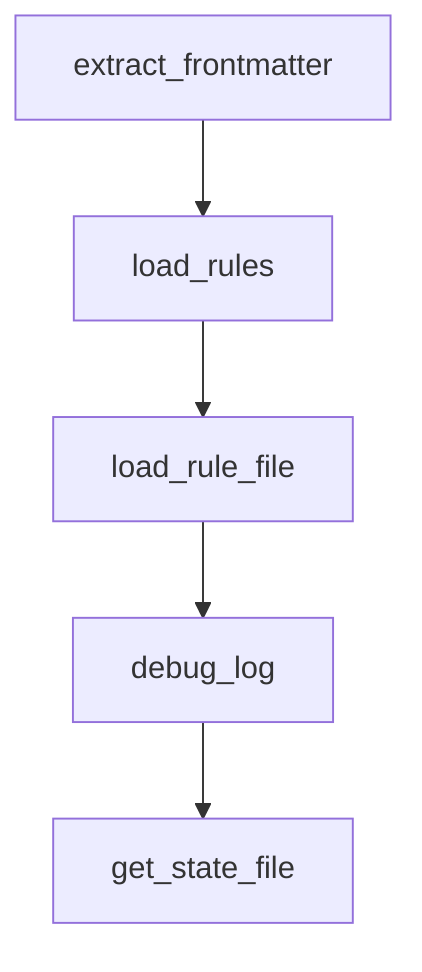

# Chapter 8: Governance and Enterprise Plugin Portfolio Management

Welcome to **Chapter 8: Governance and Enterprise Plugin Portfolio Management**. In this part of **Claude Plugins Official Tutorial: Anthropic's Managed Plugin Directory**, you will build an intuitive mental model first, then move into concrete implementation details and practical production tradeoffs.


This chapter provides a governance model for enterprise-scale plugin adoption.

## Learning Goals

- design plugin approval and lifecycle governance
- map plugin capabilities to compliance and security policies
- build portfolio review loops for capability and risk optimization
- keep developer velocity high while controlling operational exposure

## Governance Framework

- approved baseline plugin set by function
- risk classification for plugin categories
- periodic review and recertification
- incident-response playbook for plugin regressions

## Enterprise Practices

- require explicit rationale for every new plugin
- prefer narrowly scoped plugins over broad opaque bundles
- pair plugin rollout with observability and rollback readiness

## Source References

- [Official Plugin Docs](https://code.claude.com/docs/en/plugins)
- [Directory Repository](https://github.com/anthropics/claude-plugins-official)
- [Marketplace Catalog](https://github.com/anthropics/claude-plugins-official/blob/main/.claude-plugin/marketplace.json)

## Summary

You now have an enterprise-ready governance model for Claude Code plugin portfolios.

Next steps:

- define your org's approved plugin baseline
- publish contribution and review checklists internally
- onboard teams with role-specific plugin bundles

## Depth Expansion Playbook

## Source Code Walkthrough

### `plugins/hookify/core/config_loader.py`

The `extract_frontmatter` function in [`plugins/hookify/core/config_loader.py`](https://github.com/anthropics/claude-plugins-official/blob/HEAD/plugins/hookify/core/config_loader.py) handles a key part of this chapter's functionality:

```py


def extract_frontmatter(content: str) -> tuple[Dict[str, Any], str]:
    """Extract YAML frontmatter and message body from markdown.

    Returns (frontmatter_dict, message_body).

    Supports multi-line dictionary items in lists by preserving indentation.
    """
    if not content.startswith('---'):
        return {}, content

    # Split on --- markers
    parts = content.split('---', 2)
    if len(parts) < 3:
        return {}, content

    frontmatter_text = parts[1]
    message = parts[2].strip()

    # Simple YAML parser that handles indented list items
    frontmatter = {}
    lines = frontmatter_text.split('\n')

    current_key = None
    current_list = []
    current_dict = {}
    in_list = False
    in_dict_item = False

    for line in lines:
        # Skip empty lines and comments
```

This function is important because it defines how Claude Plugins Official Tutorial: Anthropic's Managed Plugin Directory implements the patterns covered in this chapter.

### `plugins/hookify/core/config_loader.py`

The `load_rules` function in [`plugins/hookify/core/config_loader.py`](https://github.com/anthropics/claude-plugins-official/blob/HEAD/plugins/hookify/core/config_loader.py) handles a key part of this chapter's functionality:

```py


def load_rules(event: Optional[str] = None) -> List[Rule]:
    """Load all hookify rules from .claude directory.

    Args:
        event: Optional event filter ("bash", "file", "stop", etc.)

    Returns:
        List of enabled Rule objects matching the event.
    """
    rules = []

    # Find all hookify.*.local.md files
    pattern = os.path.join('.claude', 'hookify.*.local.md')
    files = glob.glob(pattern)

    for file_path in files:
        try:
            rule = load_rule_file(file_path)
            if not rule:
                continue

            # Filter by event if specified
            if event:
                if rule.event != 'all' and rule.event != event:
                    continue

            # Only include enabled rules
            if rule.enabled:
                rules.append(rule)

```

This function is important because it defines how Claude Plugins Official Tutorial: Anthropic's Managed Plugin Directory implements the patterns covered in this chapter.

### `plugins/hookify/core/config_loader.py`

The `load_rule_file` function in [`plugins/hookify/core/config_loader.py`](https://github.com/anthropics/claude-plugins-official/blob/HEAD/plugins/hookify/core/config_loader.py) handles a key part of this chapter's functionality:

```py
    for file_path in files:
        try:
            rule = load_rule_file(file_path)
            if not rule:
                continue

            # Filter by event if specified
            if event:
                if rule.event != 'all' and rule.event != event:
                    continue

            # Only include enabled rules
            if rule.enabled:
                rules.append(rule)

        except (IOError, OSError, PermissionError) as e:
            # File I/O errors - log and continue
            print(f"Warning: Failed to read {file_path}: {e}", file=sys.stderr)
            continue
        except (ValueError, KeyError, AttributeError, TypeError) as e:
            # Parsing errors - log and continue
            print(f"Warning: Failed to parse {file_path}: {e}", file=sys.stderr)
            continue
        except Exception as e:
            # Unexpected errors - log with type details
            print(f"Warning: Unexpected error loading {file_path} ({type(e).__name__}): {e}", file=sys.stderr)
            continue

    return rules


def load_rule_file(file_path: str) -> Optional[Rule]:
```

This function is important because it defines how Claude Plugins Official Tutorial: Anthropic's Managed Plugin Directory implements the patterns covered in this chapter.

### `plugins/security-guidance/hooks/security_reminder_hook.py`

The `debug_log` function in [`plugins/security-guidance/hooks/security_reminder_hook.py`](https://github.com/anthropics/claude-plugins-official/blob/HEAD/plugins/security-guidance/hooks/security_reminder_hook.py) handles a key part of this chapter's functionality:

```py


def debug_log(message):
    """Append debug message to log file with timestamp."""
    try:
        timestamp = datetime.now().strftime("%Y-%m-%d %H:%M:%S.%f")[:-3]
        with open(DEBUG_LOG_FILE, "a") as f:
            f.write(f"[{timestamp}] {message}\n")
    except Exception as e:
        # Silently ignore logging errors to avoid disrupting the hook
        pass


# State file to track warnings shown (session-scoped using session ID)

# Security patterns configuration
SECURITY_PATTERNS = [
    {
        "ruleName": "github_actions_workflow",
        "path_check": lambda path: ".github/workflows/" in path
        and (path.endswith(".yml") or path.endswith(".yaml")),
        "reminder": """You are editing a GitHub Actions workflow file. Be aware of these security risks:

1. **Command Injection**: Never use untrusted input (like issue titles, PR descriptions, commit messages) directly in run: commands without proper escaping
2. **Use environment variables**: Instead of ${{ github.event.issue.title }}, use env: with proper quoting
3. **Review the guide**: https://github.blog/security/vulnerability-research/how-to-catch-github-actions-workflow-injections-before-attackers-do/

Example of UNSAFE pattern to avoid:
run: echo "${{ github.event.issue.title }}"

Example of SAFE pattern:
env:
```

This function is important because it defines how Claude Plugins Official Tutorial: Anthropic's Managed Plugin Directory implements the patterns covered in this chapter.


## How These Components Connect


