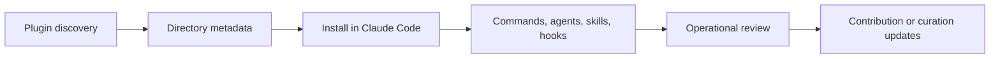

# Claude Plugins Official Tutorial: Anthropic's Managed Plugin Directory

> Learn how to use `anthropics/claude-plugins-official` to discover, evaluate, install, and contribute Claude Code plugins with clear directory standards and plugin safety practices.

## Why This Track Matters

The official plugin directory is a key distribution layer for the Claude Code plugin ecosystem and a reference point for plugin structure, discoverability, and quality expectations.

This track focuses on:

- installing plugins from the directory safely
- understanding internal vs external plugin structure
- applying manifest and packaging conventions correctly
- operating plugin governance workflows for teams

## Current Snapshot (auto-updated)

- repository: [`anthropics/claude-plugins-official`](https://github.com/anthropics/claude-plugins-official)
- stars: about **7.3k**
- latest release: **none tagged** (rolling `main`)
- recent activity: updates on **February 11, 2026**
- project positioning: Anthropic-managed directory for Claude Code plugins

## Mental Model

## Chapter Guide

| Chapter | Key Question | Outcome |
|:--------|:-------------|:--------|
| [01 - Getting Started](01-getting-started.md) | How do I install plugins from the directory quickly? | Working baseline |
| [02 - Directory Architecture and Marketplace Model](02-directory-architecture-and-marketplace-model.md) | How are internal and external plugins organized? | Strong architecture model |
| [03 - Plugin Manifest and Structural Contracts](03-plugin-manifest-and-structural-contracts.md) | What files and metadata are required for compliant plugins? | Better authoring reliability |
| [04 - Commands, Agents, Skills, Hooks, and MCP Composition](04-commands-agents-skills-hooks-and-mcp-composition.md) | How do plugin capabilities compose into workflows? | Better capability design |
| [05 - Trust, Security, and Risk Controls](05-trust-security-and-risk-controls.md) | How do I evaluate plugin safety before use? | Safer adoption process |
| [06 - Installation, Operations, and Update Strategy](06-installation-operations-and-update-strategy.md) | How do teams run plugin operations at scale? | Operational consistency |
| [07 - Submission and Contribution Workflow](07-submission-and-contribution-workflow.md) | How do I submit and maintain plugins in the directory? | Contributor readiness |
| [08 - Governance and Enterprise Plugin Portfolio Management](08-governance-and-enterprise-plugin-portfolio-management.md) | How do orgs manage plugin portfolios over time? | Governance playbook |

## What You Will Learn

- how to install and evaluate official-directory plugins
- how plugin contracts map to real Claude Code capabilities
- how to apply risk controls around third-party plugin use
- how to contribute plugins with stronger acceptance probability

## Source References

- [Claude Plugins Official Repository](https://github.com/anthropics/claude-plugins-official)
- [Directory README](https://github.com/anthropics/claude-plugins-official/blob/main/README.md)
- [Marketplace Catalog](https://github.com/anthropics/claude-plugins-official/blob/main/.claude-plugin/marketplace.json)
- [Example Plugin](https://github.com/anthropics/claude-plugins-official/tree/main/plugins/example-plugin)
- [Official Plugin Docs](https://code.claude.com/docs/en/plugins)

## Related Tutorials

- [Claude Code Tutorial](../claude-code-tutorial/)
- [Wshobson Agents Tutorial](../wshobson-agents-tutorial/)
- [Agents.md Tutorial](../agents-md-tutorial/)
- [MCP Servers Tutorial](../mcp-servers-tutorial/)

---

Start with [Chapter 1: Getting Started](01-getting-started.md).

## Navigation & Backlinks

- [Start Here: Chapter 1: Getting Started](01-getting-started.md)
- [Back to Main Catalog](../../README.md#-tutorial-catalog)
- [Browse A-Z Tutorial Directory](../../discoverability/tutorial-directory.md)
- [Search by Intent](../../discoverability/query-hub.md)
- [Explore Category Hubs](../../README.md#category-hubs)

## Full Chapter Map

1. [Chapter 1: Getting Started](01-getting-started.md)
2. [Chapter 2: Directory Architecture and Marketplace Model](02-directory-architecture-and-marketplace-model.md)
3. [Chapter 3: Plugin Manifest and Structural Contracts](03-plugin-manifest-and-structural-contracts.md)
4. [Chapter 4: Commands, Agents, Skills, Hooks, and MCP Composition](04-commands-agents-skills-hooks-and-mcp-composition.md)
5. [Chapter 5: Trust, Security, and Risk Controls](05-trust-security-and-risk-controls.md)
6. [Chapter 6: Installation, Operations, and Update Strategy](06-installation-operations-and-update-strategy.md)
7. [Chapter 7: Submission and Contribution Workflow](07-submission-and-contribution-workflow.md)
8. [Chapter 8: Governance and Enterprise Plugin Portfolio Management](08-governance-and-enterprise-plugin-portfolio-management.md)

*Generated by [AI Codebase Knowledge Builder](https://github.com/The-Pocket/Tutorial-Codebase-Knowledge)*
