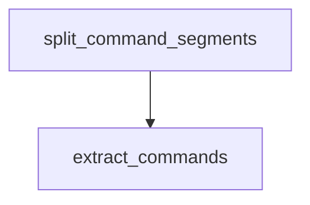

# Chapter 1: Getting Started

Welcome to **Chapter 1: Getting Started**. In this part of **Claude Quickstarts Tutorial: Production Integration Patterns**, you will build an intuitive mental model first, then move into concrete implementation details and practical production tradeoffs.


This chapter sets up the quickstarts repository and helps you pick the right project first.

## Clone and Install

```bash
git clone https://github.com/anthropics/anthropic-quickstarts.git
cd anthropic-quickstarts
```

Each quickstart may have its own dependencies. Follow the local README in each project folder.

## Configure Credentials

```bash
export ANTHROPIC_API_KEY="your_api_key_here"
```

## Choosing Your First Quickstart

- Start with **Customer Support** for straightforward chat workflows.
- Pick **Data Analyst** for structured outputs and visualization.
- Use **Browser/Computer Use** only when automation control is required.

## Success Criteria

- Project boots locally.
- API credentials are loaded securely.
- First request to Claude succeeds.

## Summary

You now have a working local setup and a clear path for selecting a starter quickstart.

Next: [Chapter 2: Customer Support Agents](02-customer-support-agents.md)

## What Problem Does This Solve?

Most teams struggle here because the hard part is not writing more code, but deciding clear boundaries for `anthropic`, `quickstarts`, `clone` so behavior stays predictable as complexity grows.

In practical terms, this chapter helps you avoid three common failures:

- coupling core logic too tightly to one implementation path
- missing the handoff boundaries between setup, execution, and validation
- shipping changes without clear rollback or observability strategy

After working through this chapter, you should be able to reason about `Chapter 1: Getting Started` as an operating subsystem inside **Claude Quickstarts Tutorial: Production Integration Patterns**, with explicit contracts for inputs, state transitions, and outputs.

Use the implementation notes around `https`, `github`, `anthropics` as your checklist when adapting these patterns to your own repository.

## How it Works Under the Hood

Under the hood, `Chapter 1: Getting Started` usually follows a repeatable control path:

1. **Context bootstrap**: initialize runtime config and prerequisites for `anthropic`.
2. **Input normalization**: shape incoming data so `quickstarts` receives stable contracts.
3. **Core execution**: run the main logic branch and propagate intermediate state through `clone`.
4. **Policy and safety checks**: enforce limits, auth scopes, and failure boundaries.
5. **Output composition**: return canonical result payloads for downstream consumers.
6. **Operational telemetry**: emit logs/metrics needed for debugging and performance tuning.

When debugging, walk this sequence in order and confirm each stage has explicit success/failure conditions.

## Source Walkthrough

Use the following upstream sources to verify implementation details while reading this chapter:

- [Claude Quickstarts repository](https://github.com/anthropics/anthropic-quickstarts)
  Why it matters: authoritative reference on `Claude Quickstarts repository` (github.com).

Suggested trace strategy:
- search upstream code for `anthropic` and `quickstarts` to map concrete implementation paths
- compare docs claims against actual runtime/config code before reusing patterns in production

## Chapter Connections

- [Tutorial Index](README.md)
- [Next Chapter: Chapter 2: Customer Support Agents](02-customer-support-agents.md)
- [Main Catalog](../../README.md#-tutorial-catalog)
- [A-Z Tutorial Directory](../../discoverability/tutorial-directory.md)

## Source Code Walkthrough

### `autonomous-coding/security.py`

The `split_command_segments` function in [`autonomous-coding/security.py`](https://github.com/anthropics/anthropic-quickstarts/blob/HEAD/autonomous-coding/security.py) handles a key part of this chapter's functionality:

```py


def split_command_segments(command_string: str) -> list[str]:
    """
    Split a compound command into individual command segments.

    Handles command chaining (&&, ||, ;) but not pipes (those are single commands).

    Args:
        command_string: The full shell command

    Returns:
        List of individual command segments
    """
    import re

    # Split on && and || while preserving the ability to handle each segment
    # This regex splits on && or || that aren't inside quotes
    segments = re.split(r"\s*(?:&&|\|\|)\s*", command_string)

    # Further split on semicolons
    result = []
    for segment in segments:
        sub_segments = re.split(r'(?<!["\'])\s*;\s*(?!["\'])', segment)
        for sub in sub_segments:
            sub = sub.strip()
            if sub:
                result.append(sub)

    return result


```

This function is important because it defines how Claude Quickstarts Tutorial: Production Integration Patterns implements the patterns covered in this chapter.

### `autonomous-coding/security.py`

The `extract_commands` function in [`autonomous-coding/security.py`](https://github.com/anthropics/anthropic-quickstarts/blob/HEAD/autonomous-coding/security.py) handles a key part of this chapter's functionality:

```py


def extract_commands(command_string: str) -> list[str]:
    """
    Extract command names from a shell command string.

    Handles pipes, command chaining (&&, ||, ;), and subshells.
    Returns the base command names (without paths).

    Args:
        command_string: The full shell command

    Returns:
        List of command names found in the string
    """
    commands = []

    # shlex doesn't treat ; as a separator, so we need to pre-process
    import re

    # Split on semicolons that aren't inside quotes (simple heuristic)
    # This handles common cases like "echo hello; ls"
    segments = re.split(r'(?<!["\'])\s*;\s*(?!["\'])', command_string)

    for segment in segments:
        segment = segment.strip()
        if not segment:
            continue

        try:
            tokens = shlex.split(segment)
        except ValueError:
```

This function is important because it defines how Claude Quickstarts Tutorial: Production Integration Patterns implements the patterns covered in this chapter.


## How These Components Connect


