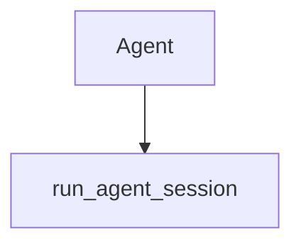

# Chapter 2: Customer Support Agents

Welcome to **Chapter 2: Customer Support Agents**. In this part of **Claude Quickstarts Tutorial: Production Integration Patterns**, you will build an intuitive mental model first, then move into concrete implementation details and practical production tradeoffs.


Customer-support quickstarts show high-value patterns for retrieval and response quality.

## Core Architecture

1. Receive user query.
2. Retrieve relevant support articles.
3. Send context + query to Claude.
4. Return concise answer with escalation path.

## Retrieval Pattern

- Normalize and chunk support docs.
- Rank top candidates by relevance.
- Attach citations in final answer.

## Response Policy Guardrails

- Never fabricate policy details.
- Escalate billing/legal edge cases.
- Keep answers short and actionable.

## Operational Metrics

- first-response latency
- ticket deflection rate
- escalation rate
- user satisfaction score

## Summary

You can now design a robust support agent with retrieval and escalation.

Next: [Chapter 3: Data Processing and Analysis](03-data-processing-analysis.md)

## What Problem Does This Solve?

Most teams struggle here because the hard part is not writing more code, but deciding clear boundaries for core abstractions in this chapter so behavior stays predictable as complexity grows.

In practical terms, this chapter helps you avoid three common failures:

- coupling core logic too tightly to one implementation path
- missing the handoff boundaries between setup, execution, and validation
- shipping changes without clear rollback or observability strategy

After working through this chapter, you should be able to reason about `Chapter 2: Customer Support Agents` as an operating subsystem inside **Claude Quickstarts Tutorial: Production Integration Patterns**, with explicit contracts for inputs, state transitions, and outputs.

Use the implementation notes around execution and reliability details as your checklist when adapting these patterns to your own repository.

## How it Works Under the Hood

Under the hood, `Chapter 2: Customer Support Agents` usually follows a repeatable control path:

1. **Context bootstrap**: initialize runtime config and prerequisites for `core component`.
2. **Input normalization**: shape incoming data so `execution layer` receives stable contracts.
3. **Core execution**: run the main logic branch and propagate intermediate state through `state model`.
4. **Policy and safety checks**: enforce limits, auth scopes, and failure boundaries.
5. **Output composition**: return canonical result payloads for downstream consumers.
6. **Operational telemetry**: emit logs/metrics needed for debugging and performance tuning.

When debugging, walk this sequence in order and confirm each stage has explicit success/failure conditions.

## Source Walkthrough

Use the following upstream sources to verify implementation details while reading this chapter:

- [Claude Quickstarts repository](https://github.com/anthropics/anthropic-quickstarts)
  Why it matters: authoritative reference on `Claude Quickstarts repository` (github.com).

Suggested trace strategy:
- search upstream code for `Customer` and `Support` to map concrete implementation paths
- compare docs claims against actual runtime/config code before reusing patterns in production

## Chapter Connections

- [Tutorial Index](README.md)
- [Previous Chapter: Chapter 1: Getting Started](01-getting-started.md)
- [Next Chapter: Chapter 3: Data Processing and Analysis](03-data-processing-analysis.md)
- [Main Catalog](../../README.md#-tutorial-catalog)
- [A-Z Tutorial Directory](../../discoverability/tutorial-directory.md)

## Depth Expansion Playbook

## Source Code Walkthrough

### `agents/agent.py`

The `Agent` class in [`agents/agent.py`](https://github.com/anthropics/anthropic-quickstarts/blob/HEAD/agents/agent.py) handles a key part of this chapter's functionality:

```py
"""Agent implementation with Claude API and tools."""

import asyncio
import os
from contextlib import AsyncExitStack
from dataclasses import dataclass
from typing import Any

from anthropic import Anthropic

from .tools.base import Tool
from .utils.connections import setup_mcp_connections
from .utils.history_util import MessageHistory
from .utils.tool_util import execute_tools


@dataclass
class ModelConfig:
    """Configuration settings for Claude model parameters."""

    # Available models include:
    # - claude-sonnet-4-20250514 (default)
    # - claude-opus-4-20250514
    # - claude-haiku-4-5-20251001
    # - claude-3-5-sonnet-20240620
    # - claude-3-haiku-20240307
    model: str = "claude-sonnet-4-20250514"
    max_tokens: int = 4096
    temperature: float = 1.0
    context_window_tokens: int = 180000
```

This class is important because it defines how Claude Quickstarts Tutorial: Production Integration Patterns implements the patterns covered in this chapter.

### `autonomous-coding/agent.py`

The `run_agent_session` function in [`autonomous-coding/agent.py`](https://github.com/anthropics/anthropic-quickstarts/blob/HEAD/autonomous-coding/agent.py) handles a key part of this chapter's functionality:

```py


async def run_agent_session(
    client: ClaudeSDKClient,
    message: str,
    project_dir: Path,
) -> tuple[str, str]:
    """
    Run a single agent session using Claude Agent SDK.

    Args:
        client: Claude SDK client
        message: The prompt to send
        project_dir: Project directory path

    Returns:
        (status, response_text) where status is:
        - "continue" if agent should continue working
        - "error" if an error occurred
    """
    print("Sending prompt to Claude Agent SDK...\n")

    try:
        # Send the query
        await client.query(message)

        # Collect response text and show tool use
        response_text = ""
        async for msg in client.receive_response():
            msg_type = type(msg).__name__

            # Handle AssistantMessage (text and tool use)
```

This function is important because it defines how Claude Quickstarts Tutorial: Production Integration Patterns implements the patterns covered in this chapter.


## How These Components Connect


