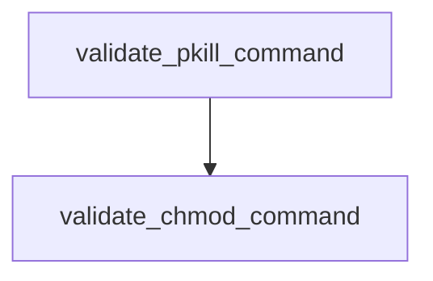

# Chapter 2: Customer Support Agents

Welcome to **Chapter 2: Customer Support Agents**. In this part of **Claude Quickstarts Tutorial: Production Integration Patterns**, you will build an intuitive mental model first, then move into concrete implementation details and practical production tradeoffs.


Customer-support quickstarts show high-value patterns for retrieval and response quality.

## Core Architecture

1. Receive user query.
2. Retrieve relevant support articles.
3. Send context + query to Claude.
4. Return concise answer with escalation path.

## Retrieval Pattern

- Normalize and chunk support docs.
- Rank top candidates by relevance.
- Attach citations in final answer.

## Response Policy Guardrails

- Never fabricate policy details.
- Escalate billing/legal edge cases.
- Keep answers short and actionable.

## Operational Metrics

- first-response latency
- ticket deflection rate
- escalation rate
- user satisfaction score

## Summary

You can now design a robust support agent with retrieval and escalation.

Next: [Chapter 3: Data Processing and Analysis](03-data-processing-analysis.md)

## What Problem Does This Solve?

Most teams struggle here because the hard part is not writing more code, but deciding clear boundaries for core abstractions in this chapter so behavior stays predictable as complexity grows.

In practical terms, this chapter helps you avoid three common failures:

- coupling core logic too tightly to one implementation path
- missing the handoff boundaries between setup, execution, and validation
- shipping changes without clear rollback or observability strategy

After working through this chapter, you should be able to reason about `Chapter 2: Customer Support Agents` as an operating subsystem inside **Claude Quickstarts Tutorial: Production Integration Patterns**, with explicit contracts for inputs, state transitions, and outputs.

Use the implementation notes around execution and reliability details as your checklist when adapting these patterns to your own repository.

## How it Works Under the Hood

Under the hood, `Chapter 2: Customer Support Agents` usually follows a repeatable control path:

1. **Context bootstrap**: initialize runtime config and prerequisites for `core component`.
2. **Input normalization**: shape incoming data so `execution layer` receives stable contracts.
3. **Core execution**: run the main logic branch and propagate intermediate state through `state model`.
4. **Policy and safety checks**: enforce limits, auth scopes, and failure boundaries.
5. **Output composition**: return canonical result payloads for downstream consumers.
6. **Operational telemetry**: emit logs/metrics needed for debugging and performance tuning.

When debugging, walk this sequence in order and confirm each stage has explicit success/failure conditions.

## Source Walkthrough

Use the following upstream sources to verify implementation details while reading this chapter:

- [Claude Quickstarts repository](https://github.com/anthropics/anthropic-quickstarts)
  Why it matters: authoritative reference on `Claude Quickstarts repository` (github.com).

Suggested trace strategy:
- search upstream code for `Customer` and `Support` to map concrete implementation paths
- compare docs claims against actual runtime/config code before reusing patterns in production

## Chapter Connections

- [Tutorial Index](README.md)
- [Previous Chapter: Chapter 1: Getting Started](01-getting-started.md)
- [Next Chapter: Chapter 3: Data Processing and Analysis](03-data-processing-analysis.md)
- [Main Catalog](../../README.md#-tutorial-catalog)
- [A-Z Tutorial Directory](../../discoverability/tutorial-directory.md)

## Source Code Walkthrough

### `autonomous-coding/security.py`

The `validate_pkill_command` function in [`autonomous-coding/security.py`](https://github.com/anthropics/anthropic-quickstarts/blob/HEAD/autonomous-coding/security.py) handles a key part of this chapter's functionality:

```py


def validate_pkill_command(command_string: str) -> tuple[bool, str]:
    """
    Validate pkill commands - only allow killing dev-related processes.

    Uses shlex to parse the command, avoiding regex bypass vulnerabilities.

    Returns:
        Tuple of (is_allowed, reason_if_blocked)
    """
    # Allowed process names for pkill
    allowed_process_names = {
        "node",
        "npm",
        "npx",
        "vite",
        "next",
    }

    try:
        tokens = shlex.split(command_string)
    except ValueError:
        return False, "Could not parse pkill command"

    if not tokens:
        return False, "Empty pkill command"

    # Separate flags from arguments
    args = []
    for token in tokens[1:]:
        if not token.startswith("-"):
```

This function is important because it defines how Claude Quickstarts Tutorial: Production Integration Patterns implements the patterns covered in this chapter.

### `autonomous-coding/security.py`

The `validate_chmod_command` function in [`autonomous-coding/security.py`](https://github.com/anthropics/anthropic-quickstarts/blob/HEAD/autonomous-coding/security.py) handles a key part of this chapter's functionality:

```py


def validate_chmod_command(command_string: str) -> tuple[bool, str]:
    """
    Validate chmod commands - only allow making files executable with +x.

    Returns:
        Tuple of (is_allowed, reason_if_blocked)
    """
    try:
        tokens = shlex.split(command_string)
    except ValueError:
        return False, "Could not parse chmod command"

    if not tokens or tokens[0] != "chmod":
        return False, "Not a chmod command"

    # Look for the mode argument
    # Valid modes: +x, u+x, a+x, etc. (anything ending with +x for execute permission)
    mode = None
    files = []

    for token in tokens[1:]:
        if token.startswith("-"):
            # Skip flags like -R (we don't allow recursive chmod anyway)
            return False, "chmod flags are not allowed"
        elif mode is None:
            mode = token
        else:
            files.append(token)

    if mode is None:
```

This function is important because it defines how Claude Quickstarts Tutorial: Production Integration Patterns implements the patterns covered in this chapter.


## How These Components Connect


