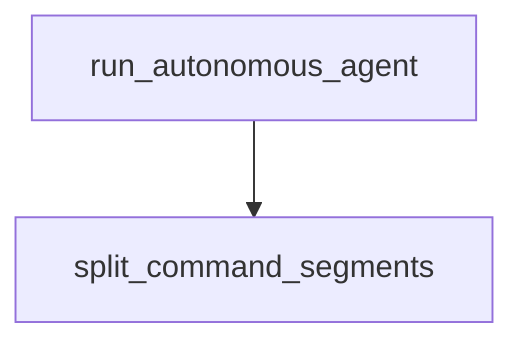

# Chapter 3: Data Processing and Analysis

Welcome to **Chapter 3: Data Processing and Analysis**. In this part of **Claude Quickstarts Tutorial: Production Integration Patterns**, you will build an intuitive mental model first, then move into concrete implementation details and practical production tradeoffs.


Data quickstarts focus on turning raw data into trustworthy, structured insight.

## Typical Workflow

- ingest CSV/JSON or API output
- validate and profile data quality
- ask Claude for explanations and summaries
- return machine-readable structured output

## Structured Output Pattern

```json
{
  "summary": "Revenue grew 12% QoQ",
  "risks": ["higher churn in SMB"],
  "recommendations": ["run retention campaign"]
}
```

## Best Practices

- Keep schema strict for downstream systems.
- Include data-quality checks before inference.
- Separate analysis prompts from presentation prompts.

## Summary

You can now build reproducible Claude-driven analytics pipelines.

Next: [Chapter 4: Browser and Computer Use](04-browser-computer-use.md)

## What Problem Does This Solve?

Most teams struggle here because the hard part is not writing more code, but deciding clear boundaries for `summary`, `Revenue`, `grew` so behavior stays predictable as complexity grows.

In practical terms, this chapter helps you avoid three common failures:

- coupling core logic too tightly to one implementation path
- missing the handoff boundaries between setup, execution, and validation
- shipping changes without clear rollback or observability strategy

After working through this chapter, you should be able to reason about `Chapter 3: Data Processing and Analysis` as an operating subsystem inside **Claude Quickstarts Tutorial: Production Integration Patterns**, with explicit contracts for inputs, state transitions, and outputs.

Use the implementation notes around `risks`, `higher`, `churn` as your checklist when adapting these patterns to your own repository.

## How it Works Under the Hood

Under the hood, `Chapter 3: Data Processing and Analysis` usually follows a repeatable control path:

1. **Context bootstrap**: initialize runtime config and prerequisites for `summary`.
2. **Input normalization**: shape incoming data so `Revenue` receives stable contracts.
3. **Core execution**: run the main logic branch and propagate intermediate state through `grew`.
4. **Policy and safety checks**: enforce limits, auth scopes, and failure boundaries.
5. **Output composition**: return canonical result payloads for downstream consumers.
6. **Operational telemetry**: emit logs/metrics needed for debugging and performance tuning.

When debugging, walk this sequence in order and confirm each stage has explicit success/failure conditions.

## Source Walkthrough

Use the following upstream sources to verify implementation details while reading this chapter:

- [Claude Quickstarts repository](https://github.com/anthropics/anthropic-quickstarts)
  Why it matters: authoritative reference on `Claude Quickstarts repository` (github.com).

Suggested trace strategy:
- search upstream code for `summary` and `Revenue` to map concrete implementation paths
- compare docs claims against actual runtime/config code before reusing patterns in production

## Chapter Connections

- [Tutorial Index](README.md)
- [Previous Chapter: Chapter 2: Customer Support Agents](02-customer-support-agents.md)
- [Next Chapter: Chapter 4: Browser and Computer Use](04-browser-computer-use.md)
- [Main Catalog](../../README.md#-tutorial-catalog)
- [A-Z Tutorial Directory](../../discoverability/tutorial-directory.md)

## Depth Expansion Playbook

## Source Code Walkthrough

### `autonomous-coding/agent.py`

The `run_autonomous_agent` function in [`autonomous-coding/agent.py`](https://github.com/anthropics/anthropic-quickstarts/blob/HEAD/autonomous-coding/agent.py) handles a key part of this chapter's functionality:

```py


async def run_autonomous_agent(
    project_dir: Path,
    model: str,
    max_iterations: Optional[int] = None,
) -> None:
    """
    Run the autonomous agent loop.

    Args:
        project_dir: Directory for the project
        model: Claude model to use
        max_iterations: Maximum number of iterations (None for unlimited)
    """
    print("\n" + "=" * 70)
    print("  AUTONOMOUS CODING AGENT DEMO")
    print("=" * 70)
    print(f"\nProject directory: {project_dir}")
    print(f"Model: {model}")
    if max_iterations:
        print(f"Max iterations: {max_iterations}")
    else:
        print("Max iterations: Unlimited (will run until completion)")
    print()

    # Create project directory
    project_dir.mkdir(parents=True, exist_ok=True)

    # Check if this is a fresh start or continuation
    tests_file = project_dir / "feature_list.json"
    is_first_run = not tests_file.exists()
```

This function is important because it defines how Claude Quickstarts Tutorial: Production Integration Patterns implements the patterns covered in this chapter.

### `autonomous-coding/security.py`

The `split_command_segments` function in [`autonomous-coding/security.py`](https://github.com/anthropics/anthropic-quickstarts/blob/HEAD/autonomous-coding/security.py) handles a key part of this chapter's functionality:

```py


def split_command_segments(command_string: str) -> list[str]:
    """
    Split a compound command into individual command segments.

    Handles command chaining (&&, ||, ;) but not pipes (those are single commands).

    Args:
        command_string: The full shell command

    Returns:
        List of individual command segments
    """
    import re

    # Split on && and || while preserving the ability to handle each segment
    # This regex splits on && or || that aren't inside quotes
    segments = re.split(r"\s*(?:&&|\|\|)\s*", command_string)

    # Further split on semicolons
    result = []
    for segment in segments:
        sub_segments = re.split(r'(?<!["\'])\s*;\s*(?!["\'])', segment)
        for sub in sub_segments:
            sub = sub.strip()
            if sub:
                result.append(sub)

    return result


```

This function is important because it defines how Claude Quickstarts Tutorial: Production Integration Patterns implements the patterns covered in this chapter.


## How These Components Connect


