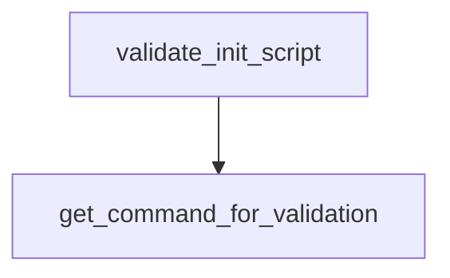

# Chapter 3: Data Processing and Analysis

Welcome to **Chapter 3: Data Processing and Analysis**. In this part of **Claude Quickstarts Tutorial: Production Integration Patterns**, you will build an intuitive mental model first, then move into concrete implementation details and practical production tradeoffs.


Data quickstarts focus on turning raw data into trustworthy, structured insight.

## Typical Workflow

- ingest CSV/JSON or API output
- validate and profile data quality
- ask Claude for explanations and summaries
- return machine-readable structured output

## Structured Output Pattern

```json
{
  "summary": "Revenue grew 12% QoQ",
  "risks": ["higher churn in SMB"],
  "recommendations": ["run retention campaign"]
}
```

## Best Practices

- Keep schema strict for downstream systems.
- Include data-quality checks before inference.
- Separate analysis prompts from presentation prompts.

## Summary

You can now build reproducible Claude-driven analytics pipelines.

Next: [Chapter 4: Browser and Computer Use](04-browser-computer-use.md)

## What Problem Does This Solve?

Most teams struggle here because the hard part is not writing more code, but deciding clear boundaries for `summary`, `Revenue`, `grew` so behavior stays predictable as complexity grows.

In practical terms, this chapter helps you avoid three common failures:

- coupling core logic too tightly to one implementation path
- missing the handoff boundaries between setup, execution, and validation
- shipping changes without clear rollback or observability strategy

After working through this chapter, you should be able to reason about `Chapter 3: Data Processing and Analysis` as an operating subsystem inside **Claude Quickstarts Tutorial: Production Integration Patterns**, with explicit contracts for inputs, state transitions, and outputs.

Use the implementation notes around `risks`, `higher`, `churn` as your checklist when adapting these patterns to your own repository.

## How it Works Under the Hood

Under the hood, `Chapter 3: Data Processing and Analysis` usually follows a repeatable control path:

1. **Context bootstrap**: initialize runtime config and prerequisites for `summary`.
2. **Input normalization**: shape incoming data so `Revenue` receives stable contracts.
3. **Core execution**: run the main logic branch and propagate intermediate state through `grew`.
4. **Policy and safety checks**: enforce limits, auth scopes, and failure boundaries.
5. **Output composition**: return canonical result payloads for downstream consumers.
6. **Operational telemetry**: emit logs/metrics needed for debugging and performance tuning.

When debugging, walk this sequence in order and confirm each stage has explicit success/failure conditions.

## Source Walkthrough

Use the following upstream sources to verify implementation details while reading this chapter:

- [Claude Quickstarts repository](https://github.com/anthropics/anthropic-quickstarts)
  Why it matters: authoritative reference on `Claude Quickstarts repository` (github.com).

Suggested trace strategy:
- search upstream code for `summary` and `Revenue` to map concrete implementation paths
- compare docs claims against actual runtime/config code before reusing patterns in production

## Chapter Connections

- [Tutorial Index](README.md)
- [Previous Chapter: Chapter 2: Customer Support Agents](02-customer-support-agents.md)
- [Next Chapter: Chapter 4: Browser and Computer Use](04-browser-computer-use.md)
- [Main Catalog](../../README.md#-tutorial-catalog)
- [A-Z Tutorial Directory](../../discoverability/tutorial-directory.md)

## Source Code Walkthrough

### `autonomous-coding/security.py`

The `validate_init_script` function in [`autonomous-coding/security.py`](https://github.com/anthropics/anthropic-quickstarts/blob/HEAD/autonomous-coding/security.py) handles a key part of this chapter's functionality:

```py


def validate_init_script(command_string: str) -> tuple[bool, str]:
    """
    Validate init.sh script execution - only allow ./init.sh.

    Returns:
        Tuple of (is_allowed, reason_if_blocked)
    """
    try:
        tokens = shlex.split(command_string)
    except ValueError:
        return False, "Could not parse init script command"

    if not tokens:
        return False, "Empty command"

    # The command should be exactly ./init.sh (possibly with arguments)
    script = tokens[0]

    # Allow ./init.sh or paths ending in /init.sh
    if script == "./init.sh" or script.endswith("/init.sh"):
        return True, ""

    return False, f"Only ./init.sh is allowed, got: {script}"


def get_command_for_validation(cmd: str, segments: list[str]) -> str:
    """
    Find the specific command segment that contains the given command.

    Args:
```

This function is important because it defines how Claude Quickstarts Tutorial: Production Integration Patterns implements the patterns covered in this chapter.

### `autonomous-coding/security.py`

The `get_command_for_validation` function in [`autonomous-coding/security.py`](https://github.com/anthropics/anthropic-quickstarts/blob/HEAD/autonomous-coding/security.py) handles a key part of this chapter's functionality:

```py


def get_command_for_validation(cmd: str, segments: list[str]) -> str:
    """
    Find the specific command segment that contains the given command.

    Args:
        cmd: The command name to find
        segments: List of command segments

    Returns:
        The segment containing the command, or empty string if not found
    """
    for segment in segments:
        segment_commands = extract_commands(segment)
        if cmd in segment_commands:
            return segment
    return ""


async def bash_security_hook(input_data, tool_use_id=None, context=None):
    """
    Pre-tool-use hook that validates bash commands using an allowlist.

    Only commands in ALLOWED_COMMANDS are permitted.

    Args:
        input_data: Dict containing tool_name and tool_input
        tool_use_id: Optional tool use ID
        context: Optional context

    Returns:
```

This function is important because it defines how Claude Quickstarts Tutorial: Production Integration Patterns implements the patterns covered in this chapter.


## How These Components Connect


