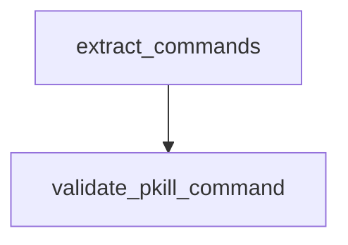

# Chapter 4: Browser and Computer Use

Welcome to **Chapter 4: Browser and Computer Use**. In this part of **Claude Quickstarts Tutorial: Production Integration Patterns**, you will build an intuitive mental model first, then move into concrete implementation details and practical production tradeoffs.


Browser and desktop control quickstarts are high leverage, but they require explicit safety boundaries.

## Execution Loop

A reliable automation loop is:

1. inspect state (DOM snapshot, screenshot, focused window)
2. plan a single concrete action
3. execute action
4. verify resulting state
5. repeat until goal or stop condition

This keeps errors localized and makes debugging straightforward.

## Browser Automation Pattern

Use short, verifiable actions:

- navigate to known URL
- wait for explicit selectors
- fill one field at a time
- verify expected text/state before continuing

Avoid monolithic "do everything" instructions that hide failure points.

## Computer-Use Risk Model

Desktop automation should classify actions into risk tiers:

| Tier | Example | Required Control |
|:-----|:--------|:-----------------|
| Low | read visible state | none or lightweight logging |
| Medium | non-destructive clicks/type | confirmation on first use |
| High | file deletion/send/submit | explicit human approval per action |

## Guardrails

- strict domain and application allowlists
- denylist destructive shortcuts by default
- short action timeouts with retry limits
- full action log with screenshots for audit

## Failure Recovery

When state diverges from expectations:

- stop action sequence
- capture current state artifacts
- ask for user confirmation or corrected target

## Summary

You can now run browser/computer-use workflows with a deterministic control loop and practical safety gates.

Next: [Chapter 5: Autonomous Coding Agents](05-autonomous-coding-agents.md)

## What Problem Does This Solve?

Most teams struggle here because the hard part is not writing more code, but deciding clear boundaries for core abstractions in this chapter so behavior stays predictable as complexity grows.

In practical terms, this chapter helps you avoid three common failures:

- coupling core logic too tightly to one implementation path
- missing the handoff boundaries between setup, execution, and validation
- shipping changes without clear rollback or observability strategy

After working through this chapter, you should be able to reason about `Chapter 4: Browser and Computer Use` as an operating subsystem inside **Claude Quickstarts Tutorial: Production Integration Patterns**, with explicit contracts for inputs, state transitions, and outputs.

Use the implementation notes around execution and reliability details as your checklist when adapting these patterns to your own repository.

## How it Works Under the Hood

Under the hood, `Chapter 4: Browser and Computer Use` usually follows a repeatable control path:

1. **Context bootstrap**: initialize runtime config and prerequisites for `core component`.
2. **Input normalization**: shape incoming data so `execution layer` receives stable contracts.
3. **Core execution**: run the main logic branch and propagate intermediate state through `state model`.
4. **Policy and safety checks**: enforce limits, auth scopes, and failure boundaries.
5. **Output composition**: return canonical result payloads for downstream consumers.
6. **Operational telemetry**: emit logs/metrics needed for debugging and performance tuning.

When debugging, walk this sequence in order and confirm each stage has explicit success/failure conditions.

## Source Walkthrough

Use the following upstream sources to verify implementation details while reading this chapter:

- [Claude Quickstarts repository](https://github.com/anthropics/anthropic-quickstarts)
  Why it matters: authoritative reference on `Claude Quickstarts repository` (github.com).

Suggested trace strategy:
- search upstream code for `Browser` and `and` to map concrete implementation paths
- compare docs claims against actual runtime/config code before reusing patterns in production

## Chapter Connections

- [Tutorial Index](README.md)
- [Previous Chapter: Chapter 3: Data Processing and Analysis](03-data-processing-analysis.md)
- [Next Chapter: Chapter 5: Autonomous Coding Agents](05-autonomous-coding-agents.md)
- [Main Catalog](../../README.md#-tutorial-catalog)
- [A-Z Tutorial Directory](../../discoverability/tutorial-directory.md)

## Depth Expansion Playbook

## Source Code Walkthrough

### `autonomous-coding/security.py`

The `extract_commands` function in [`autonomous-coding/security.py`](https://github.com/anthropics/anthropic-quickstarts/blob/HEAD/autonomous-coding/security.py) handles a key part of this chapter's functionality:

```py


def extract_commands(command_string: str) -> list[str]:
    """
    Extract command names from a shell command string.

    Handles pipes, command chaining (&&, ||, ;), and subshells.
    Returns the base command names (without paths).

    Args:
        command_string: The full shell command

    Returns:
        List of command names found in the string
    """
    commands = []

    # shlex doesn't treat ; as a separator, so we need to pre-process
    import re

    # Split on semicolons that aren't inside quotes (simple heuristic)
    # This handles common cases like "echo hello; ls"
    segments = re.split(r'(?<!["\'])\s*;\s*(?!["\'])', command_string)

    for segment in segments:
        segment = segment.strip()
        if not segment:
            continue

        try:
            tokens = shlex.split(segment)
        except ValueError:
```

This function is important because it defines how Claude Quickstarts Tutorial: Production Integration Patterns implements the patterns covered in this chapter.

### `autonomous-coding/security.py`

The `validate_pkill_command` function in [`autonomous-coding/security.py`](https://github.com/anthropics/anthropic-quickstarts/blob/HEAD/autonomous-coding/security.py) handles a key part of this chapter's functionality:

```py


def validate_pkill_command(command_string: str) -> tuple[bool, str]:
    """
    Validate pkill commands - only allow killing dev-related processes.

    Uses shlex to parse the command, avoiding regex bypass vulnerabilities.

    Returns:
        Tuple of (is_allowed, reason_if_blocked)
    """
    # Allowed process names for pkill
    allowed_process_names = {
        "node",
        "npm",
        "npx",
        "vite",
        "next",
    }

    try:
        tokens = shlex.split(command_string)
    except ValueError:
        return False, "Could not parse pkill command"

    if not tokens:
        return False, "Empty pkill command"

    # Separate flags from arguments
    args = []
    for token in tokens[1:]:
        if not token.startswith("-"):
```

This function is important because it defines how Claude Quickstarts Tutorial: Production Integration Patterns implements the patterns covered in this chapter.


## How These Components Connect


