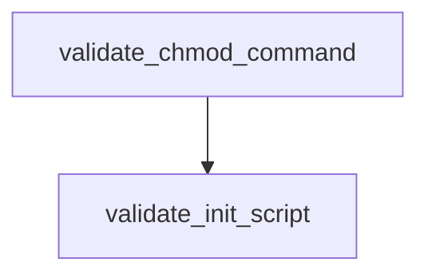

# Chapter 5: Autonomous Coding Agents

Welcome to **Chapter 5: Autonomous Coding Agents**. In this part of **Claude Quickstarts Tutorial: Production Integration Patterns**, you will build an intuitive mental model first, then move into concrete implementation details and practical production tradeoffs.


Autonomous coding quickstarts work best when planning and execution are separated.

## Two-Agent Baseline

- **Planner/Initializer**: clarifies objective, constraints, acceptance criteria
- **Executor/Coder**: performs edits, runs tests, reports concrete outcomes

This split reduces context confusion and improves handoff quality.

## Checkpointed Workflow

Use explicit checkpoints after meaningful work units:

1. expected outcome
2. files changed
3. tests run and result
4. unresolved risks
5. next step

Store checkpoints in version control or task state files so runs can resume reliably.

## Autonomous Loop Pattern

```text
plan -> edit -> test -> summarize diff -> checkpoint -> continue or stop
```

Stop conditions should be explicit:

- acceptance criteria met
- blocking test failures
- unsafe/conflicting instructions

## Quality Controls

| Control | Purpose |
|:--------|:--------|
| Required tests per checkpoint | Prevent hidden regressions |
| Diff summary requirement | Improve reviewability |
| Policy checks before merge | Enforce org standards |
| Max iteration budget | Prevent runaway loops |

## Common Failure Modes

- planning omitted, leading to aimless edits
- too many edits before first test run
- missing rollback strategy for failed experiments

## Summary

You can now design autonomous coding flows that are resumable, test-driven, and reviewable.

Next: [Chapter 6: Production Patterns](06-production-patterns.md)

## What Problem Does This Solve?

Most teams struggle here because the hard part is not writing more code, but deciding clear boundaries for `plan`, `edit`, `test` so behavior stays predictable as complexity grows.

In practical terms, this chapter helps you avoid three common failures:

- coupling core logic too tightly to one implementation path
- missing the handoff boundaries between setup, execution, and validation
- shipping changes without clear rollback or observability strategy

After working through this chapter, you should be able to reason about `Chapter 5: Autonomous Coding Agents` as an operating subsystem inside **Claude Quickstarts Tutorial: Production Integration Patterns**, with explicit contracts for inputs, state transitions, and outputs.

Use the implementation notes around `summarize`, `diff`, `checkpoint` as your checklist when adapting these patterns to your own repository.

## How it Works Under the Hood

Under the hood, `Chapter 5: Autonomous Coding Agents` usually follows a repeatable control path:

1. **Context bootstrap**: initialize runtime config and prerequisites for `plan`.
2. **Input normalization**: shape incoming data so `edit` receives stable contracts.
3. **Core execution**: run the main logic branch and propagate intermediate state through `test`.
4. **Policy and safety checks**: enforce limits, auth scopes, and failure boundaries.
5. **Output composition**: return canonical result payloads for downstream consumers.
6. **Operational telemetry**: emit logs/metrics needed for debugging and performance tuning.

When debugging, walk this sequence in order and confirm each stage has explicit success/failure conditions.

## Source Walkthrough

Use the following upstream sources to verify implementation details while reading this chapter:

- [Claude Quickstarts repository](https://github.com/anthropics/anthropic-quickstarts)
  Why it matters: authoritative reference on `Claude Quickstarts repository` (github.com).

Suggested trace strategy:
- search upstream code for `plan` and `edit` to map concrete implementation paths
- compare docs claims against actual runtime/config code before reusing patterns in production

## Chapter Connections

- [Tutorial Index](README.md)
- [Previous Chapter: Chapter 4: Browser and Computer Use](04-browser-computer-use.md)
- [Next Chapter: Chapter 6: Production Patterns](06-production-patterns.md)
- [Main Catalog](../../README.md#-tutorial-catalog)
- [A-Z Tutorial Directory](../../discoverability/tutorial-directory.md)

## Depth Expansion Playbook

## Source Code Walkthrough

### `autonomous-coding/security.py`

The `validate_chmod_command` function in [`autonomous-coding/security.py`](https://github.com/anthropics/anthropic-quickstarts/blob/HEAD/autonomous-coding/security.py) handles a key part of this chapter's functionality:

```py


def validate_chmod_command(command_string: str) -> tuple[bool, str]:
    """
    Validate chmod commands - only allow making files executable with +x.

    Returns:
        Tuple of (is_allowed, reason_if_blocked)
    """
    try:
        tokens = shlex.split(command_string)
    except ValueError:
        return False, "Could not parse chmod command"

    if not tokens or tokens[0] != "chmod":
        return False, "Not a chmod command"

    # Look for the mode argument
    # Valid modes: +x, u+x, a+x, etc. (anything ending with +x for execute permission)
    mode = None
    files = []

    for token in tokens[1:]:
        if token.startswith("-"):
            # Skip flags like -R (we don't allow recursive chmod anyway)
            return False, "chmod flags are not allowed"
        elif mode is None:
            mode = token
        else:
            files.append(token)

    if mode is None:
```

This function is important because it defines how Claude Quickstarts Tutorial: Production Integration Patterns implements the patterns covered in this chapter.

### `autonomous-coding/security.py`

The `validate_init_script` function in [`autonomous-coding/security.py`](https://github.com/anthropics/anthropic-quickstarts/blob/HEAD/autonomous-coding/security.py) handles a key part of this chapter's functionality:

```py


def validate_init_script(command_string: str) -> tuple[bool, str]:
    """
    Validate init.sh script execution - only allow ./init.sh.

    Returns:
        Tuple of (is_allowed, reason_if_blocked)
    """
    try:
        tokens = shlex.split(command_string)
    except ValueError:
        return False, "Could not parse init script command"

    if not tokens:
        return False, "Empty command"

    # The command should be exactly ./init.sh (possibly with arguments)
    script = tokens[0]

    # Allow ./init.sh or paths ending in /init.sh
    if script == "./init.sh" or script.endswith("/init.sh"):
        return True, ""

    return False, f"Only ./init.sh is allowed, got: {script}"


def get_command_for_validation(cmd: str, segments: list[str]) -> str:
    """
    Find the specific command segment that contains the given command.

    Args:
```

This function is important because it defines how Claude Quickstarts Tutorial: Production Integration Patterns implements the patterns covered in this chapter.


## How These Components Connect


