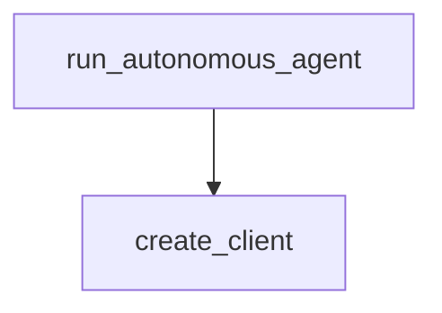

# Chapter 6: Production Patterns

Welcome to **Chapter 6: Production Patterns**. In this part of **Claude Quickstarts Tutorial: Production Integration Patterns**, you will build an intuitive mental model first, then move into concrete implementation details and practical production tradeoffs.


This chapter consolidates production lessons across all quickstarts.

## Reliability Baseline

- retries with bounded backoff
- timeout budgets by endpoint
- circuit breakers for dependencies

## Security Baseline

- scoped API keys and secret rotation
- strict tool allowlists
- PII redaction in logs and traces

## Observability Baseline

- request IDs in every response
- latency + error metrics by feature
- quality evaluation datasets for regression detection

## Final Summary

You now have a practical framework for moving Claude quickstart prototypes into production.

Next: [Chapter 7: Evaluation and Guardrails](07-evaluation-guardrails.md)

Related:
- [Anthropic Skills Tutorial](../anthropic-skills-tutorial/)
- [Claude Code Tutorial](../claude-code-tutorial/)

## What Problem Does This Solve?

Most teams struggle here because the hard part is not writing more code, but deciding clear boundaries for core abstractions in this chapter so behavior stays predictable as complexity grows.

In practical terms, this chapter helps you avoid three common failures:

- coupling core logic too tightly to one implementation path
- missing the handoff boundaries between setup, execution, and validation
- shipping changes without clear rollback or observability strategy

After working through this chapter, you should be able to reason about `Chapter 6: Production Patterns` as an operating subsystem inside **Claude Quickstarts Tutorial: Production Integration Patterns**, with explicit contracts for inputs, state transitions, and outputs.

Use the implementation notes around execution and reliability details as your checklist when adapting these patterns to your own repository.

## How it Works Under the Hood

Under the hood, `Chapter 6: Production Patterns` usually follows a repeatable control path:

1. **Context bootstrap**: initialize runtime config and prerequisites for `core component`.
2. **Input normalization**: shape incoming data so `execution layer` receives stable contracts.
3. **Core execution**: run the main logic branch and propagate intermediate state through `state model`.
4. **Policy and safety checks**: enforce limits, auth scopes, and failure boundaries.
5. **Output composition**: return canonical result payloads for downstream consumers.
6. **Operational telemetry**: emit logs/metrics needed for debugging and performance tuning.

When debugging, walk this sequence in order and confirm each stage has explicit success/failure conditions.

## Source Walkthrough

Use the following upstream sources to verify implementation details while reading this chapter:

- [Claude Quickstarts repository](https://github.com/anthropics/anthropic-quickstarts)
  Why it matters: authoritative reference on `Claude Quickstarts repository` (github.com).

Suggested trace strategy:
- search upstream code for `Production` and `Patterns` to map concrete implementation paths
- compare docs claims against actual runtime/config code before reusing patterns in production

## Chapter Connections

- [Tutorial Index](README.md)
- [Previous Chapter: Chapter 5: Autonomous Coding Agents](05-autonomous-coding-agents.md)
- [Next Chapter: Chapter 7: Evaluation and Guardrails](07-evaluation-guardrails.md)
- [Main Catalog](../../README.md#-tutorial-catalog)
- [A-Z Tutorial Directory](../../discoverability/tutorial-directory.md)

## Source Code Walkthrough

### `autonomous-coding/agent.py`

The `run_autonomous_agent` function in [`autonomous-coding/agent.py`](https://github.com/anthropics/anthropic-quickstarts/blob/HEAD/autonomous-coding/agent.py) handles a key part of this chapter's functionality:

```py


async def run_autonomous_agent(
    project_dir: Path,
    model: str,
    max_iterations: Optional[int] = None,
) -> None:
    """
    Run the autonomous agent loop.

    Args:
        project_dir: Directory for the project
        model: Claude model to use
        max_iterations: Maximum number of iterations (None for unlimited)
    """
    print("\n" + "=" * 70)
    print("  AUTONOMOUS CODING AGENT DEMO")
    print("=" * 70)
    print(f"\nProject directory: {project_dir}")
    print(f"Model: {model}")
    if max_iterations:
        print(f"Max iterations: {max_iterations}")
    else:
        print("Max iterations: Unlimited (will run until completion)")
    print()

    # Create project directory
    project_dir.mkdir(parents=True, exist_ok=True)

    # Check if this is a fresh start or continuation
    tests_file = project_dir / "feature_list.json"
    is_first_run = not tests_file.exists()
```

This function is important because it defines how Claude Quickstarts Tutorial: Production Integration Patterns implements the patterns covered in this chapter.

### `autonomous-coding/client.py`

The `create_client` function in [`autonomous-coding/client.py`](https://github.com/anthropics/anthropic-quickstarts/blob/HEAD/autonomous-coding/client.py) handles a key part of this chapter's functionality:

```py


def create_client(project_dir: Path, model: str) -> ClaudeSDKClient:
    """
    Create a Claude Agent SDK client with multi-layered security.

    Args:
        project_dir: Directory for the project
        model: Claude model to use

    Returns:
        Configured ClaudeSDKClient

    Security layers (defense in depth):
    1. Sandbox - OS-level bash command isolation prevents filesystem escape
    2. Permissions - File operations restricted to project_dir only
    3. Security hooks - Bash commands validated against an allowlist
       (see security.py for ALLOWED_COMMANDS)
    """
    api_key = os.environ.get("ANTHROPIC_API_KEY")
    if not api_key:
        raise ValueError(
            "ANTHROPIC_API_KEY environment variable not set.\n"
            "Get your API key from: https://console.anthropic.com/"
        )

    # Create comprehensive security settings
    # Note: Using relative paths ("./**") restricts access to project directory
    # since cwd is set to project_dir
    security_settings = {
        "sandbox": {"enabled": True, "autoAllowBashIfSandboxed": True},
        "permissions": {
```

This function is important because it defines how Claude Quickstarts Tutorial: Production Integration Patterns implements the patterns covered in this chapter.


## How These Components Connect


