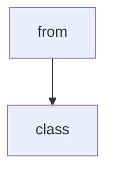

# Chapter 7: Evaluation and Guardrails

Welcome to **Chapter 7: Evaluation and Guardrails**. In this part of **Claude Quickstarts Tutorial: Production Integration Patterns**, you will build an intuitive mental model first, then move into concrete implementation details and practical production tradeoffs.


This chapter covers quality evaluation and runtime guardrails for Claude quickstart applications.

## Evaluation Framework

- build task-specific eval sets from real production prompts
- define pass/fail rubrics for factuality, safety, and completeness
- track score deltas for every prompt or workflow change

## Guardrail Layers

- input filters for malformed or abusive payloads
- output checks for policy, PII, and unsafe actions
- tool-call validation with strict schemas

## Release Gating

- block deployments on significant eval regressions
- run canary traffic before full rollout
- capture rollback criteria upfront

## Summary

You can now integrate measurable quality checks with safety controls.

Next: [Chapter 8: Enterprise Operations](08-enterprise-operations.md)

## What Problem Does This Solve?

Most teams struggle here because the hard part is not writing more code, but deciding clear boundaries for core abstractions in this chapter so behavior stays predictable as complexity grows.

In practical terms, this chapter helps you avoid three common failures:

- coupling core logic too tightly to one implementation path
- missing the handoff boundaries between setup, execution, and validation
- shipping changes without clear rollback or observability strategy

After working through this chapter, you should be able to reason about `Chapter 7: Evaluation and Guardrails` as an operating subsystem inside **Claude Quickstarts Tutorial: Production Integration Patterns**, with explicit contracts for inputs, state transitions, and outputs.

Use the implementation notes around execution and reliability details as your checklist when adapting these patterns to your own repository.

## How it Works Under the Hood

Under the hood, `Chapter 7: Evaluation and Guardrails` usually follows a repeatable control path:

1. **Context bootstrap**: initialize runtime config and prerequisites for `core component`.
2. **Input normalization**: shape incoming data so `execution layer` receives stable contracts.
3. **Core execution**: run the main logic branch and propagate intermediate state through `state model`.
4. **Policy and safety checks**: enforce limits, auth scopes, and failure boundaries.
5. **Output composition**: return canonical result payloads for downstream consumers.
6. **Operational telemetry**: emit logs/metrics needed for debugging and performance tuning.

When debugging, walk this sequence in order and confirm each stage has explicit success/failure conditions.

## Source Walkthrough

Use the following upstream sources to verify implementation details while reading this chapter:

- [Claude Quickstarts repository](https://github.com/anthropics/anthropic-quickstarts)
  Why it matters: authoritative reference on `Claude Quickstarts repository` (github.com).

Suggested trace strategy:
- search upstream code for `Evaluation` and `and` to map concrete implementation paths
- compare docs claims against actual runtime/config code before reusing patterns in production

## Chapter Connections

- [Tutorial Index](README.md)
- [Previous Chapter: Chapter 6: Production Patterns](06-production-patterns.md)
- [Next Chapter: Chapter 8: Enterprise Operations](08-enterprise-operations.md)
- [Main Catalog](../../README.md#-tutorial-catalog)
- [A-Z Tutorial Directory](../../discoverability/tutorial-directory.md)

## Source Code Walkthrough

### `agents/agent.py`

The `from` class in [`agents/agent.py`](https://github.com/anthropics/anthropic-quickstarts/blob/HEAD/agents/agent.py) handles a key part of this chapter's functionality:

```py
import asyncio
import os
from contextlib import AsyncExitStack
from dataclasses import dataclass
from typing import Any

from anthropic import Anthropic

from .tools.base import Tool
from .utils.connections import setup_mcp_connections
from .utils.history_util import MessageHistory
from .utils.tool_util import execute_tools


@dataclass
class ModelConfig:
    """Configuration settings for Claude model parameters."""

    # Available models include:
    # - claude-sonnet-4-20250514 (default)
    # - claude-opus-4-20250514
    # - claude-haiku-4-5-20251001
    # - claude-3-5-sonnet-20240620
    # - claude-3-haiku-20240307
    model: str = "claude-sonnet-4-20250514"
    max_tokens: int = 4096
    temperature: float = 1.0
    context_window_tokens: int = 180000


class Agent:
    """Claude-powered agent with tool use capabilities."""
```

This class is important because it defines how Claude Quickstarts Tutorial: Production Integration Patterns implements the patterns covered in this chapter.

### `agents/agent.py`

The `class` class in [`agents/agent.py`](https://github.com/anthropics/anthropic-quickstarts/blob/HEAD/agents/agent.py) handles a key part of this chapter's functionality:

```py
import os
from contextlib import AsyncExitStack
from dataclasses import dataclass
from typing import Any

from anthropic import Anthropic

from .tools.base import Tool
from .utils.connections import setup_mcp_connections
from .utils.history_util import MessageHistory
from .utils.tool_util import execute_tools


@dataclass
class ModelConfig:
    """Configuration settings for Claude model parameters."""

    # Available models include:
    # - claude-sonnet-4-20250514 (default)
    # - claude-opus-4-20250514
    # - claude-haiku-4-5-20251001
    # - claude-3-5-sonnet-20240620
    # - claude-3-haiku-20240307
    model: str = "claude-sonnet-4-20250514"
    max_tokens: int = 4096
    temperature: float = 1.0
    context_window_tokens: int = 180000


class Agent:
    """Claude-powered agent with tool use capabilities."""

```

This class is important because it defines how Claude Quickstarts Tutorial: Production Integration Patterns implements the patterns covered in this chapter.


## How These Components Connect


