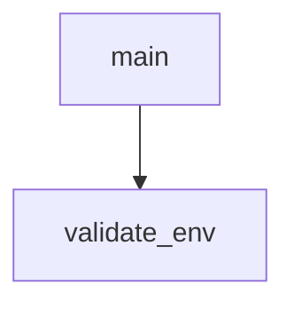

# Chapter 8: Enterprise Operations

Welcome to **Chapter 8: Enterprise Operations**. In this part of **Claude Quickstarts Tutorial: Production Integration Patterns**, you will build an intuitive mental model first, then move into concrete implementation details and practical production tradeoffs.


This chapter closes the quickstarts path with an enterprise operating model.

## Multi-Tenant Governance Baseline

- per-tenant rate and token quotas
- model access policies by environment
- centralized prompt/config versioning
- approval workflows for high-risk tool classes

## Auditability Requirements

Capture immutable run metadata:

- request and trace IDs
- model/version used
- tools invoked and arguments (with redaction)
- policy decisions and approval events
- final outputs and status

Without this, incident response and compliance review become guesswork.

## Reliability and Incident Readiness

- define SLOs for latency and success rate
- maintain runbooks for provider degradation
- implement fallback behavior for critical workflows
- test rollback paths during release drills

## Security and Data Handling

| Area | Enterprise Control |
|:-----|:-------------------|
| Secrets | centralized secret management, no inline keys |
| Data retention | environment-specific retention windows |
| PII handling | classification + redaction policy |
| Access control | least privilege by role/team |

## Adoption Playbook

1. launch read-only assistant capabilities first
2. baseline quality/cost metrics
3. introduce mutating actions with approvals
4. expand scope by team with policy templates

## Final Summary

You now have a practical blueprint for scaling Claude quickstarts into governed enterprise operations.

Related:
- [Anthropic Skills Tutorial](../anthropic-skills-tutorial/)
- [MCP Servers Tutorial](../mcp-servers-tutorial/)

## What Problem Does This Solve?

Most teams struggle here because the hard part is not writing more code, but deciding clear boundaries for core abstractions in this chapter so behavior stays predictable as complexity grows.

In practical terms, this chapter helps you avoid three common failures:

- coupling core logic too tightly to one implementation path
- missing the handoff boundaries between setup, execution, and validation
- shipping changes without clear rollback or observability strategy

After working through this chapter, you should be able to reason about `Chapter 8: Enterprise Operations` as an operating subsystem inside **Claude Quickstarts Tutorial: Production Integration Patterns**, with explicit contracts for inputs, state transitions, and outputs.

Use the implementation notes around execution and reliability details as your checklist when adapting these patterns to your own repository.

## How it Works Under the Hood

Under the hood, `Chapter 8: Enterprise Operations` usually follows a repeatable control path:

1. **Context bootstrap**: initialize runtime config and prerequisites for `core component`.
2. **Input normalization**: shape incoming data so `execution layer` receives stable contracts.
3. **Core execution**: run the main logic branch and propagate intermediate state through `state model`.
4. **Policy and safety checks**: enforce limits, auth scopes, and failure boundaries.
5. **Output composition**: return canonical result payloads for downstream consumers.
6. **Operational telemetry**: emit logs/metrics needed for debugging and performance tuning.

When debugging, walk this sequence in order and confirm each stage has explicit success/failure conditions.

## Source Walkthrough

Use the following upstream sources to verify implementation details while reading this chapter:

- [Claude Quickstarts repository](https://github.com/anthropics/anthropic-quickstarts)
  Why it matters: authoritative reference on `Claude Quickstarts repository` (github.com).

Suggested trace strategy:
- search upstream code for `Enterprise` and `Operations` to map concrete implementation paths
- compare docs claims against actual runtime/config code before reusing patterns in production

## Chapter Connections

- [Tutorial Index](README.md)
- [Previous Chapter: Chapter 7: Evaluation and Guardrails](07-evaluation-guardrails.md)
- [Main Catalog](../../README.md#-tutorial-catalog)
- [A-Z Tutorial Directory](../../discoverability/tutorial-directory.md)

## Depth Expansion Playbook

## Source Code Walkthrough

### `autonomous-coding/autonomous_agent_demo.py`

The `main` function in [`autonomous-coding/autonomous_agent_demo.py`](https://github.com/anthropics/anthropic-quickstarts/blob/HEAD/autonomous-coding/autonomous_agent_demo.py) handles a key part of this chapter's functionality:

```py


def main() -> None:
    """Main entry point."""
    args = parse_args()

    # Check for API key
    if not os.environ.get("ANTHROPIC_API_KEY"):
        print("Error: ANTHROPIC_API_KEY environment variable not set")
        print("\nGet your API key from: https://console.anthropic.com/")
        print("\nThen set it:")
        print("  export ANTHROPIC_API_KEY='your-api-key-here'")
        return

    # Automatically place projects in generations/ directory unless already specified
    project_dir = args.project_dir
    if not str(project_dir).startswith("generations/"):
        # Convert relative paths to be under generations/
        if project_dir.is_absolute():
            # If absolute path, use as-is
            pass
        else:
            # Prepend generations/ to relative paths
            project_dir = Path("generations") / project_dir

    # Run the agent
    try:
        asyncio.run(
            run_autonomous_agent(
                project_dir=project_dir,
                model=args.model,
                max_iterations=args.max_iterations,
```

This function is important because it defines how Claude Quickstarts Tutorial: Production Integration Patterns implements the patterns covered in this chapter.

### `browser-use-demo/validate_env.py`

The `validate_env` function in [`browser-use-demo/validate_env.py`](https://github.com/anthropics/anthropic-quickstarts/blob/HEAD/browser-use-demo/validate_env.py) handles a key part of this chapter's functionality:

```py


def validate_env():
    """Validate required environment variables are set."""
    # Check API key
    api_key = os.environ.get("ANTHROPIC_API_KEY")

    if not api_key:
        print("\n" + "=" * 60)
        print("ERROR: Missing required configuration!")
        print("=" * 60)
        print("\nThe Browser Use Demo requires proper configuration to run.")
        print("\n🔧 RECOMMENDED: Use docker-compose with a .env file:")
        print("  1. Copy the example environment file:")
        print("     cp .env.example .env")
        print("  2. Edit .env and add your Anthropic API key")
        print("  3. Run with docker-compose:")
        print("     docker-compose up --build")
        print("=" * 60)
        sys.exit(1)

    if api_key == "your_anthropic_api_key_here" or len(api_key) < 10:
        print("\n" + "=" * 60)
        print("ERROR: Invalid API key!")
        print("=" * 60)
        print("  ANTHROPIC_API_KEY: Must be a valid API key")
        print("\nTo fix this, please edit your .env file with a valid API key")
        print("=" * 60)
        sys.exit(1)

    print("\n✓ Environment validation passed")
    print(f"  Display: {DISPLAY_WIDTH}x{DISPLAY_HEIGHT}")
```

This function is important because it defines how Claude Quickstarts Tutorial: Production Integration Patterns implements the patterns covered in this chapter.


## How These Components Connect


