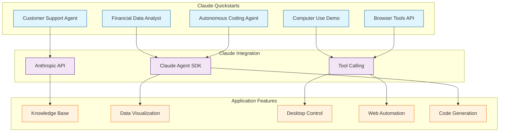

# Claude Quickstarts Tutorial: Production Integration Patterns

> Learn from Anthropic's official quickstart projects to build deployable applications with Claude API, including customer support, data analysis, browser automation, and autonomous coding.

[](https://github.com/anthropics/anthropic-quickstarts)
[](https://opensource.org/licenses/MIT)
[](https://github.com/anthropics/anthropic-quickstarts)

## 🎯 What are Claude Quickstarts?

**Claude Quickstarts** is Anthropic's official collection of reference projects demonstrating production-ready patterns for building with Claude. Each quickstart is a complete, deployable application showcasing best practices for specific use cases from customer support to autonomous coding agents.

### Key Features

| Feature | Description |
|:--------|:------------|
| **Production-Ready** | Complete applications, not just code snippets |
| **Multi-Domain** | Customer support, data analysis, browser automation, coding |
| **Best Practices** | Error handling, monitoring, security patterns |
| **Multiple Languages** | Python (56%) and TypeScript (26%) implementations |
| **Claude Agent SDK** | Demonstrates multi-agent patterns and tool use |
| **Deployment Guides** | Docker, cloud platforms, scaling strategies |

## Architecture Overview



## Tutorial Structure

| Chapter | Topic | What You'll Learn |
|:--------|:------|:------------------|
| [1. Getting Started](01-getting-started.md) | Overview | Repository structure, setup, choosing quickstarts |
| [2. Customer Support Agents](02-customer-support-agents.md) | Chatbots | Support chatbots, ticket classification, knowledge base integration |
| [3. Data Processing and Analysis](03-data-processing-analysis.md) | Analytics | Financial data analysis, visualization, structured outputs |
| [4. Browser and Computer Use](04-browser-computer-use.md) | Automation | Browser automation with Playwright, desktop control |
| [5. Autonomous Coding Agents](05-autonomous-coding-agents.md) | Development | Two-agent pattern, git persistence, multi-session coding |
| [6. Production Patterns](06-production-patterns.md) | Deployment | Error handling, monitoring, scaling, security |
| [7. Evaluation and Guardrails](07-evaluation-guardrails.md) | Quality | Eval sets, policy checks, and release gating |
| [8. Enterprise Operations](08-enterprise-operations.md) | Operations | Tenant governance, auditability, and incident readiness |

## Tech Stack

| Component | Technology |
|:----------|:-----------|
| **Languages** | Python 56%, TypeScript 26%, Jupyter 7%, JavaScript 6% |
| **Claude Integration** | Anthropic API, Claude Agent SDK |
| **Web Frameworks** | FastAPI (Python), Express/Next.js (TypeScript) |
| **Browser Automation** | Playwright |
| **Desktop Control** | Computer Use API (Beta) |
| **Deployment** | Docker, cloud platforms |

## Featured Quickstarts

### 1. Customer Support Agent
**Use Case:** AI-powered customer service chatbot

**Features:**
- Natural language understanding for support queries
- Knowledge base access and retrieval
- Ticket classification and routing
- Multi-turn conversation handling

**Tech:** Python, FastAPI, Claude API

### 2. Financial Data Analyst
**Use Case:** Interactive data analysis with visualization

**Features:**
- Chat-based data exploration
- Chart and graph generation
- Statistical analysis
- Structured data outputs

**Tech:** Python, Streamlit, Claude Agent SDK

### 3. Computer Use Demo
**Use Case:** Claude controlling desktop computer

**Features:**
- Desktop automation (`computer_use_20251124` tool)
- Screenshot analysis
- Mouse and keyboard control
- Zoom and navigation actions

**Tech:** Python, Computer Use API (Beta)

### 4. Browser Tools API Demo
**Use Case:** Web automation and scraping

**Features:**
- Browser automation with Playwright
- DOM inspection and interaction
- Form filling and navigation
- Screenshot analysis for debugging

**Tech:** TypeScript, Playwright, Claude API

### 5. Autonomous Coding Agent
**Use Case:** AI pair programmer with persistence

**Features:**
- Two-agent pattern (initializer + coding agent)
- Git-based persistence across sessions
- Multi-file code generation
- Iterative development workflow

**Tech:** Python, Claude Agent SDK, git

## What You'll Build

By the end of this tutorial, you'll be able to:

- **Build Support Chatbots** with knowledge base integration
- **Create Data Analysis Tools** with Claude-powered insights
- **Automate Browsers** using Claude + Playwright
- **Build Coding Agents** with multi-session persistence
- **Deploy Production Apps** with proper error handling and monitoring
- **Implement Tool Use** for external integrations
- **Follow Best Practices** from Anthropic's engineering team

## Prerequisites

- **Python or TypeScript** programming experience
- **Anthropic API key** (sign up at [console.anthropic.com](https://console.anthropic.com))
- **Basic understanding** of REST APIs
- **Docker** familiarity helpful for deployment

## Related Tutorials

**Prerequisites:**
- [Anthropic API Tutorial](../anthropic-code-tutorial/) - Claude API fundamentals (recommended)

**Complementary:**
- [Anthropic Skills Tutorial](../anthropic-skills-tutorial/) - Reusable agent capabilities
- [Claude Code Tutorial](../claude-code-tutorial/) - Claude CLI tool
- [MCP Python SDK Tutorial](../mcp-python-sdk-tutorial/) - Building custom tools

**Next Steps:**
- Custom Claude integrations
- Multi-agent orchestration
- Production deployment patterns

## Quickstart Comparison

| Quickstart | Complexity | Use Case | Best For |
|:-----------|:-----------|:---------|:---------|
| **Customer Support** | Medium | Support chatbots | Businesses with support needs |
| **Data Analyst** | Low-Medium | Data exploration | Data teams, analysts |
| **Computer Use** | High (Beta) | Desktop automation | Advanced automation |
| **Browser Tools** | Medium-High | Web scraping | Web automation tasks |
| **Coding Agent** | High | AI pair programming | Developers, code generation |

## Example: Customer Support Agent Pattern

```python
from anthropic import Anthropic

client = Anthropic()

def support_agent(user_query: str, knowledge_base: list):
    # Retrieve relevant knowledge
    context = retrieve_from_kb(user_query, knowledge_base)

    # Call Claude with context
    response = client.messages.create(
        model="claude-3-5-sonnet-20241022",
        max_tokens=1024,
        messages=[{
            "role": "user",
            "content": f"Context: {context}\n\nUser question: {user_query}"
        }]
    )

    return response.content[0].text
```

---

Ready to begin? Start with [Chapter 1: Getting Started](01-getting-started.md).

---

*Built with insights from the [Claude Quickstarts repository](https://github.com/anthropics/anthropic-quickstarts) and Anthropic documentation.*
