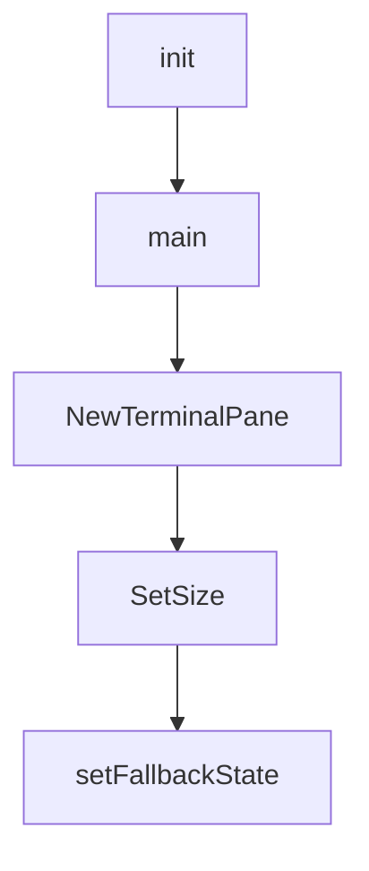

# Chapter 1: Getting Started

Welcome to **Chapter 1: Getting Started**. In this part of **Claude Squad Tutorial: Multi-Agent Terminal Session Orchestration**, you will build an intuitive mental model first, then move into concrete implementation details and practical production tradeoffs.


This chapter gets Claude Squad installed and ready for your first multi-session run.

## Install

```bash
brew install claude-squad
ln -s "$(brew --prefix)/bin/claude-squad" "$(brew --prefix)/bin/cs"
```

Alternative manual install:

```bash
curl -fsSL https://raw.githubusercontent.com/smtg-ai/claude-squad/main/install.sh | bash
```

## Prerequisites

- `tmux`
- `gh` (GitHub CLI)

## Launch

```bash
cs
```

## Source References

- [Claude Squad README](https://github.com/smtg-ai/claude-squad/blob/main/README.md)

## Summary

You now have Claude Squad installed with prerequisites for multi-session execution.

Next: [Chapter 2: tmux and Worktree Architecture](02-tmux-and-worktree-architecture.md)

## Depth Expansion Playbook

## Source Code Walkthrough

### `main.go`

The `init` function in [`main.go`](https://github.com/smtg-ai/claude-squad/blob/HEAD/main.go) handles a key part of this chapter's functionality:

```go
			storage, err := session.NewStorage(state)
			if err != nil {
				return fmt.Errorf("failed to initialize storage: %w", err)
			}
			if err := storage.DeleteAllInstances(); err != nil {
				return fmt.Errorf("failed to reset storage: %w", err)
			}
			fmt.Println("Storage has been reset successfully")

			if err := tmux.CleanupSessions(cmd2.MakeExecutor()); err != nil {
				return fmt.Errorf("failed to cleanup tmux sessions: %w", err)
			}
			fmt.Println("Tmux sessions have been cleaned up")

			if err := git.CleanupWorktrees(); err != nil {
				return fmt.Errorf("failed to cleanup worktrees: %w", err)
			}
			fmt.Println("Worktrees have been cleaned up")

			// Kill any daemon that's running.
			if err := daemon.StopDaemon(); err != nil {
				return err
			}
			fmt.Println("daemon has been stopped")

			return nil
		},
	}

	debugCmd = &cobra.Command{
		Use:   "debug",
		Short: "Print debug information like config paths",
```

This function is important because it defines how Claude Squad Tutorial: Multi-Agent Terminal Session Orchestration implements the patterns covered in this chapter.

### `main.go`

The `main` function in [`main.go`](https://github.com/smtg-ai/claude-squad/blob/HEAD/main.go) handles a key part of this chapter's functionality:

```go
package main

import (
	"claude-squad/app"
	cmd2 "claude-squad/cmd"
	"claude-squad/config"
	"claude-squad/daemon"
	"claude-squad/log"
	"claude-squad/session"
	"claude-squad/session/git"
	"claude-squad/session/tmux"
	"context"
	"encoding/json"
	"fmt"
	"path/filepath"

	"github.com/spf13/cobra"
)

var (
	version     = "1.0.17"
	programFlag string
	autoYesFlag bool
	daemonFlag  bool
	rootCmd     = &cobra.Command{
		Use:   "claude-squad",
		Short: "Claude Squad - Manage multiple AI agents like Claude Code, Aider, Codex, and Amp.",
		RunE: func(cmd *cobra.Command, args []string) error {
			ctx := context.Background()
			log.Initialize(daemonFlag)
```

This function is important because it defines how Claude Squad Tutorial: Multi-Agent Terminal Session Orchestration implements the patterns covered in this chapter.

### `ui/terminal.go`

The `NewTerminalPane` function in [`ui/terminal.go`](https://github.com/smtg-ai/claude-squad/blob/HEAD/ui/terminal.go) handles a key part of this chapter's functionality:

```go
}

func NewTerminalPane() *TerminalPane {
	return &TerminalPane{
		sessions: make(map[string]*terminalSession),
		viewport: viewport.New(0, 0),
	}
}

func (t *TerminalPane) SetSize(width, height int) {
	t.mu.Lock()
	defer t.mu.Unlock()
	t.width = width
	t.height = height
	t.viewport.Width = width
	t.viewport.Height = height
	if s, ok := t.sessions[t.currentTitle]; ok && s.tmuxSession != nil {
		if err := s.tmuxSession.SetDetachedSize(width, height); err != nil {
			log.InfoLog.Printf("terminal pane: failed to set detached size: %v", err)
		}
	}
}

// setFallbackState sets the terminal pane to display a fallback message.
// Caller must hold t.mu.
func (t *TerminalPane) setFallbackState(message string) {
	t.fallback = true
	t.fallbackText = lipgloss.JoinVertical(lipgloss.Center, FallBackText, "", message)
	t.content = ""
}

// UpdateContent captures the tmux pane output for the terminal session.
```

This function is important because it defines how Claude Squad Tutorial: Multi-Agent Terminal Session Orchestration implements the patterns covered in this chapter.

### `ui/terminal.go`

The `SetSize` function in [`ui/terminal.go`](https://github.com/smtg-ai/claude-squad/blob/HEAD/ui/terminal.go) handles a key part of this chapter's functionality:

```go
}

func (t *TerminalPane) SetSize(width, height int) {
	t.mu.Lock()
	defer t.mu.Unlock()
	t.width = width
	t.height = height
	t.viewport.Width = width
	t.viewport.Height = height
	if s, ok := t.sessions[t.currentTitle]; ok && s.tmuxSession != nil {
		if err := s.tmuxSession.SetDetachedSize(width, height); err != nil {
			log.InfoLog.Printf("terminal pane: failed to set detached size: %v", err)
		}
	}
}

// setFallbackState sets the terminal pane to display a fallback message.
// Caller must hold t.mu.
func (t *TerminalPane) setFallbackState(message string) {
	t.fallback = true
	t.fallbackText = lipgloss.JoinVertical(lipgloss.Center, FallBackText, "", message)
	t.content = ""
}

// UpdateContent captures the tmux pane output for the terminal session.
func (t *TerminalPane) UpdateContent(instance *session.Instance) error {
	t.mu.Lock()
	defer t.mu.Unlock()

	if instance == nil {
		t.setFallbackState("Select an instance to open a terminal")
		return nil
```

This function is important because it defines how Claude Squad Tutorial: Multi-Agent Terminal Session Orchestration implements the patterns covered in this chapter.


## How These Components Connect


