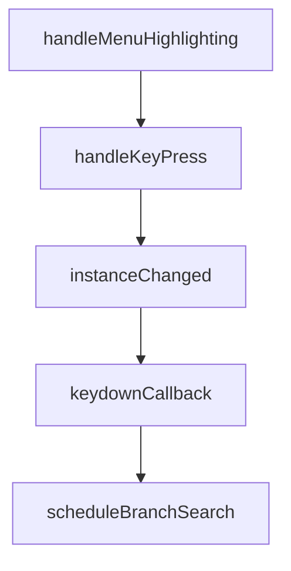

# Chapter 2: tmux and Worktree Architecture

Welcome to **Chapter 2: tmux and Worktree Architecture**. In this part of **Claude Squad Tutorial: Multi-Agent Terminal Session Orchestration**, you will build an intuitive mental model first, then move into concrete implementation details and practical production tradeoffs.


Claude Squad isolates each task using tmux sessions and git worktrees.

## Core Architecture

| Layer | Role |
|:------|:-----|
| tmux sessions | independent terminal execution contexts |
| git worktrees | branch-isolated code workspaces |
| TUI | centralized control and status view |

## Why It Works

- no branch/file conflicts across active tasks
- easier background execution and resumption
- clear separation between session runtime and repo state

## Source References

- [tmux session code](https://github.com/smtg-ai/claude-squad/blob/main/session/tmux/tmux.go)
- [git worktree code](https://github.com/smtg-ai/claude-squad/blob/main/session/git/worktree.go)

## Summary

You now understand the isolation model that powers Claude Squad parallelism.

Next: [Chapter 3: Session Lifecycle and Task Parallelism](03-session-lifecycle-and-task-parallelism.md)

## Depth Expansion Playbook

## Source Code Walkthrough

### `app/app.go`

The `handleMenuHighlighting` function in [`app/app.go`](https://github.com/smtg-ai/claude-squad/blob/HEAD/app/app.go) handles a key part of this chapter's functionality:

```go
}

func (m *home) handleMenuHighlighting(msg tea.KeyMsg) (cmd tea.Cmd, returnEarly bool) {
	// Handle menu highlighting when you press a button. We intercept it here and immediately return to
	// update the ui while re-sending the keypress. Then, on the next call to this, we actually handle the keypress.
	if m.keySent {
		m.keySent = false
		return nil, false
	}
	if m.state == statePrompt || m.state == stateHelp || m.state == stateConfirm {
		return nil, false
	}
	// If it's in the global keymap, we should try to highlight it.
	name, ok := keys.GlobalKeyStringsMap[msg.String()]
	if !ok {
		return nil, false
	}

	if m.list.GetSelectedInstance() != nil && m.list.GetSelectedInstance().Paused() && name == keys.KeyEnter {
		return nil, false
	}
	if name == keys.KeyShiftDown || name == keys.KeyShiftUp {
		return nil, false
	}

	// Skip the menu highlighting if the key is not in the map or we are using the shift up and down keys.
	// TODO: cleanup: when you press enter on stateNew, we use keys.KeySubmitName. We should unify the keymap.
	if name == keys.KeyEnter && m.state == stateNew {
		name = keys.KeySubmitName
	}
	m.keySent = true
	return tea.Batch(
```

This function is important because it defines how Claude Squad Tutorial: Multi-Agent Terminal Session Orchestration implements the patterns covered in this chapter.

### `app/app.go`

The `handleKeyPress` function in [`app/app.go`](https://github.com/smtg-ai/claude-squad/blob/HEAD/app/app.go) handles a key part of this chapter's functionality:

```go
		return m, nil
	case tea.KeyMsg:
		return m.handleKeyPress(msg)
	case tea.WindowSizeMsg:
		m.updateHandleWindowSizeEvent(msg)
		return m, nil
	case error:
		// Handle errors from confirmation actions
		return m, m.handleError(msg)
	case instanceChangedMsg:
		// Handle instance changed after confirmation action
		return m, m.instanceChanged()
	case instanceStartedMsg:
		// Select the instance that just started (or failed)
		m.list.SelectInstance(msg.instance)

		if msg.err != nil {
			m.list.Kill()
			return m, tea.Batch(m.handleError(msg.err), m.instanceChanged())
		}

		// Save after successful start
		if err := m.storage.SaveInstances(m.list.GetInstances()); err != nil {
			return m, m.handleError(err)
		}
		if m.autoYes {
			msg.instance.AutoYes = true
		}

		if msg.promptAfterName {
			m.state = statePrompt
			m.menu.SetState(ui.StatePrompt)
```

This function is important because it defines how Claude Squad Tutorial: Multi-Agent Terminal Session Orchestration implements the patterns covered in this chapter.

### `app/app.go`

The `instanceChanged` function in [`app/app.go`](https://github.com/smtg-ai/claude-squad/blob/HEAD/app/app.go) handles a key part of this chapter's functionality:

```go
		m.errBox.Clear()
	case previewTickMsg:
		cmd := m.instanceChanged()
		return m, tea.Batch(
			cmd,
			func() tea.Msg {
				time.Sleep(100 * time.Millisecond)
				return previewTickMsg{}
			},
		)
	case keyupMsg:
		m.menu.ClearKeydown()
		return m, nil
	case tickUpdateMetadataMessage:
		for _, instance := range m.list.GetInstances() {
			if !instance.Started() || instance.Paused() {
				continue
			}
			instance.CheckAndHandleTrustPrompt()
			updated, prompt := instance.HasUpdated()
			if updated {
				instance.SetStatus(session.Running)
			} else {
				if prompt {
					instance.TapEnter()
				} else {
					instance.SetStatus(session.Ready)
				}
			}
			if err := instance.UpdateDiffStats(); err != nil {
				log.WarningLog.Printf("could not update diff stats: %v", err)
			}
```

This function is important because it defines how Claude Squad Tutorial: Multi-Agent Terminal Session Orchestration implements the patterns covered in this chapter.

### `app/app.go`

The `keydownCallback` function in [`app/app.go`](https://github.com/smtg-ai/claude-squad/blob/HEAD/app/app.go) handles a key part of this chapter's functionality:

```go
	return tea.Batch(
		func() tea.Msg { return msg },
		m.keydownCallback(name)), true
}

func (m *home) handleKeyPress(msg tea.KeyMsg) (mod tea.Model, cmd tea.Cmd) {
	cmd, returnEarly := m.handleMenuHighlighting(msg)
	if returnEarly {
		return m, cmd
	}

	if m.state == stateHelp {
		return m.handleHelpState(msg)
	}

	if m.state == stateNew {
		// Handle quit commands first. Don't handle q because the user might want to type that.
		if msg.String() == "ctrl+c" {
			m.state = stateDefault
			m.promptAfterName = false
			m.list.Kill()
			return m, tea.Sequence(
				tea.WindowSize(),
				func() tea.Msg {
					m.menu.SetState(ui.StateDefault)
					return nil
				},
			)
		}

		instance := m.list.GetInstances()[m.list.NumInstances()-1]
		switch msg.Type {
```

This function is important because it defines how Claude Squad Tutorial: Multi-Agent Terminal Session Orchestration implements the patterns covered in this chapter.


## How These Components Connect


