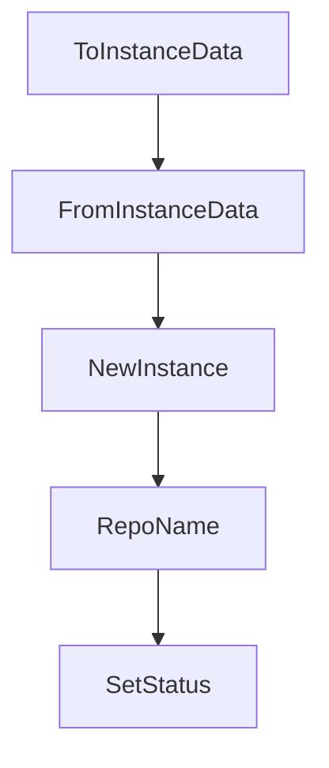

# Chapter 2: tmux and Worktree Architecture

Welcome to **Chapter 2: tmux and Worktree Architecture**. In this part of **Claude Squad Tutorial: Multi-Agent Terminal Session Orchestration**, you will build an intuitive mental model first, then move into concrete implementation details and practical production tradeoffs.


Claude Squad isolates each task using tmux sessions and git worktrees.

## Core Architecture

| Layer | Role |
|:------|:-----|
| tmux sessions | independent terminal execution contexts |
| git worktrees | branch-isolated code workspaces |
| TUI | centralized control and status view |

## Why It Works

- no branch/file conflicts across active tasks
- easier background execution and resumption
- clear separation between session runtime and repo state

## Source References

- [tmux session code](https://github.com/smtg-ai/claude-squad/blob/main/session/tmux/tmux.go)
- [git worktree code](https://github.com/smtg-ai/claude-squad/blob/main/session/git/worktree.go)

## Summary

You now understand the isolation model that powers Claude Squad parallelism.

Next: [Chapter 3: Session Lifecycle and Task Parallelism](03-session-lifecycle-and-task-parallelism.md)

## Source Code Walkthrough

### `session/instance.go`

The `ToInstanceData` function in [`session/instance.go`](https://github.com/smtg-ai/claude-squad/blob/HEAD/session/instance.go) handles a key part of this chapter's functionality:

```go
}

// ToInstanceData converts an Instance to its serializable form
func (i *Instance) ToInstanceData() InstanceData {
	data := InstanceData{
		Title:     i.Title,
		Path:      i.Path,
		Branch:    i.Branch,
		Status:    i.Status,
		Height:    i.Height,
		Width:     i.Width,
		CreatedAt: i.CreatedAt,
		UpdatedAt: time.Now(),
		Program:   i.Program,
		AutoYes:   i.AutoYes,
	}

	// Only include worktree data if gitWorktree is initialized
	if i.gitWorktree != nil {
		data.Worktree = GitWorktreeData{
			RepoPath:         i.gitWorktree.GetRepoPath(),
			WorktreePath:     i.gitWorktree.GetWorktreePath(),
			SessionName:      i.Title,
			BranchName:       i.gitWorktree.GetBranchName(),
			BaseCommitSHA:    i.gitWorktree.GetBaseCommitSHA(),
			IsExistingBranch: i.gitWorktree.IsExistingBranch(),
		}
	}

	// Only include diff stats if they exist
	if i.diffStats != nil {
		data.DiffStats = DiffStatsData{
```

This function is important because it defines how Claude Squad Tutorial: Multi-Agent Terminal Session Orchestration implements the patterns covered in this chapter.

### `session/instance.go`

The `FromInstanceData` function in [`session/instance.go`](https://github.com/smtg-ai/claude-squad/blob/HEAD/session/instance.go) handles a key part of this chapter's functionality:

```go
}

// FromInstanceData creates a new Instance from serialized data
func FromInstanceData(data InstanceData) (*Instance, error) {
	instance := &Instance{
		Title:     data.Title,
		Path:      data.Path,
		Branch:    data.Branch,
		Status:    data.Status,
		Height:    data.Height,
		Width:     data.Width,
		CreatedAt: data.CreatedAt,
		UpdatedAt: data.UpdatedAt,
		Program:   data.Program,
		gitWorktree: git.NewGitWorktreeFromStorage(
			data.Worktree.RepoPath,
			data.Worktree.WorktreePath,
			data.Worktree.SessionName,
			data.Worktree.BranchName,
			data.Worktree.BaseCommitSHA,
			data.Worktree.IsExistingBranch,
		),
		diffStats: &git.DiffStats{
			Added:   data.DiffStats.Added,
			Removed: data.DiffStats.Removed,
			Content: data.DiffStats.Content,
		},
	}

	if instance.Paused() {
		instance.started = true
		instance.tmuxSession = tmux.NewTmuxSession(instance.Title, instance.Program)
```

This function is important because it defines how Claude Squad Tutorial: Multi-Agent Terminal Session Orchestration implements the patterns covered in this chapter.

### `session/instance.go`

The `NewInstance` function in [`session/instance.go`](https://github.com/smtg-ai/claude-squad/blob/HEAD/session/instance.go) handles a key part of this chapter's functionality:

```go
}

func NewInstance(opts InstanceOptions) (*Instance, error) {
	t := time.Now()

	// Convert path to absolute
	absPath, err := filepath.Abs(opts.Path)
	if err != nil {
		return nil, fmt.Errorf("failed to get absolute path: %w", err)
	}

	return &Instance{
		Title:          opts.Title,
		Status:         Ready,
		Path:           absPath,
		Program:        opts.Program,
		Height:         0,
		Width:          0,
		CreatedAt:      t,
		UpdatedAt:      t,
		AutoYes:        false,
		selectedBranch: opts.Branch,
	}, nil
}

func (i *Instance) RepoName() (string, error) {
	if !i.started {
		return "", fmt.Errorf("cannot get repo name for instance that has not been started")
	}
	return i.gitWorktree.GetRepoName(), nil
}

```

This function is important because it defines how Claude Squad Tutorial: Multi-Agent Terminal Session Orchestration implements the patterns covered in this chapter.

### `session/instance.go`

The `RepoName` function in [`session/instance.go`](https://github.com/smtg-ai/claude-squad/blob/HEAD/session/instance.go) handles a key part of this chapter's functionality:

```go
}

func (i *Instance) RepoName() (string, error) {
	if !i.started {
		return "", fmt.Errorf("cannot get repo name for instance that has not been started")
	}
	return i.gitWorktree.GetRepoName(), nil
}

func (i *Instance) SetStatus(status Status) {
	i.Status = status
}

// SetSelectedBranch sets the branch to use when starting the instance.
func (i *Instance) SetSelectedBranch(branch string) {
	i.selectedBranch = branch
}

// firstTimeSetup is true if this is a new instance. Otherwise, it's one loaded from storage.
func (i *Instance) Start(firstTimeSetup bool) error {
	if i.Title == "" {
		return fmt.Errorf("instance title cannot be empty")
	}

	var tmuxSession *tmux.TmuxSession
	if i.tmuxSession != nil {
		// Use existing tmux session (useful for testing)
		tmuxSession = i.tmuxSession
	} else {
		// Create new tmux session
		tmuxSession = tmux.NewTmuxSession(i.Title, i.Program)
	}
```

This function is important because it defines how Claude Squad Tutorial: Multi-Agent Terminal Session Orchestration implements the patterns covered in this chapter.


## How These Components Connect


