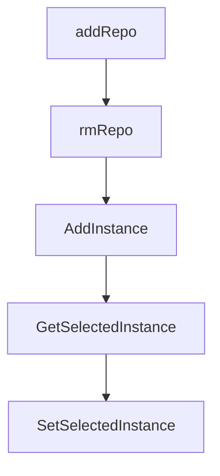

# Chapter 3: Session Lifecycle and Task Parallelism

Welcome to **Chapter 3: Session Lifecycle and Task Parallelism**. In this part of **Claude Squad Tutorial: Multi-Agent Terminal Session Orchestration**, you will build an intuitive mental model first, then move into concrete implementation details and practical production tradeoffs.


Claude Squad session controls support task creation, pause/resume, and deletion within one terminal workflow.

## Key Session Actions

- create session (`n` / `N`)
- attach/detach (`enter`/`o`, `ctrl-q`)
- pause/resume (`c`, `r`)
- delete session (`D`)

## Parallelism Pattern

Run multiple sessions in parallel for independent features or bug fixes, each on its own worktree branch.

## Source References

- [Claude Squad README: menu and session controls](https://github.com/smtg-ai/claude-squad/blob/main/README.md)

## Summary

You now have a session lifecycle model for high-throughput parallel task execution.

Next: [Chapter 4: Multi-Agent Program Integration](04-multi-agent-program-integration.md)

## Depth Expansion Playbook

## Source Code Walkthrough

### `ui/list.go`

The `addRepo` function in [`ui/list.go`](https://github.com/smtg-ai/claude-squad/blob/HEAD/ui/list.go) handles a key part of this chapter's functionality:

```go
}

func (l *List) addRepo(repo string) {
	if _, ok := l.repos[repo]; !ok {
		l.repos[repo] = 0
	}
	l.repos[repo]++
}

func (l *List) rmRepo(repo string) {
	if _, ok := l.repos[repo]; !ok {
		log.ErrorLog.Printf("repo %s not found", repo)
		return
	}
	l.repos[repo]--
	if l.repos[repo] == 0 {
		delete(l.repos, repo)
	}
}

// AddInstance adds a new instance to the list. It returns a finalizer function that should be called when the instance
// is started. If the instance was restored from storage or is paused, you can call the finalizer immediately.
// When creating a new one and entering the name, you want to call the finalizer once the name is done.
func (l *List) AddInstance(instance *session.Instance) (finalize func()) {
	l.items = append(l.items, instance)
	// The finalizer registers the repo name once the instance is started.
	return func() {
		repoName, err := instance.RepoName()
		if err != nil {
			log.ErrorLog.Printf("could not get repo name: %v", err)
			return
		}
```

This function is important because it defines how Claude Squad Tutorial: Multi-Agent Terminal Session Orchestration implements the patterns covered in this chapter.

### `ui/list.go`

The `rmRepo` function in [`ui/list.go`](https://github.com/smtg-ai/claude-squad/blob/HEAD/ui/list.go) handles a key part of this chapter's functionality:

```go
		log.ErrorLog.Printf("could not get repo name: %v", err)
	} else {
		l.rmRepo(repoName)
	}

	// Since there's items after this, the selectedIdx can stay the same.
	l.items = append(l.items[:l.selectedIdx], l.items[l.selectedIdx+1:]...)
}

func (l *List) Attach() (chan struct{}, error) {
	targetInstance := l.items[l.selectedIdx]
	return targetInstance.Attach()
}

// Up selects the prev item in the list.
func (l *List) Up() {
	if len(l.items) == 0 {
		return
	}
	if l.selectedIdx > 0 {
		l.selectedIdx--
	}
}

func (l *List) addRepo(repo string) {
	if _, ok := l.repos[repo]; !ok {
		l.repos[repo] = 0
	}
	l.repos[repo]++
}

func (l *List) rmRepo(repo string) {
```

This function is important because it defines how Claude Squad Tutorial: Multi-Agent Terminal Session Orchestration implements the patterns covered in this chapter.

### `ui/list.go`

The `AddInstance` function in [`ui/list.go`](https://github.com/smtg-ai/claude-squad/blob/HEAD/ui/list.go) handles a key part of this chapter's functionality:

```go
}

// AddInstance adds a new instance to the list. It returns a finalizer function that should be called when the instance
// is started. If the instance was restored from storage or is paused, you can call the finalizer immediately.
// When creating a new one and entering the name, you want to call the finalizer once the name is done.
func (l *List) AddInstance(instance *session.Instance) (finalize func()) {
	l.items = append(l.items, instance)
	// The finalizer registers the repo name once the instance is started.
	return func() {
		repoName, err := instance.RepoName()
		if err != nil {
			log.ErrorLog.Printf("could not get repo name: %v", err)
			return
		}

		l.addRepo(repoName)
	}
}

// GetSelectedInstance returns the currently selected instance
func (l *List) GetSelectedInstance() *session.Instance {
	if len(l.items) == 0 {
		return nil
	}
	return l.items[l.selectedIdx]
}

// SetSelectedInstance sets the selected index. Noop if the index is out of bounds.
func (l *List) SetSelectedInstance(idx int) {
	if idx >= len(l.items) {
		return
	}
```

This function is important because it defines how Claude Squad Tutorial: Multi-Agent Terminal Session Orchestration implements the patterns covered in this chapter.

### `ui/list.go`

The `GetSelectedInstance` function in [`ui/list.go`](https://github.com/smtg-ai/claude-squad/blob/HEAD/ui/list.go) handles a key part of this chapter's functionality:

```go
}

// GetSelectedInstance returns the currently selected instance
func (l *List) GetSelectedInstance() *session.Instance {
	if len(l.items) == 0 {
		return nil
	}
	return l.items[l.selectedIdx]
}

// SetSelectedInstance sets the selected index. Noop if the index is out of bounds.
func (l *List) SetSelectedInstance(idx int) {
	if idx >= len(l.items) {
		return
	}
	l.selectedIdx = idx
}

// SelectInstance finds and selects the given instance in the list.
func (l *List) SelectInstance(target *session.Instance) {
	for i, inst := range l.items {
		if inst == target {
			l.SetSelectedInstance(i)
			return
		}
	}
}

// GetInstances returns all instances in the list
func (l *List) GetInstances() []*session.Instance {
	return l.items
}
```

This function is important because it defines how Claude Squad Tutorial: Multi-Agent Terminal Session Orchestration implements the patterns covered in this chapter.


## How These Components Connect


