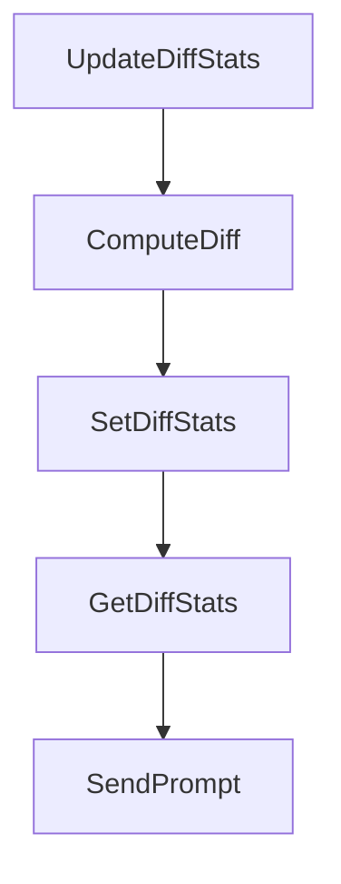

# Chapter 3: Session Lifecycle and Task Parallelism

Welcome to **Chapter 3: Session Lifecycle and Task Parallelism**. In this part of **Claude Squad Tutorial: Multi-Agent Terminal Session Orchestration**, you will build an intuitive mental model first, then move into concrete implementation details and practical production tradeoffs.


Claude Squad session controls support task creation, pause/resume, and deletion within one terminal workflow.

## Key Session Actions

- create session (`n` / `N`)
- attach/detach (`enter`/`o`, `ctrl-q`)
- pause/resume (`c`, `r`)
- delete session (`D`)

## Parallelism Pattern

Run multiple sessions in parallel for independent features or bug fixes, each on its own worktree branch.

## Source References

- [Claude Squad README: menu and session controls](https://github.com/smtg-ai/claude-squad/blob/main/README.md)

## Summary

You now have a session lifecycle model for high-throughput parallel task execution.

Next: [Chapter 4: Multi-Agent Program Integration](04-multi-agent-program-integration.md)

## Source Code Walkthrough

### `session/instance.go`

The `UpdateDiffStats` function in [`session/instance.go`](https://github.com/smtg-ai/claude-squad/blob/HEAD/session/instance.go) handles a key part of this chapter's functionality:

```go
}

// UpdateDiffStats updates the git diff statistics for this instance
func (i *Instance) UpdateDiffStats() error {
	if !i.started {
		i.diffStats = nil
		return nil
	}

	if i.Status == Paused {
		// Keep the previous diff stats if the instance is paused
		return nil
	}

	stats := i.gitWorktree.Diff()
	if stats.Error != nil {
		if strings.Contains(stats.Error.Error(), "base commit SHA not set") {
			// Worktree is not fully set up yet, not an error
			i.diffStats = nil
			return nil
		}
		return fmt.Errorf("failed to get diff stats: %w", stats.Error)
	}

	i.diffStats = stats
	return nil
}

// ComputeDiff runs the expensive git diff I/O and returns the result without
// mutating instance state. Safe to call from a background goroutine.
func (i *Instance) ComputeDiff() *git.DiffStats {
	if !i.started || i.Status == Paused {
```

This function is important because it defines how Claude Squad Tutorial: Multi-Agent Terminal Session Orchestration implements the patterns covered in this chapter.

### `session/instance.go`

The `ComputeDiff` function in [`session/instance.go`](https://github.com/smtg-ai/claude-squad/blob/HEAD/session/instance.go) handles a key part of this chapter's functionality:

```go
}

// ComputeDiff runs the expensive git diff I/O and returns the result without
// mutating instance state. Safe to call from a background goroutine.
func (i *Instance) ComputeDiff() *git.DiffStats {
	if !i.started || i.Status == Paused {
		return nil
	}
	return i.gitWorktree.Diff()
}

// SetDiffStats sets the diff statistics on the instance. Should be called from
// the main event loop to avoid data races with View.
func (i *Instance) SetDiffStats(stats *git.DiffStats) {
	i.diffStats = stats
}

// GetDiffStats returns the current git diff statistics
func (i *Instance) GetDiffStats() *git.DiffStats {
	return i.diffStats
}

// SendPrompt sends a prompt to the tmux session
func (i *Instance) SendPrompt(prompt string) error {
	if !i.started {
		return fmt.Errorf("instance not started")
	}
	if i.tmuxSession == nil {
		return fmt.Errorf("tmux session not initialized")
	}
	if err := i.tmuxSession.SendKeys(prompt); err != nil {
		return fmt.Errorf("error sending keys to tmux session: %w", err)
```

This function is important because it defines how Claude Squad Tutorial: Multi-Agent Terminal Session Orchestration implements the patterns covered in this chapter.

### `session/instance.go`

The `SetDiffStats` function in [`session/instance.go`](https://github.com/smtg-ai/claude-squad/blob/HEAD/session/instance.go) handles a key part of this chapter's functionality:

```go
}

// SetDiffStats sets the diff statistics on the instance. Should be called from
// the main event loop to avoid data races with View.
func (i *Instance) SetDiffStats(stats *git.DiffStats) {
	i.diffStats = stats
}

// GetDiffStats returns the current git diff statistics
func (i *Instance) GetDiffStats() *git.DiffStats {
	return i.diffStats
}

// SendPrompt sends a prompt to the tmux session
func (i *Instance) SendPrompt(prompt string) error {
	if !i.started {
		return fmt.Errorf("instance not started")
	}
	if i.tmuxSession == nil {
		return fmt.Errorf("tmux session not initialized")
	}
	if err := i.tmuxSession.SendKeys(prompt); err != nil {
		return fmt.Errorf("error sending keys to tmux session: %w", err)
	}

	// Brief pause to prevent carriage return from being interpreted as newline
	time.Sleep(100 * time.Millisecond)
	if err := i.tmuxSession.TapEnter(); err != nil {
		return fmt.Errorf("error tapping enter: %w", err)
	}

	return nil
```

This function is important because it defines how Claude Squad Tutorial: Multi-Agent Terminal Session Orchestration implements the patterns covered in this chapter.

### `session/instance.go`

The `GetDiffStats` function in [`session/instance.go`](https://github.com/smtg-ai/claude-squad/blob/HEAD/session/instance.go) handles a key part of this chapter's functionality:

```go
}

// GetDiffStats returns the current git diff statistics
func (i *Instance) GetDiffStats() *git.DiffStats {
	return i.diffStats
}

// SendPrompt sends a prompt to the tmux session
func (i *Instance) SendPrompt(prompt string) error {
	if !i.started {
		return fmt.Errorf("instance not started")
	}
	if i.tmuxSession == nil {
		return fmt.Errorf("tmux session not initialized")
	}
	if err := i.tmuxSession.SendKeys(prompt); err != nil {
		return fmt.Errorf("error sending keys to tmux session: %w", err)
	}

	// Brief pause to prevent carriage return from being interpreted as newline
	time.Sleep(100 * time.Millisecond)
	if err := i.tmuxSession.TapEnter(); err != nil {
		return fmt.Errorf("error tapping enter: %w", err)
	}

	return nil
}

// PreviewFullHistory captures the entire tmux pane output including full scrollback history
func (i *Instance) PreviewFullHistory() (string, error) {
	if !i.started || i.Status == Paused {
		return "", nil
```

This function is important because it defines how Claude Squad Tutorial: Multi-Agent Terminal Session Orchestration implements the patterns covered in this chapter.


## How These Components Connect


