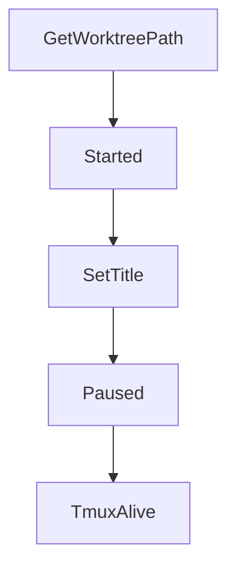

# Chapter 4: Multi-Agent Program Integration

Welcome to **Chapter 4: Multi-Agent Program Integration**. In this part of **Claude Squad Tutorial: Multi-Agent Terminal Session Orchestration**, you will build an intuitive mental model first, then move into concrete implementation details and practical production tradeoffs.


Claude Squad can orchestrate different terminal agents by configuring the program command per session.

## Example Programs

| Agent Program | Launch Example |
|:--------------|:---------------|
| Claude Code | `cs` (default) |
| Codex | `cs -p "codex"` |
| Gemini | `cs -p "gemini"` |
| Aider | `cs -p "aider ..."` |

## Integration Guidance

- keep program-specific environment variables explicit
- validate each program's prompt/approval conventions
- standardize defaults in config for team consistency

## Source References

- [Claude Squad README: multi-agent usage](https://github.com/smtg-ai/claude-squad/blob/main/README.md)

## Summary

You now know how to use Claude Squad as a shared orchestrator across multiple coding agents.

Next: [Chapter 5: Review, Checkout, and Push Workflow](05-review-checkout-and-push-workflow.md)

## Depth Expansion Playbook

## Source Code Walkthrough

### `session/instance.go`

The `GetWorktreePath` function in [`session/instance.go`](https://github.com/smtg-ai/claude-squad/blob/HEAD/session/instance.go) handles a key part of this chapter's functionality:

```go
		data.Worktree = GitWorktreeData{
			RepoPath:         i.gitWorktree.GetRepoPath(),
			WorktreePath:     i.gitWorktree.GetWorktreePath(),
			SessionName:      i.Title,
			BranchName:       i.gitWorktree.GetBranchName(),
			BaseCommitSHA:    i.gitWorktree.GetBaseCommitSHA(),
			IsExistingBranch: i.gitWorktree.IsExistingBranch(),
		}
	}

	// Only include diff stats if they exist
	if i.diffStats != nil {
		data.DiffStats = DiffStatsData{
			Added:   i.diffStats.Added,
			Removed: i.diffStats.Removed,
			Content: i.diffStats.Content,
		}
	}

	return data
}

// FromInstanceData creates a new Instance from serialized data
func FromInstanceData(data InstanceData) (*Instance, error) {
	instance := &Instance{
		Title:     data.Title,
		Path:      data.Path,
		Branch:    data.Branch,
		Status:    data.Status,
		Height:    data.Height,
		Width:     data.Width,
		CreatedAt: data.CreatedAt,
```

This function is important because it defines how Claude Squad Tutorial: Multi-Agent Terminal Session Orchestration implements the patterns covered in this chapter.

### `session/instance.go`

The `Started` function in [`session/instance.go`](https://github.com/smtg-ai/claude-squad/blob/HEAD/session/instance.go) handles a key part of this chapter's functionality:

```go
}

func (i *Instance) Started() bool {
	return i.started
}

// SetTitle sets the title of the instance. Returns an error if the instance has started.
// We cant change the title once it's been used for a tmux session etc.
func (i *Instance) SetTitle(title string) error {
	if i.started {
		return fmt.Errorf("cannot change title of a started instance")
	}
	i.Title = title
	return nil
}

func (i *Instance) Paused() bool {
	return i.Status == Paused
}

// TmuxAlive returns true if the tmux session is alive. This is a sanity check before attaching.
func (i *Instance) TmuxAlive() bool {
	return i.tmuxSession.DoesSessionExist()
}

// Pause stops the tmux session and removes the worktree, preserving the branch
func (i *Instance) Pause() error {
	if !i.started {
		return fmt.Errorf("cannot pause instance that has not been started")
	}
	if i.Status == Paused {
		return fmt.Errorf("instance is already paused")
```

This function is important because it defines how Claude Squad Tutorial: Multi-Agent Terminal Session Orchestration implements the patterns covered in this chapter.

### `session/instance.go`

The `SetTitle` function in [`session/instance.go`](https://github.com/smtg-ai/claude-squad/blob/HEAD/session/instance.go) handles a key part of this chapter's functionality:

```go
}

// SetTitle sets the title of the instance. Returns an error if the instance has started.
// We cant change the title once it's been used for a tmux session etc.
func (i *Instance) SetTitle(title string) error {
	if i.started {
		return fmt.Errorf("cannot change title of a started instance")
	}
	i.Title = title
	return nil
}

func (i *Instance) Paused() bool {
	return i.Status == Paused
}

// TmuxAlive returns true if the tmux session is alive. This is a sanity check before attaching.
func (i *Instance) TmuxAlive() bool {
	return i.tmuxSession.DoesSessionExist()
}

// Pause stops the tmux session and removes the worktree, preserving the branch
func (i *Instance) Pause() error {
	if !i.started {
		return fmt.Errorf("cannot pause instance that has not been started")
	}
	if i.Status == Paused {
		return fmt.Errorf("instance is already paused")
	}

	var errs []error

```

This function is important because it defines how Claude Squad Tutorial: Multi-Agent Terminal Session Orchestration implements the patterns covered in this chapter.

### `session/instance.go`

The `Paused` function in [`session/instance.go`](https://github.com/smtg-ai/claude-squad/blob/HEAD/session/instance.go) handles a key part of this chapter's functionality:

```go
	// Loading is if the instance is loading (if we are starting it up or something).
	Loading
	// Paused is if the instance is paused (worktree removed but branch preserved).
	Paused
)

// Instance is a running instance of claude code.
type Instance struct {
	// Title is the title of the instance.
	Title string
	// Path is the path to the workspace.
	Path string
	// Branch is the branch of the instance.
	Branch string
	// Status is the status of the instance.
	Status Status
	// Program is the program to run in the instance.
	Program string
	// Height is the height of the instance.
	Height int
	// Width is the width of the instance.
	Width int
	// CreatedAt is the time the instance was created.
	CreatedAt time.Time
	// UpdatedAt is the time the instance was last updated.
	UpdatedAt time.Time
	// AutoYes is true if the instance should automatically press enter when prompted.
	AutoYes bool
	// Prompt is the initial prompt to pass to the instance on startup
	Prompt string

	// DiffStats stores the current git diff statistics
```

This function is important because it defines how Claude Squad Tutorial: Multi-Agent Terminal Session Orchestration implements the patterns covered in this chapter.


## How These Components Connect


