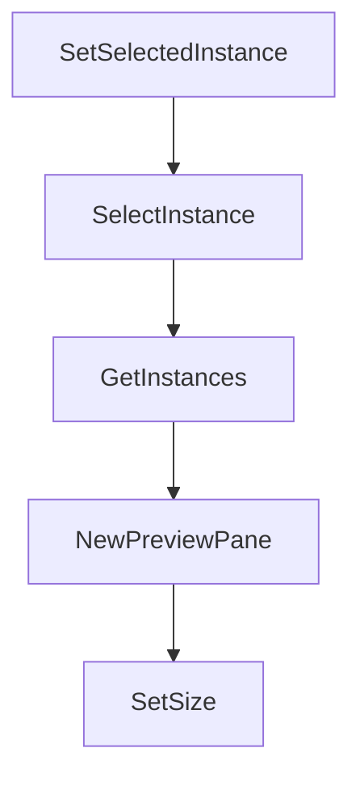

# Chapter 4: Multi-Agent Program Integration

Welcome to **Chapter 4: Multi-Agent Program Integration**. In this part of **Claude Squad Tutorial: Multi-Agent Terminal Session Orchestration**, you will build an intuitive mental model first, then move into concrete implementation details and practical production tradeoffs.


Claude Squad can orchestrate different terminal agents by configuring the program command per session.

## Example Programs

| Agent Program | Launch Example |
|:--------------|:---------------|
| Claude Code | `cs` (default) |
| Codex | `cs -p "codex"` |
| Gemini | `cs -p "gemini"` |
| Aider | `cs -p "aider ..."` |

## Integration Guidance

- keep program-specific environment variables explicit
- validate each program's prompt/approval conventions
- standardize defaults in config for team consistency

## Source References

- [Claude Squad README: multi-agent usage](https://github.com/smtg-ai/claude-squad/blob/main/README.md)

## Summary

You now know how to use Claude Squad as a shared orchestrator across multiple coding agents.

Next: [Chapter 5: Review, Checkout, and Push Workflow](05-review-checkout-and-push-workflow.md)

## Source Code Walkthrough

### `ui/list.go`

The `SetSelectedInstance` function in [`ui/list.go`](https://github.com/smtg-ai/claude-squad/blob/HEAD/ui/list.go) handles a key part of this chapter's functionality:

```go
}

// SetSelectedInstance sets the selected index. Noop if the index is out of bounds.
func (l *List) SetSelectedInstance(idx int) {
	if idx >= len(l.items) {
		return
	}
	l.selectedIdx = idx
}

// SelectInstance finds and selects the given instance in the list.
func (l *List) SelectInstance(target *session.Instance) {
	for i, inst := range l.items {
		if inst == target {
			l.SetSelectedInstance(i)
			return
		}
	}
}

// GetInstances returns all instances in the list
func (l *List) GetInstances() []*session.Instance {
	return l.items
}

```

This function is important because it defines how Claude Squad Tutorial: Multi-Agent Terminal Session Orchestration implements the patterns covered in this chapter.

### `ui/list.go`

The `SelectInstance` function in [`ui/list.go`](https://github.com/smtg-ai/claude-squad/blob/HEAD/ui/list.go) handles a key part of this chapter's functionality:

```go
}

// SelectInstance finds and selects the given instance in the list.
func (l *List) SelectInstance(target *session.Instance) {
	for i, inst := range l.items {
		if inst == target {
			l.SetSelectedInstance(i)
			return
		}
	}
}

// GetInstances returns all instances in the list
func (l *List) GetInstances() []*session.Instance {
	return l.items
}

```

This function is important because it defines how Claude Squad Tutorial: Multi-Agent Terminal Session Orchestration implements the patterns covered in this chapter.

### `ui/list.go`

The `GetInstances` function in [`ui/list.go`](https://github.com/smtg-ai/claude-squad/blob/HEAD/ui/list.go) handles a key part of this chapter's functionality:

```go
}

// GetInstances returns all instances in the list
func (l *List) GetInstances() []*session.Instance {
	return l.items
}

```

This function is important because it defines how Claude Squad Tutorial: Multi-Agent Terminal Session Orchestration implements the patterns covered in this chapter.

### `ui/preview.go`

The `NewPreviewPane` function in [`ui/preview.go`](https://github.com/smtg-ai/claude-squad/blob/HEAD/ui/preview.go) handles a key part of this chapter's functionality:

```go
}

func NewPreviewPane() *PreviewPane {
	return &PreviewPane{
		viewport: viewport.New(0, 0),
	}
}

func (p *PreviewPane) SetSize(width, maxHeight int) {
	p.width = width
	p.height = maxHeight
	p.viewport.Width = width
	p.viewport.Height = maxHeight
}

// setFallbackState sets the preview state with fallback text and a message
func (p *PreviewPane) setFallbackState(message string) {
	p.previewState = previewState{
		fallback: true,
		text:     lipgloss.JoinVertical(lipgloss.Center, FallBackText, "", message),
	}
}

// Updates the preview pane content with the tmux pane content
func (p *PreviewPane) UpdateContent(instance *session.Instance) error {
	switch {
	case instance == nil:
		p.setFallbackState("No agents running yet. Spin up a new instance with 'n' to get started!")
		return nil
	case instance.Status == session.Loading:
		p.setFallbackState("Setting up workspace...")
		return nil
```

This function is important because it defines how Claude Squad Tutorial: Multi-Agent Terminal Session Orchestration implements the patterns covered in this chapter.


## How These Components Connect


