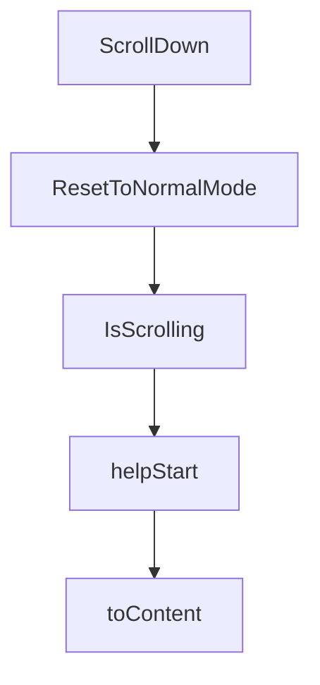

# Chapter 5: Review, Checkout, and Push Workflow

Welcome to **Chapter 5: Review, Checkout, and Push Workflow**. In this part of **Claude Squad Tutorial: Multi-Agent Terminal Session Orchestration**, you will build an intuitive mental model first, then move into concrete implementation details and practical production tradeoffs.


Claude Squad emphasizes reviewing isolated changes before pushing them upstream.

## Built-In Workflow Actions

- review session diffs in the TUI
- checkout/pause session state when ready
- commit and push branch from session context

## Delivery Pattern

1. run task in isolated worktree
2. inspect diff and session output
3. commit/push only validated branch
4. merge through normal PR process

## Source References

- [Claude Squad README: review and push controls](https://github.com/smtg-ai/claude-squad/blob/main/README.md)

## Summary

You now have a branch-safe path from agent output to PR-ready changes.

Next: [Chapter 6: AutoYes, Daemon Polling, and Safety Controls](06-autoyes-daemon-polling-and-safety-controls.md)

## Source Code Walkthrough

### `ui/terminal.go`

The `ScrollDown` function in [`ui/terminal.go`](https://github.com/smtg-ai/claude-squad/blob/HEAD/ui/terminal.go) handles a key part of this chapter's functionality:

```go
}

// ScrollDown enters scroll mode (if not already) and scrolls down.
func (t *TerminalPane) ScrollDown() error {
	t.mu.Lock()
	defer t.mu.Unlock()
	if !t.isScrolling {
		return t.enterScrollMode()
	}
	t.viewport.LineDown(1)
	return nil
}

// ResetToNormalMode exits scroll mode and restores normal content display.
func (t *TerminalPane) ResetToNormalMode() {
	t.mu.Lock()
	defer t.mu.Unlock()
	if !t.isScrolling {
		return
	}
	t.isScrolling = false
	t.viewport.SetContent("")
	t.viewport.GotoTop()
}

// IsScrolling returns whether the terminal pane is in scroll mode.
func (t *TerminalPane) IsScrolling() bool {
	t.mu.Lock()
	defer t.mu.Unlock()
	return t.isScrolling
}

```

This function is important because it defines how Claude Squad Tutorial: Multi-Agent Terminal Session Orchestration implements the patterns covered in this chapter.

### `ui/terminal.go`

The `ResetToNormalMode` function in [`ui/terminal.go`](https://github.com/smtg-ai/claude-squad/blob/HEAD/ui/terminal.go) handles a key part of this chapter's functionality:

```go
}

// ResetToNormalMode exits scroll mode and restores normal content display.
func (t *TerminalPane) ResetToNormalMode() {
	t.mu.Lock()
	defer t.mu.Unlock()
	if !t.isScrolling {
		return
	}
	t.isScrolling = false
	t.viewport.SetContent("")
	t.viewport.GotoTop()
}

// IsScrolling returns whether the terminal pane is in scroll mode.
func (t *TerminalPane) IsScrolling() bool {
	t.mu.Lock()
	defer t.mu.Unlock()
	return t.isScrolling
}

```

This function is important because it defines how Claude Squad Tutorial: Multi-Agent Terminal Session Orchestration implements the patterns covered in this chapter.

### `ui/terminal.go`

The `IsScrolling` function in [`ui/terminal.go`](https://github.com/smtg-ai/claude-squad/blob/HEAD/ui/terminal.go) handles a key part of this chapter's functionality:

```go
}

// IsScrolling returns whether the terminal pane is in scroll mode.
func (t *TerminalPane) IsScrolling() bool {
	t.mu.Lock()
	defer t.mu.Unlock()
	return t.isScrolling
}

```

This function is important because it defines how Claude Squad Tutorial: Multi-Agent Terminal Session Orchestration implements the patterns covered in this chapter.

### `app/help.go`

The `helpStart` function in [`app/help.go`](https://github.com/smtg-ai/claude-squad/blob/HEAD/app/help.go) handles a key part of this chapter's functionality:

```go
type helpTypeInstanceCheckout struct{}

func helpStart(instance *session.Instance) helpText {
	return helpTypeInstanceStart{instance: instance}
}

func (h helpTypeGeneral) toContent() string {
	content := lipgloss.JoinVertical(lipgloss.Left,
		titleStyle.Render("Claude Squad"),
		"",
		"A terminal UI that manages multiple Claude Code (and other local agents) in separate workspaces.",
		"",
		headerStyle.Render("Managing:"),
		keyStyle.Render("n")+descStyle.Render("         - Create a new session"),
		keyStyle.Render("N")+descStyle.Render("         - Create a new session with a prompt"),
		keyStyle.Render("D")+descStyle.Render("         - Kill (delete) the selected session"),
		keyStyle.Render("↑/j, ↓/k")+descStyle.Render("  - Navigate between sessions"),
		keyStyle.Render("↵/o")+descStyle.Render("       - Attach to the selected session"),
		keyStyle.Render("ctrl-q")+descStyle.Render("    - Detach from session"),
		"",
		headerStyle.Render("Handoff:"),
		keyStyle.Render("p")+descStyle.Render("         - Commit and push branch to github"),
		keyStyle.Render("c")+descStyle.Render("         - Checkout: commit changes and pause session"),
		keyStyle.Render("r")+descStyle.Render("         - Resume a paused session"),
		"",
		headerStyle.Render("Other:"),
		keyStyle.Render("tab")+descStyle.Render("       - Switch between preview, diff, and terminal tabs"),
		keyStyle.Render("shift-↓/↑")+descStyle.Render(" - Scroll in preview/diff/terminal view"),
		keyStyle.Render("q")+descStyle.Render("         - Quit the application"),
	)
	return content
}
```

This function is important because it defines how Claude Squad Tutorial: Multi-Agent Terminal Session Orchestration implements the patterns covered in this chapter.


## How These Components Connect


