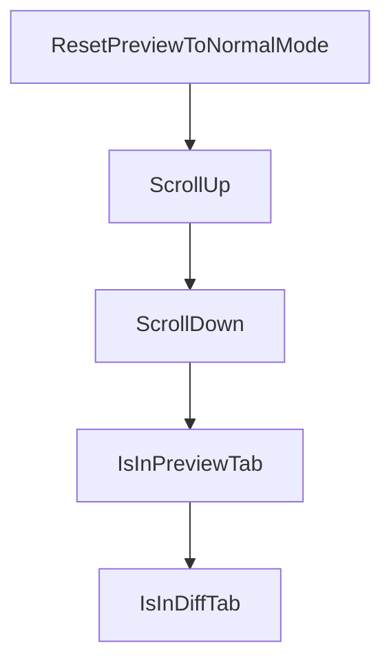

# Chapter 5: Review, Checkout, and Push Workflow

Welcome to **Chapter 5: Review, Checkout, and Push Workflow**. In this part of **Claude Squad Tutorial: Multi-Agent Terminal Session Orchestration**, you will build an intuitive mental model first, then move into concrete implementation details and practical production tradeoffs.


Claude Squad emphasizes reviewing isolated changes before pushing them upstream.

## Built-In Workflow Actions

- review session diffs in the TUI
- checkout/pause session state when ready
- commit and push branch from session context

## Delivery Pattern

1. run task in isolated worktree
2. inspect diff and session output
3. commit/push only validated branch
4. merge through normal PR process

## Source References

- [Claude Squad README: review and push controls](https://github.com/smtg-ai/claude-squad/blob/main/README.md)

## Summary

You now have a branch-safe path from agent output to PR-ready changes.

Next: [Chapter 6: AutoYes, Daemon Polling, and Safety Controls](06-autoyes-daemon-polling-and-safety-controls.md)

## Depth Expansion Playbook

## Source Code Walkthrough

### `ui/tabbed_window.go`

The `ResetPreviewToNormalMode` function in [`ui/tabbed_window.go`](https://github.com/smtg-ai/claude-squad/blob/HEAD/ui/tabbed_window.go) handles a key part of this chapter's functionality:

```go
}

// ResetPreviewToNormalMode resets the preview pane to normal mode
func (w *TabbedWindow) ResetPreviewToNormalMode(instance *session.Instance) error {
	return w.preview.ResetToNormalMode(instance)
}

// Add these new methods for handling scroll events
func (w *TabbedWindow) ScrollUp() {
	switch w.activeTab {
	case PreviewTab:
		err := w.preview.ScrollUp(w.instance)
		if err != nil {
			log.InfoLog.Printf("tabbed window failed to scroll up: %v", err)
		}
	case DiffTab:
		w.diff.ScrollUp()
	case TerminalTab:
		if err := w.terminal.ScrollUp(); err != nil {
			log.InfoLog.Printf("tabbed window failed to scroll terminal up: %v", err)
		}
	}
}

func (w *TabbedWindow) ScrollDown() {
	switch w.activeTab {
	case PreviewTab:
		err := w.preview.ScrollDown(w.instance)
		if err != nil {
			log.InfoLog.Printf("tabbed window failed to scroll down: %v", err)
		}
	case DiffTab:
```

This function is important because it defines how Claude Squad Tutorial: Multi-Agent Terminal Session Orchestration implements the patterns covered in this chapter.

### `ui/tabbed_window.go`

The `ScrollUp` function in [`ui/tabbed_window.go`](https://github.com/smtg-ai/claude-squad/blob/HEAD/ui/tabbed_window.go) handles a key part of this chapter's functionality:

```go

// Add these new methods for handling scroll events
func (w *TabbedWindow) ScrollUp() {
	switch w.activeTab {
	case PreviewTab:
		err := w.preview.ScrollUp(w.instance)
		if err != nil {
			log.InfoLog.Printf("tabbed window failed to scroll up: %v", err)
		}
	case DiffTab:
		w.diff.ScrollUp()
	case TerminalTab:
		if err := w.terminal.ScrollUp(); err != nil {
			log.InfoLog.Printf("tabbed window failed to scroll terminal up: %v", err)
		}
	}
}

func (w *TabbedWindow) ScrollDown() {
	switch w.activeTab {
	case PreviewTab:
		err := w.preview.ScrollDown(w.instance)
		if err != nil {
			log.InfoLog.Printf("tabbed window failed to scroll down: %v", err)
		}
	case DiffTab:
		w.diff.ScrollDown()
	case TerminalTab:
		if err := w.terminal.ScrollDown(); err != nil {
			log.InfoLog.Printf("tabbed window failed to scroll terminal down: %v", err)
		}
	}
```

This function is important because it defines how Claude Squad Tutorial: Multi-Agent Terminal Session Orchestration implements the patterns covered in this chapter.

### `ui/tabbed_window.go`

The `ScrollDown` function in [`ui/tabbed_window.go`](https://github.com/smtg-ai/claude-squad/blob/HEAD/ui/tabbed_window.go) handles a key part of this chapter's functionality:

```go
}

func (w *TabbedWindow) ScrollDown() {
	switch w.activeTab {
	case PreviewTab:
		err := w.preview.ScrollDown(w.instance)
		if err != nil {
			log.InfoLog.Printf("tabbed window failed to scroll down: %v", err)
		}
	case DiffTab:
		w.diff.ScrollDown()
	case TerminalTab:
		if err := w.terminal.ScrollDown(); err != nil {
			log.InfoLog.Printf("tabbed window failed to scroll terminal down: %v", err)
		}
	}
}

// IsInPreviewTab returns true if the preview tab is currently active
func (w *TabbedWindow) IsInPreviewTab() bool {
	return w.activeTab == PreviewTab
}

// IsInDiffTab returns true if the diff tab is currently active
func (w *TabbedWindow) IsInDiffTab() bool {
	return w.activeTab == DiffTab
}

// IsInTerminalTab returns true if the terminal tab is currently active
func (w *TabbedWindow) IsInTerminalTab() bool {
	return w.activeTab == TerminalTab
}
```

This function is important because it defines how Claude Squad Tutorial: Multi-Agent Terminal Session Orchestration implements the patterns covered in this chapter.

### `ui/tabbed_window.go`

The `IsInPreviewTab` function in [`ui/tabbed_window.go`](https://github.com/smtg-ai/claude-squad/blob/HEAD/ui/tabbed_window.go) handles a key part of this chapter's functionality:

```go
}

// IsInPreviewTab returns true if the preview tab is currently active
func (w *TabbedWindow) IsInPreviewTab() bool {
	return w.activeTab == PreviewTab
}

// IsInDiffTab returns true if the diff tab is currently active
func (w *TabbedWindow) IsInDiffTab() bool {
	return w.activeTab == DiffTab
}

// IsInTerminalTab returns true if the terminal tab is currently active
func (w *TabbedWindow) IsInTerminalTab() bool {
	return w.activeTab == TerminalTab
}

// GetActiveTab returns the currently active tab index
func (w *TabbedWindow) GetActiveTab() int {
	return w.activeTab
}

// AttachTerminal attaches to the terminal tmux session
func (w *TabbedWindow) AttachTerminal() (chan struct{}, error) {
	return w.terminal.Attach()
}

// CleanupTerminal closes the terminal session
func (w *TabbedWindow) CleanupTerminal() {
	w.terminal.Close()
}

```

This function is important because it defines how Claude Squad Tutorial: Multi-Agent Terminal Session Orchestration implements the patterns covered in this chapter.


## How These Components Connect


