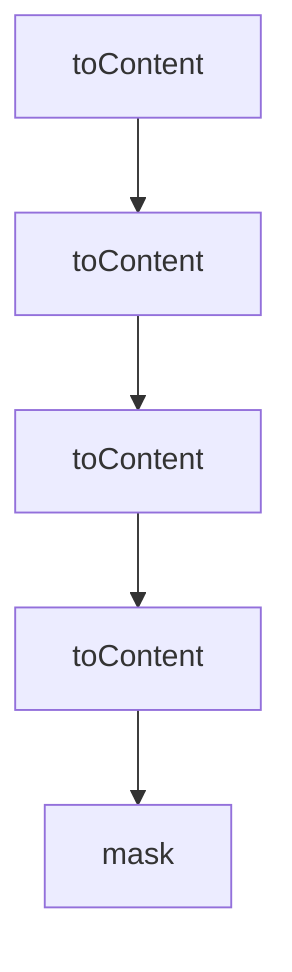

# Chapter 6: AutoYes, Daemon Polling, and Safety Controls

Welcome to **Chapter 6: AutoYes, Daemon Polling, and Safety Controls**. In this part of **Claude Squad Tutorial: Multi-Agent Terminal Session Orchestration**, you will build an intuitive mental model first, then move into concrete implementation details and practical production tradeoffs.


AutoYes features can increase throughput but require strict boundaries.

## Safety Considerations

- `--autoyes` is experimental and should be limited to trusted tasks
- polling/daemon controls affect unattended behavior
- enforce stronger review gates before pushing auto-accepted outputs

## Source References

- [Claude Squad CLI flags](https://github.com/smtg-ai/claude-squad/blob/main/README.md)
- [Config fields including AutoYes and daemon interval](https://github.com/smtg-ai/claude-squad/blob/main/config/config.go)

## Summary

You now understand how to apply automation controls without removing governance.

Next: [Chapter 7: Configuration and State Management](07-configuration-and-state-management.md)

## Depth Expansion Playbook

## Source Code Walkthrough

### `app/help.go`

The `toContent` function in [`app/help.go`](https://github.com/smtg-ai/claude-squad/blob/HEAD/app/help.go) handles a key part of this chapter's functionality:

```go

type helpText interface {
	// toContent returns the help UI content.
	toContent() string
	// mask returns the bit mask for this help text. These are used to track which help screens
	// have been seen in the config and app state.
	mask() uint32
}

type helpTypeGeneral struct{}

type helpTypeInstanceStart struct {
	instance *session.Instance
}

type helpTypeInstanceAttach struct{}

type helpTypeInstanceCheckout struct{}

func helpStart(instance *session.Instance) helpText {
	return helpTypeInstanceStart{instance: instance}
}

func (h helpTypeGeneral) toContent() string {
	content := lipgloss.JoinVertical(lipgloss.Left,
		titleStyle.Render("Claude Squad"),
		"",
		"A terminal UI that manages multiple Claude Code (and other local agents) in separate workspaces.",
		"",
		headerStyle.Render("Managing:"),
		keyStyle.Render("n")+descStyle.Render("         - Create a new session"),
		keyStyle.Render("N")+descStyle.Render("         - Create a new session with a prompt"),
```

This function is important because it defines how Claude Squad Tutorial: Multi-Agent Terminal Session Orchestration implements the patterns covered in this chapter.

### `app/help.go`

The `toContent` function in [`app/help.go`](https://github.com/smtg-ai/claude-squad/blob/HEAD/app/help.go) handles a key part of this chapter's functionality:

```go

type helpText interface {
	// toContent returns the help UI content.
	toContent() string
	// mask returns the bit mask for this help text. These are used to track which help screens
	// have been seen in the config and app state.
	mask() uint32
}

type helpTypeGeneral struct{}

type helpTypeInstanceStart struct {
	instance *session.Instance
}

type helpTypeInstanceAttach struct{}

type helpTypeInstanceCheckout struct{}

func helpStart(instance *session.Instance) helpText {
	return helpTypeInstanceStart{instance: instance}
}

func (h helpTypeGeneral) toContent() string {
	content := lipgloss.JoinVertical(lipgloss.Left,
		titleStyle.Render("Claude Squad"),
		"",
		"A terminal UI that manages multiple Claude Code (and other local agents) in separate workspaces.",
		"",
		headerStyle.Render("Managing:"),
		keyStyle.Render("n")+descStyle.Render("         - Create a new session"),
		keyStyle.Render("N")+descStyle.Render("         - Create a new session with a prompt"),
```

This function is important because it defines how Claude Squad Tutorial: Multi-Agent Terminal Session Orchestration implements the patterns covered in this chapter.

### `app/help.go`

The `toContent` function in [`app/help.go`](https://github.com/smtg-ai/claude-squad/blob/HEAD/app/help.go) handles a key part of this chapter's functionality:

```go

type helpText interface {
	// toContent returns the help UI content.
	toContent() string
	// mask returns the bit mask for this help text. These are used to track which help screens
	// have been seen in the config and app state.
	mask() uint32
}

type helpTypeGeneral struct{}

type helpTypeInstanceStart struct {
	instance *session.Instance
}

type helpTypeInstanceAttach struct{}

type helpTypeInstanceCheckout struct{}

func helpStart(instance *session.Instance) helpText {
	return helpTypeInstanceStart{instance: instance}
}

func (h helpTypeGeneral) toContent() string {
	content := lipgloss.JoinVertical(lipgloss.Left,
		titleStyle.Render("Claude Squad"),
		"",
		"A terminal UI that manages multiple Claude Code (and other local agents) in separate workspaces.",
		"",
		headerStyle.Render("Managing:"),
		keyStyle.Render("n")+descStyle.Render("         - Create a new session"),
		keyStyle.Render("N")+descStyle.Render("         - Create a new session with a prompt"),
```

This function is important because it defines how Claude Squad Tutorial: Multi-Agent Terminal Session Orchestration implements the patterns covered in this chapter.

### `app/help.go`

The `toContent` function in [`app/help.go`](https://github.com/smtg-ai/claude-squad/blob/HEAD/app/help.go) handles a key part of this chapter's functionality:

```go

type helpText interface {
	// toContent returns the help UI content.
	toContent() string
	// mask returns the bit mask for this help text. These are used to track which help screens
	// have been seen in the config and app state.
	mask() uint32
}

type helpTypeGeneral struct{}

type helpTypeInstanceStart struct {
	instance *session.Instance
}

type helpTypeInstanceAttach struct{}

type helpTypeInstanceCheckout struct{}

func helpStart(instance *session.Instance) helpText {
	return helpTypeInstanceStart{instance: instance}
}

func (h helpTypeGeneral) toContent() string {
	content := lipgloss.JoinVertical(lipgloss.Left,
		titleStyle.Render("Claude Squad"),
		"",
		"A terminal UI that manages multiple Claude Code (and other local agents) in separate workspaces.",
		"",
		headerStyle.Render("Managing:"),
		keyStyle.Render("n")+descStyle.Render("         - Create a new session"),
		keyStyle.Render("N")+descStyle.Render("         - Create a new session with a prompt"),
```

This function is important because it defines how Claude Squad Tutorial: Multi-Agent Terminal Session Orchestration implements the patterns covered in this chapter.


## How These Components Connect


