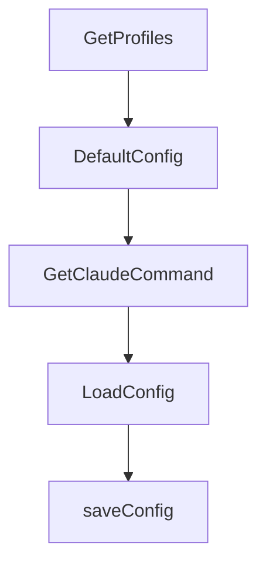

# Chapter 6: AutoYes, Daemon Polling, and Safety Controls

Welcome to **Chapter 6: AutoYes, Daemon Polling, and Safety Controls**. In this part of **Claude Squad Tutorial: Multi-Agent Terminal Session Orchestration**, you will build an intuitive mental model first, then move into concrete implementation details and practical production tradeoffs.


AutoYes features can increase throughput but require strict boundaries.

## Safety Considerations

- `--autoyes` is experimental and should be limited to trusted tasks
- polling/daemon controls affect unattended behavior
- enforce stronger review gates before pushing auto-accepted outputs

## Source References

- [Claude Squad CLI flags](https://github.com/smtg-ai/claude-squad/blob/main/README.md)
- [Config fields including AutoYes and daemon interval](https://github.com/smtg-ai/claude-squad/blob/main/config/config.go)

## Summary

You now understand how to apply automation controls without removing governance.

Next: [Chapter 7: Configuration and State Management](07-configuration-and-state-management.md)

## Source Code Walkthrough

### `config/config.go`

The `GetProfiles` function in [`config/config.go`](https://github.com/smtg-ai/claude-squad/blob/HEAD/config/config.go) handles a key part of this chapter's functionality:

```go
}

// GetProfiles returns a unified list of profiles. If Profiles is defined,
// those are returned with the default profile first. Otherwise, a single
// profile is synthesized from DefaultProgram.
func (c *Config) GetProfiles() []Profile {
	if len(c.Profiles) == 0 {
		return []Profile{{Name: c.DefaultProgram, Program: c.DefaultProgram}}
	}
	// Reorder so the default profile comes first.
	profiles := make([]Profile, 0, len(c.Profiles))
	for _, p := range c.Profiles {
		if p.Name == c.DefaultProgram {
			profiles = append(profiles, p)
			break
		}
	}
	for _, p := range c.Profiles {
		if p.Name != c.DefaultProgram {
			profiles = append(profiles, p)
		}
	}
	return profiles
}

// DefaultConfig returns the default configuration
func DefaultConfig() *Config {
	program, err := GetClaudeCommand()
	if err != nil {
		log.ErrorLog.Printf("failed to get claude command: %v", err)
		program = defaultProgram
	}
```

This function is important because it defines how Claude Squad Tutorial: Multi-Agent Terminal Session Orchestration implements the patterns covered in this chapter.

### `config/config.go`

The `DefaultConfig` function in [`config/config.go`](https://github.com/smtg-ai/claude-squad/blob/HEAD/config/config.go) handles a key part of this chapter's functionality:

```go
}

// DefaultConfig returns the default configuration
func DefaultConfig() *Config {
	program, err := GetClaudeCommand()
	if err != nil {
		log.ErrorLog.Printf("failed to get claude command: %v", err)
		program = defaultProgram
	}

	return &Config{
		DefaultProgram:     program,
		AutoYes:            false,
		DaemonPollInterval: 1000,
		BranchPrefix: func() string {
			user, err := user.Current()
			if err != nil || user == nil || user.Username == "" {
				log.ErrorLog.Printf("failed to get current user: %v", err)
				return "session/"
			}
			return fmt.Sprintf("%s/", strings.ToLower(user.Username))
		}(),
	}
}

// GetClaudeCommand attempts to find the "claude" command in the user's shell
// It checks in the following order:
// 1. Shell alias resolution: using "which" command
// 2. PATH lookup
//
// If both fail, it returns an error.
func GetClaudeCommand() (string, error) {
```

This function is important because it defines how Claude Squad Tutorial: Multi-Agent Terminal Session Orchestration implements the patterns covered in this chapter.

### `config/config.go`

The `GetClaudeCommand` function in [`config/config.go`](https://github.com/smtg-ai/claude-squad/blob/HEAD/config/config.go) handles a key part of this chapter's functionality:

```go
// DefaultConfig returns the default configuration
func DefaultConfig() *Config {
	program, err := GetClaudeCommand()
	if err != nil {
		log.ErrorLog.Printf("failed to get claude command: %v", err)
		program = defaultProgram
	}

	return &Config{
		DefaultProgram:     program,
		AutoYes:            false,
		DaemonPollInterval: 1000,
		BranchPrefix: func() string {
			user, err := user.Current()
			if err != nil || user == nil || user.Username == "" {
				log.ErrorLog.Printf("failed to get current user: %v", err)
				return "session/"
			}
			return fmt.Sprintf("%s/", strings.ToLower(user.Username))
		}(),
	}
}

// GetClaudeCommand attempts to find the "claude" command in the user's shell
// It checks in the following order:
// 1. Shell alias resolution: using "which" command
// 2. PATH lookup
//
// If both fail, it returns an error.
func GetClaudeCommand() (string, error) {
	shell := os.Getenv("SHELL")
	if shell == "" {
```

This function is important because it defines how Claude Squad Tutorial: Multi-Agent Terminal Session Orchestration implements the patterns covered in this chapter.

### `config/config.go`

The `LoadConfig` function in [`config/config.go`](https://github.com/smtg-ai/claude-squad/blob/HEAD/config/config.go) handles a key part of this chapter's functionality:

```go
}

func LoadConfig() *Config {
	configDir, err := GetConfigDir()
	if err != nil {
		log.ErrorLog.Printf("failed to get config directory: %v", err)
		return DefaultConfig()
	}

	configPath := filepath.Join(configDir, ConfigFileName)
	data, err := os.ReadFile(configPath)
	if err != nil {
		if os.IsNotExist(err) {
			// Create and save default config if file doesn't exist
			defaultCfg := DefaultConfig()
			if saveErr := saveConfig(defaultCfg); saveErr != nil {
				log.WarningLog.Printf("failed to save default config: %v", saveErr)
			}
			return defaultCfg
		}

		log.WarningLog.Printf("failed to get config file: %v", err)
		return DefaultConfig()
	}

	var config Config
	if err := json.Unmarshal(data, &config); err != nil {
		log.ErrorLog.Printf("failed to parse config file: %v", err)
		return DefaultConfig()
	}

	return &config
```

This function is important because it defines how Claude Squad Tutorial: Multi-Agent Terminal Session Orchestration implements the patterns covered in this chapter.


## How These Components Connect


