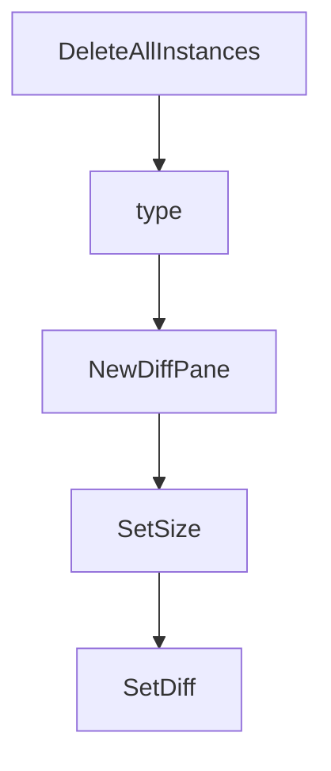

# Chapter 7: Configuration and State Management

Welcome to **Chapter 7: Configuration and State Management**. In this part of **Claude Squad Tutorial: Multi-Agent Terminal Session Orchestration**, you will build an intuitive mental model first, then move into concrete implementation details and practical production tradeoffs.


Claude Squad keeps configuration and session artifacts in a dedicated user config directory.

## Configuration Model

- config dir: `~/.claude-squad`
- configurable defaults: program, branch prefix, AutoYes, polling interval
- session/worktree metadata persisted for lifecycle operations

## Team Practice

- standardize default program and branch prefix conventions
- document reset/recovery flow for corrupted local state
- keep config introspection in onboarding (`cs debug`)

## Source References

- [Config implementation](https://github.com/smtg-ai/claude-squad/blob/main/config/config.go)
- [Claude Squad README: debug command](https://github.com/smtg-ai/claude-squad/blob/main/README.md)

## Summary

You now have an operational model for Claude Squad configuration and local state behavior.

Next: [Chapter 8: Production Team Operations](08-production-team-operations.md)

## Depth Expansion Playbook

## Source Code Walkthrough

### `session/storage.go`

The `DeleteAllInstances` function in [`session/storage.go`](https://github.com/smtg-ai/claude-squad/blob/HEAD/session/storage.go) handles a key part of this chapter's functionality:

```go
}

// DeleteAllInstances removes all stored instances
func (s *Storage) DeleteAllInstances() error {
	return s.state.DeleteAllInstances()
}

```

This function is important because it defines how Claude Squad Tutorial: Multi-Agent Terminal Session Orchestration implements the patterns covered in this chapter.

### `session/storage.go`

The `type` interface in [`session/storage.go`](https://github.com/smtg-ai/claude-squad/blob/HEAD/session/storage.go) handles a key part of this chapter's functionality:

```go

// InstanceData represents the serializable data of an Instance
type InstanceData struct {
	Title     string    `json:"title"`
	Path      string    `json:"path"`
	Branch    string    `json:"branch"`
	Status    Status    `json:"status"`
	Height    int       `json:"height"`
	Width     int       `json:"width"`
	CreatedAt time.Time `json:"created_at"`
	UpdatedAt time.Time `json:"updated_at"`
	AutoYes   bool      `json:"auto_yes"`

	Program   string          `json:"program"`
	Worktree  GitWorktreeData `json:"worktree"`
	DiffStats DiffStatsData   `json:"diff_stats"`
}

// GitWorktreeData represents the serializable data of a GitWorktree
type GitWorktreeData struct {
	RepoPath         string `json:"repo_path"`
	WorktreePath     string `json:"worktree_path"`
	SessionName      string `json:"session_name"`
	BranchName       string `json:"branch_name"`
	BaseCommitSHA    string `json:"base_commit_sha"`
	IsExistingBranch bool   `json:"is_existing_branch"`
}

// DiffStatsData represents the serializable data of a DiffStats
type DiffStatsData struct {
	Added   int    `json:"added"`
	Removed int    `json:"removed"`
```

This interface is important because it defines how Claude Squad Tutorial: Multi-Agent Terminal Session Orchestration implements the patterns covered in this chapter.

### `ui/diff.go`

The `NewDiffPane` function in [`ui/diff.go`](https://github.com/smtg-ai/claude-squad/blob/HEAD/ui/diff.go) handles a key part of this chapter's functionality:

```go
}

func NewDiffPane() *DiffPane {
	return &DiffPane{
		viewport: viewport.New(0, 0),
	}
}

func (d *DiffPane) SetSize(width, height int) {
	d.width = width
	d.height = height
	d.viewport.Width = width
	d.viewport.Height = height
	// Update viewport content if diff exists
	if d.diff != "" || d.stats != "" {
		d.viewport.SetContent(lipgloss.JoinVertical(lipgloss.Left, d.stats, d.diff))
	}
}

func (d *DiffPane) SetDiff(instance *session.Instance) {
	centeredFallbackMessage := lipgloss.Place(
		d.width,
		d.height,
		lipgloss.Center,
		lipgloss.Center,
		"No changes",
	)

	if instance == nil || !instance.Started() {
		d.viewport.SetContent(centeredFallbackMessage)
		return
	}
```

This function is important because it defines how Claude Squad Tutorial: Multi-Agent Terminal Session Orchestration implements the patterns covered in this chapter.

### `ui/diff.go`

The `SetSize` function in [`ui/diff.go`](https://github.com/smtg-ai/claude-squad/blob/HEAD/ui/diff.go) handles a key part of this chapter's functionality:

```go
}

func (d *DiffPane) SetSize(width, height int) {
	d.width = width
	d.height = height
	d.viewport.Width = width
	d.viewport.Height = height
	// Update viewport content if diff exists
	if d.diff != "" || d.stats != "" {
		d.viewport.SetContent(lipgloss.JoinVertical(lipgloss.Left, d.stats, d.diff))
	}
}

func (d *DiffPane) SetDiff(instance *session.Instance) {
	centeredFallbackMessage := lipgloss.Place(
		d.width,
		d.height,
		lipgloss.Center,
		lipgloss.Center,
		"No changes",
	)

	if instance == nil || !instance.Started() {
		d.viewport.SetContent(centeredFallbackMessage)
		return
	}

	stats := instance.GetDiffStats()
	if stats == nil {
		// Show loading message if worktree is not ready
		centeredMessage := lipgloss.Place(
			d.width,
```

This function is important because it defines how Claude Squad Tutorial: Multi-Agent Terminal Session Orchestration implements the patterns covered in this chapter.


## How These Components Connect


