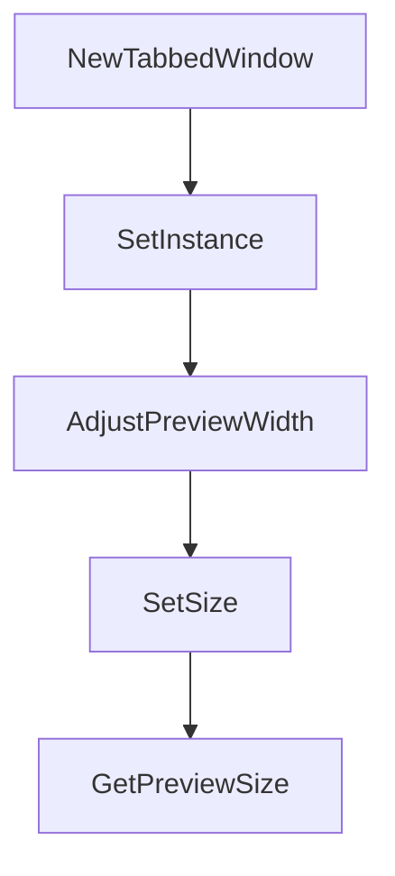

# Chapter 8: Production Team Operations

Welcome to **Chapter 8: Production Team Operations**. In this part of **Claude Squad Tutorial: Multi-Agent Terminal Session Orchestration**, you will build an intuitive mental model first, then move into concrete implementation details and practical production tradeoffs.


Successful team adoption of Claude Squad depends on clear process boundaries around session ownership, branch hygiene, and review controls.

## Operational Checklist

1. define per-session naming and ownership conventions
2. enforce branch review before merge from worktree outputs
3. limit AutoYes use to low-risk or tightly controlled contexts
4. standardize agent program defaults and environment variables
5. run periodic cleanup/reset of stale session/worktree state

## Source References

- [Claude Squad README](https://github.com/smtg-ai/claude-squad/blob/main/README.md)
- [Claude Squad release history](https://github.com/smtg-ai/claude-squad/releases)

## Summary

You now have a team-operations baseline for scaling Claude Squad safely.

## Source Code Walkthrough

### `ui/tabbed_window.go`

The `NewTabbedWindow` function in [`ui/tabbed_window.go`](https://github.com/smtg-ai/claude-squad/blob/HEAD/ui/tabbed_window.go) handles a key part of this chapter's functionality:

```go
}

func NewTabbedWindow(preview *PreviewPane, diff *DiffPane, terminal *TerminalPane) *TabbedWindow {
	return &TabbedWindow{
		tabs: []string{
			"Preview",
			"Diff",
			"Terminal",
		},
		preview:  preview,
		diff:     diff,
		terminal: terminal,
	}
}

func (w *TabbedWindow) SetInstance(instance *session.Instance) {
	w.instance = instance
}

// AdjustPreviewWidth adjusts the width of the preview pane to be 90% of the provided width.
func AdjustPreviewWidth(width int) int {
	return int(float64(width) * 0.9)
}

func (w *TabbedWindow) SetSize(width, height int) {
	w.width = AdjustPreviewWidth(width)
	w.height = height

	// Calculate the content height by subtracting:
	// 1. Tab height (including border and padding)
	// 2. Window style vertical frame size
	// 3. Additional padding/spacing (2 for the newline and spacing)
```

This function is important because it defines how Claude Squad Tutorial: Multi-Agent Terminal Session Orchestration implements the patterns covered in this chapter.

### `ui/tabbed_window.go`

The `SetInstance` function in [`ui/tabbed_window.go`](https://github.com/smtg-ai/claude-squad/blob/HEAD/ui/tabbed_window.go) handles a key part of this chapter's functionality:

```go
}

func (w *TabbedWindow) SetInstance(instance *session.Instance) {
	w.instance = instance
}

// AdjustPreviewWidth adjusts the width of the preview pane to be 90% of the provided width.
func AdjustPreviewWidth(width int) int {
	return int(float64(width) * 0.9)
}

func (w *TabbedWindow) SetSize(width, height int) {
	w.width = AdjustPreviewWidth(width)
	w.height = height

	// Calculate the content height by subtracting:
	// 1. Tab height (including border and padding)
	// 2. Window style vertical frame size
	// 3. Additional padding/spacing (2 for the newline and spacing)
	tabHeight := activeTabStyle.GetVerticalFrameSize() + 1
	contentHeight := height - tabHeight - windowStyle.GetVerticalFrameSize() - 2
	contentWidth := w.width - windowStyle.GetHorizontalFrameSize()

	w.preview.SetSize(contentWidth, contentHeight)
	w.diff.SetSize(contentWidth, contentHeight)
	w.terminal.SetSize(contentWidth, contentHeight)
}

func (w *TabbedWindow) GetPreviewSize() (width, height int) {
	return w.preview.width, w.preview.height
}

```

This function is important because it defines how Claude Squad Tutorial: Multi-Agent Terminal Session Orchestration implements the patterns covered in this chapter.

### `ui/tabbed_window.go`

The `AdjustPreviewWidth` function in [`ui/tabbed_window.go`](https://github.com/smtg-ai/claude-squad/blob/HEAD/ui/tabbed_window.go) handles a key part of this chapter's functionality:

```go
}

// AdjustPreviewWidth adjusts the width of the preview pane to be 90% of the provided width.
func AdjustPreviewWidth(width int) int {
	return int(float64(width) * 0.9)
}

func (w *TabbedWindow) SetSize(width, height int) {
	w.width = AdjustPreviewWidth(width)
	w.height = height

	// Calculate the content height by subtracting:
	// 1. Tab height (including border and padding)
	// 2. Window style vertical frame size
	// 3. Additional padding/spacing (2 for the newline and spacing)
	tabHeight := activeTabStyle.GetVerticalFrameSize() + 1
	contentHeight := height - tabHeight - windowStyle.GetVerticalFrameSize() - 2
	contentWidth := w.width - windowStyle.GetHorizontalFrameSize()

	w.preview.SetSize(contentWidth, contentHeight)
	w.diff.SetSize(contentWidth, contentHeight)
	w.terminal.SetSize(contentWidth, contentHeight)
}

func (w *TabbedWindow) GetPreviewSize() (width, height int) {
	return w.preview.width, w.preview.height
}

func (w *TabbedWindow) Toggle() {
	w.activeTab = (w.activeTab + 1) % len(w.tabs)
}

```

This function is important because it defines how Claude Squad Tutorial: Multi-Agent Terminal Session Orchestration implements the patterns covered in this chapter.

### `ui/tabbed_window.go`

The `SetSize` function in [`ui/tabbed_window.go`](https://github.com/smtg-ai/claude-squad/blob/HEAD/ui/tabbed_window.go) handles a key part of this chapter's functionality:

```go
}

func (w *TabbedWindow) SetSize(width, height int) {
	w.width = AdjustPreviewWidth(width)
	w.height = height

	// Calculate the content height by subtracting:
	// 1. Tab height (including border and padding)
	// 2. Window style vertical frame size
	// 3. Additional padding/spacing (2 for the newline and spacing)
	tabHeight := activeTabStyle.GetVerticalFrameSize() + 1
	contentHeight := height - tabHeight - windowStyle.GetVerticalFrameSize() - 2
	contentWidth := w.width - windowStyle.GetHorizontalFrameSize()

	w.preview.SetSize(contentWidth, contentHeight)
	w.diff.SetSize(contentWidth, contentHeight)
	w.terminal.SetSize(contentWidth, contentHeight)
}

func (w *TabbedWindow) GetPreviewSize() (width, height int) {
	return w.preview.width, w.preview.height
}

func (w *TabbedWindow) Toggle() {
	w.activeTab = (w.activeTab + 1) % len(w.tabs)
}

// UpdatePreview updates the content of the preview pane. instance may be nil.
func (w *TabbedWindow) UpdatePreview(instance *session.Instance) error {
	if w.activeTab != PreviewTab {
		return nil
	}
```

This function is important because it defines how Claude Squad Tutorial: Multi-Agent Terminal Session Orchestration implements the patterns covered in this chapter.


## How These Components Connect


