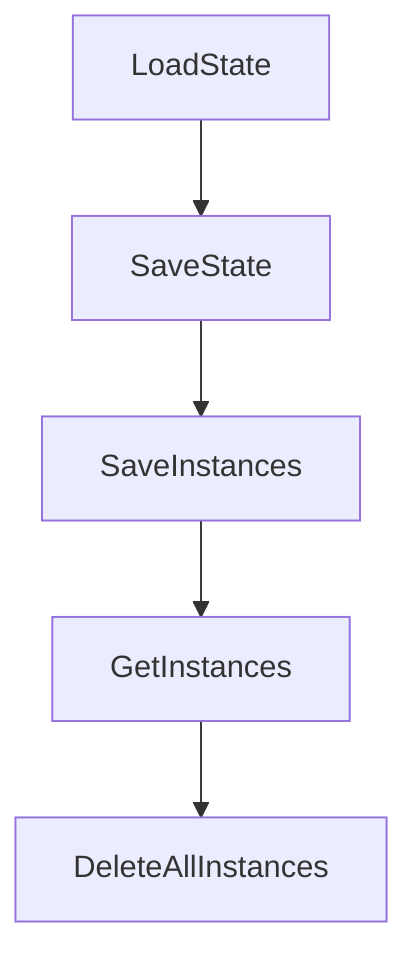

# Chapter 8: Production Team Operations

Welcome to **Chapter 8: Production Team Operations**. In this part of **Claude Squad Tutorial: Multi-Agent Terminal Session Orchestration**, you will build an intuitive mental model first, then move into concrete implementation details and practical production tradeoffs.


Successful team adoption of Claude Squad depends on clear process boundaries around session ownership, branch hygiene, and review controls.

## Operational Checklist

1. define per-session naming and ownership conventions
2. enforce branch review before merge from worktree outputs
3. limit AutoYes use to low-risk or tightly controlled contexts
4. standardize agent program defaults and environment variables
5. run periodic cleanup/reset of stale session/worktree state

## Source References

- [Claude Squad README](https://github.com/smtg-ai/claude-squad/blob/main/README.md)
- [Claude Squad release history](https://github.com/smtg-ai/claude-squad/releases)

## Summary

You now have a team-operations baseline for scaling Claude Squad safely.

## Depth Expansion Playbook

## Source Code Walkthrough

### `config/state.go`

The `LoadState` function in [`config/state.go`](https://github.com/smtg-ai/claude-squad/blob/HEAD/config/state.go) handles a key part of this chapter's functionality:

```go
}

// LoadState loads the state from disk. If it cannot be done, we return the default state.
func LoadState() *State {
	configDir, err := GetConfigDir()
	if err != nil {
		log.ErrorLog.Printf("failed to get config directory: %v", err)
		return DefaultState()
	}

	statePath := filepath.Join(configDir, StateFileName)
	data, err := os.ReadFile(statePath)
	if err != nil {
		if os.IsNotExist(err) {
			// Create and save default state if file doesn't exist
			defaultState := DefaultState()
			if saveErr := SaveState(defaultState); saveErr != nil {
				log.WarningLog.Printf("failed to save default state: %v", saveErr)
			}
			return defaultState
		}

		log.WarningLog.Printf("failed to get state file: %v", err)
		return DefaultState()
	}

	var state State
	if err := json.Unmarshal(data, &state); err != nil {
		log.ErrorLog.Printf("failed to parse state file: %v", err)
		return DefaultState()
	}

```

This function is important because it defines how Claude Squad Tutorial: Multi-Agent Terminal Session Orchestration implements the patterns covered in this chapter.

### `config/state.go`

The `SaveState` function in [`config/state.go`](https://github.com/smtg-ai/claude-squad/blob/HEAD/config/state.go) handles a key part of this chapter's functionality:

```go
			// Create and save default state if file doesn't exist
			defaultState := DefaultState()
			if saveErr := SaveState(defaultState); saveErr != nil {
				log.WarningLog.Printf("failed to save default state: %v", saveErr)
			}
			return defaultState
		}

		log.WarningLog.Printf("failed to get state file: %v", err)
		return DefaultState()
	}

	var state State
	if err := json.Unmarshal(data, &state); err != nil {
		log.ErrorLog.Printf("failed to parse state file: %v", err)
		return DefaultState()
	}

	return &state
}

// SaveState saves the state to disk
func SaveState(state *State) error {
	configDir, err := GetConfigDir()
	if err != nil {
		return fmt.Errorf("failed to get config directory: %w", err)
	}

	if err := os.MkdirAll(configDir, 0755); err != nil {
		return fmt.Errorf("failed to create config directory: %w", err)
	}

```

This function is important because it defines how Claude Squad Tutorial: Multi-Agent Terminal Session Orchestration implements the patterns covered in this chapter.

### `config/state.go`

The `SaveInstances` function in [`config/state.go`](https://github.com/smtg-ai/claude-squad/blob/HEAD/config/state.go) handles a key part of this chapter's functionality:

```go
// InstanceStorage handles instance-related operations
type InstanceStorage interface {
	// SaveInstances saves the raw instance data
	SaveInstances(instancesJSON json.RawMessage) error
	// GetInstances returns the raw instance data
	GetInstances() json.RawMessage
	// DeleteAllInstances removes all stored instances
	DeleteAllInstances() error
}

// AppState handles application-level state
type AppState interface {
	// GetHelpScreensSeen returns the bitmask of seen help screens
	GetHelpScreensSeen() uint32
	// SetHelpScreensSeen updates the bitmask of seen help screens
	SetHelpScreensSeen(seen uint32) error
}

// StateManager combines instance storage and app state management
type StateManager interface {
	InstanceStorage
	AppState
}

// State represents the application state that persists between sessions
type State struct {
	// HelpScreensSeen is a bitmask tracking which help screens have been shown
	HelpScreensSeen uint32 `json:"help_screens_seen"`
	// Instances stores the serialized instance data as raw JSON
	InstancesData json.RawMessage `json:"instances"`
}

```

This function is important because it defines how Claude Squad Tutorial: Multi-Agent Terminal Session Orchestration implements the patterns covered in this chapter.

### `config/state.go`

The `GetInstances` function in [`config/state.go`](https://github.com/smtg-ai/claude-squad/blob/HEAD/config/state.go) handles a key part of this chapter's functionality:

```go
	// SaveInstances saves the raw instance data
	SaveInstances(instancesJSON json.RawMessage) error
	// GetInstances returns the raw instance data
	GetInstances() json.RawMessage
	// DeleteAllInstances removes all stored instances
	DeleteAllInstances() error
}

// AppState handles application-level state
type AppState interface {
	// GetHelpScreensSeen returns the bitmask of seen help screens
	GetHelpScreensSeen() uint32
	// SetHelpScreensSeen updates the bitmask of seen help screens
	SetHelpScreensSeen(seen uint32) error
}

// StateManager combines instance storage and app state management
type StateManager interface {
	InstanceStorage
	AppState
}

// State represents the application state that persists between sessions
type State struct {
	// HelpScreensSeen is a bitmask tracking which help screens have been shown
	HelpScreensSeen uint32 `json:"help_screens_seen"`
	// Instances stores the serialized instance data as raw JSON
	InstancesData json.RawMessage `json:"instances"`
}

// DefaultState returns the default state
func DefaultState() *State {
```

This function is important because it defines how Claude Squad Tutorial: Multi-Agent Terminal Session Orchestration implements the patterns covered in this chapter.


## How These Components Connect


