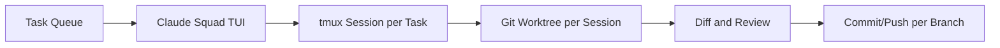

# Claude Squad Tutorial: Multi-Agent Terminal Session Orchestration

> Learn how to use `smtg-ai/claude-squad` to run and manage multiple coding-agent sessions across isolated workspaces with tmux and git worktrees.

## Why This Track Matters

As teams adopt multiple coding agents, orchestration and isolation become critical. Claude Squad provides a unified TUI for parallel agent sessions while keeping each task isolated through git worktrees.

This track focuses on:

- multi-session orchestration in one terminal UI
- tmux + git worktree isolation model
- review/commit/push flows across parallel tasks
- operational controls for background and auto-yes workflows

## Current Snapshot (Verified February 12, 2026)

- repository: [`smtg-ai/claude-squad`](https://github.com/smtg-ai/claude-squad)
- stars: about **6.0k**
- latest release: [`v1.0.14`](https://github.com/smtg-ai/claude-squad/releases/tag/v1.0.14)
- recent activity: updates on **December 24, 2025**
- project positioning: terminal orchestrator for multiple agent sessions

## Mental Model

## Chapter Guide

| Chapter | Key Question | Outcome |
|:--------|:-------------|:--------|
| [01 - Getting Started](01-getting-started.md) | How do I install Claude Squad and launch sessions? | Working baseline |
| [02 - tmux and Worktree Architecture](02-tmux-and-worktree-architecture.md) | How are sessions isolated at runtime? | Clear architecture model |
| [03 - Session Lifecycle and Task Parallelism](03-session-lifecycle-and-task-parallelism.md) | How do I run multiple tasks in parallel safely? | Better throughput and control |
| [04 - Multi-Agent Program Integration](04-multi-agent-program-integration.md) | How do I run Claude, Codex, Gemini, or Aider under one manager? | Toolchain flexibility |
| [05 - Review, Checkout, and Push Workflow](05-review-checkout-and-push-workflow.md) | How do I validate and ship isolated changes? | Safer delivery workflow |
| [06 - AutoYes, Daemon Polling, and Safety Controls](06-autoyes-daemon-polling-and-safety-controls.md) | How should auto-accept workflows be controlled? | Better risk management |
| [07 - Configuration and State Management](07-configuration-and-state-management.md) | Where does Claude Squad store and apply config/session state? | Operational clarity |
| [08 - Production Team Operations](08-production-team-operations.md) | How do teams adopt Claude Squad at scale? | Governance baseline |

## What You Will Learn

- how to orchestrate many coding-agent sessions from one terminal
- how worktree isolation reduces cross-task conflicts
- how to standardize commit/review cycles per session
- how to govern auto-accept and background execution safely

## Source References

- [Claude Squad Repository](https://github.com/smtg-ai/claude-squad)
- [Claude Squad README](https://github.com/smtg-ai/claude-squad/blob/main/README.md)
- [tmux session implementation](https://github.com/smtg-ai/claude-squad/blob/main/session/tmux/tmux.go)
- [git worktree implementation](https://github.com/smtg-ai/claude-squad/blob/main/session/git/worktree.go)
- [config implementation](https://github.com/smtg-ai/claude-squad/blob/main/config/config.go)

## Related Tutorials

- [Mistral Vibe Tutorial](../mistral-vibe-tutorial/)
- [OpenCode Tutorial](../opencode-tutorial/)
- [Cline Tutorial](../cline-tutorial/)
- [Plandex Tutorial](../plandex-tutorial/)

---

Start with [Chapter 1: Getting Started](01-getting-started.md).
